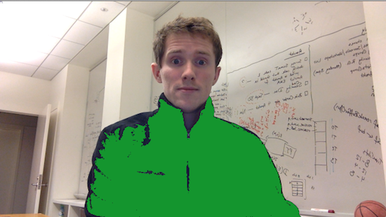

## Introduction ##

The goal in this lab is to build a webcam-based game in which a player catches
flying (virtual) objects, by moving around so that the image of their designated
catcher's "mitt" in the webcam contains the location of a flying object.

The core computational problem is to identify the mitt in the webcam image.
Here we base the recognition solely on color, so the mitt should have a fairly
uniform and distinct color. For example, I could wear my nice black shirt and
position my torso over the object, or I could use the blue cap of a marker and
delicately "pop" the object. (Both such "mitts" below are recolored to distinguish them.)

{:refdef: style="text-align: center;"}
 
{: refdef}

To find uniformly-colored regions, we employ a "region growing" (aka "flood fill")
algorithm. Region growing initializes a new region at some point that has
approximately a specified target color. It then looks at each of the point's
neighbors (either 4, just horizontally and vertically, or 8, also diagonally).
Those that are also approximately the target color become members of the region,
and their neighbors also need to be considered. The process continues until no
neighbor-of-neighbor-of... points are the desired color. Thus the "flood fill" name:
we expand outward from an initial point, as if a bucket of paint had been spilled
there and spread to all the pixels of its same color. That detects one region;
start again from another point (not already considered) to detect another region.

The basic structure of the algorithm is as follows:

    Loop over all the pixels
        If a pixel is unvisited and of the correct color
        Start a new region
        Keep track of which pixels need to be visited, initially just that one
        As long as there's some pixel that needs to be visited
            Get one to visit
            Add it to the region
            Mark it as visited
            Loop over all its neighbors
                If the neighbor is of the correct color
                    Add it to the list of pixels to be visited
        If the region is big enough to be worth keeping, do so

The target color is specified by a mouse press, as in our simpler color point
tracking example in class. The flood fill then identifies connected regions of
points that are approximately that target color. We keep the sufficiently large
regions (i.e., the size of the point set meets a threshold); these will hopefully
include the mitt, and might also include some spurious similarly-colored objects
in the image (oh, well). If the object's location is in one of those regions
(i.e., the coordinates of the object are the coordinates of a point in the region),
we consider the mitt to have *caught* the object.

The easier part of the game is the flying object. You're already familiar with how
to animate objects. For the basic version of this game (you can do more for extra
credit), the object should come from one of the sides of the window, in a diagonal
line at a random direction. If it leaves the window, the player has *missed* the
object and a new one is launched. Likewise, if it is caught, a new one is launched.

The final thing is to put the region finding and the flying object together inside
a webcam-processing loop. That's actually the easiest coding bit, once you have
the other two already worked out and have verified that the test code we provide
seems to be behaving correctly with your implementations of Universe and Flier.

## Implementation Notes ##

Provided for you are scaffolds for the three classes you need to complete:
[Universe.java](resources/Universe.java), [Flier.java](resources/Flier.java), and
[Catch.java](resources/Catch.java). To help you develop and debug, two testing
files are provided for the first two pieces: [RegionsTest.java](resources/RegionsTest.java)
and [FlierTest.java](resources/FlierTest.java). **NOTE:** These test files are complete.
They are provided for your benefit and should help you test that your implementations
of Universe and Flier are correct before trying to put everything together in the
webcam game (Catch).

Comments "TODO: YOUR CODE HERE" indicate what you need to fill in; you may also
want to define additional helper methods, instance variables, etc.

### Universe ###

The Universe class is a fairly interesting class in that it holds information
about the image which makes up the background, the tracking color, enables you
to detect and recolor regions of an image, and also manages a collection of flying
objects. We provide the constructor and various getters/setters to help you
see the connection between the Universe class and the Flier class. While you don't
have to implement these, make sure you understand what we provide you and think
about what information the Universe class exposes through the methods we provide.
From this, you must complete the remainder of the Universe class by implementing
region finding/recoloring and moving/drawing the fliers that are "in" the Universe.

#### Region Finding ####

* The Point class (which you saw in mouse press events) holds x and y coordinates.
  We can package up a list of them and think of it as a *region*. A list of these
  lists is then our *set of regions*.

* There are many ways we could test color similarity. In my solution, I simply
  compared the absolute value of each RGB channel, and made sure each was less than
  a threshold (provided). Euclidean distance is also fine.

* We need to keep track of which points we've visited, so that we don't revisit
  them. A 2D array of booleans provides a convenient way to do that — it starts
  off as all false, and we set an entry to true when we've added it to a region
  and thus shouldn't visit it again.

* You can try 4-adjacency (N, S, E, and W) or 8-adjacency (also NE, NW, SE, SW)
  for the neighbors to consider. Nested loops make 8-adjacency easier, as in some
  of our image processing code.

* We also need to keep track of the neighbors (and neighbors of neighbors...) that
  need to be visited in the region we are growing. An ArrayList can do that; initialize
  it with the point itself. Then in the loop, remove the last point from the list,
  and handle it by adding its neighbors to the list (if they are the target color).
  Two other classes that we'll use more extensively later in the course have the same
  ability: *Stack* lets us push and pop objects, while *Queue* lets us enqueue and
  dequeue. Any of these approaches is fine.

* There's a nested loop structure for recoloring: loop over all the regions; for
  each, loop over all the points.

{:refdef: style="text-align: center;"}
**NOTE:** *You should make sure that your Universe is correctly doing the region
finding/recoloring in the test code we provided (RegionsTest) before even trying
to fill in and run the Catch game.*
{: refdef}

#### Handling Fliers ####

* You probably don't want to start this part until you've completed and tested
  your implementation of the Flier class.

* Note that we have a *list* of flying objects (fliers) -- you must implement the
  code to move each of the flying objects in the list. After moving a Flier, you
  should then immediately check for catches/misses.

* Similar to moving fliers, you must implement the code to draw each of the flying
  objects in the list. This should be simple since a Flier knows how to draw itself.

### Flier ###

* The basic motion should be familiar from Bouncer. But make sure it's flying in
  from one of the sides of the window and not flying from the middle out (or from
  the border out — not fair!).

* Some of the instance variables and methods are omitted; you should add them, and
  eventually call them as appropriate from the Catch game.

* Verifying that your Flier works with the provided test code will put you in
  good shape for the actual webcam game. The test code creates and moves a
  flier, and detects misses/catchces.

{:refdef: style="text-align: center;"}
**NOTE:** *You should make sure that your Flier is working correctly in the test
code we provided (FlierTest) before even trying to fill in and run the Catch game.*
{: refdef}

### Catch ###

* The basic structure is like other webcam code we've looked at. The test code does
  a lot of the work that you need to do in Catch.java, so understanding the code
  in the provided RegionsTest and FlierTest files will get you most of the way there.
  After you understand the test code and get your implementations of Universe and
  Flier working with the provided test code, you'll then need to think about things
  like how/where to set the tracking color for the Catch game, and how to deal
  with a collection of fliers rather than just a single flier as in FlierTest.

* One new thing beyond those tests is kicking the whole thing off, upon a mouse
  press that identifies the pixel with the mitt color, just like in the color
  tracking example in class.

* In general, webcam processing can be flakey. Work in a well-lit room. Do all the
  core development with static images first (e.g., have a region of Baker catch
  the flying object — don't even read from the webcam). If you have problems with
  your webcam, do the final testing in the Sudikoff lab.

* Also, you may notice that Catch will freeze up sometimes (sometimes for no reason,
  but this is more prone to happen if you click a lot to change the tracking color, etc.);
  if this happens, just close the window and restart the Catch game -- you should
  be good to go from there.

## Exercises ##

For this problem set, you are allowed to work with one partner. Note that you do
not have to work with a partner, and if you do, you will both be given the same
grade; there is no penalty (or bonus). You should weigh whether you will get more
out of this assignment working alone or with someone else. If you choose to work
with someone else, pick your partner carefully, and make sure it is someone you
will be able to coordinate with, work well with, etc. Re-read the course policies.

1. First implement **Universe**, including the region growing algorithm and a
   method to recolor the image so that regions show up distinctly. Also, you will
   need to implement the methods to move and draw the Flier objects that are managed
   within the Universe, but it may be better to come back to this after completing
   the Flier class. Test it in the provided scaffold. For example, here's what I
   get for the brick-ish regions (R=130, G=100, B=100) with at least 50 pixels in
   the usual Baker image, recolored to random colors:

    {:refdef: style="text-align: center;"}
    
    {: refdef}

   Submit a corresponding image from your region growing algorithm. Depending on
   choices of parameters, it may be somewhat different from mine; that's okay.
   Briefly describe the implementation and parameter choices you made and their
   impact on the detected regions.

2. Next implement **Flier**, including the flying motion (move), detection of catch
   (checkWin()) and miss (checkLose()), and the toss() method. Test it in the
   provided scaffold. As discussed above, this testing will take you a long way
   toward the game. Turn in a screenshot of the flier in action.

3. Now put parts 1 and 2 together in the provided webcam-based scaffold, **Catch**. When a mouse
   press is detected, create a new Universe object, set the target color, and create/toss
   some fixed number of flying objects (5 by default). Also, be sure to start a new
   object flying when one is caught or missed. Submit a screenshot image of you / your
   partner playing the game, showing the "mitt" (and spurious extra mitts) by
   recoloring its points. Briefly describe the utility and limitations of region
   growing in this game context.

### Extra Credit ###

You may obtain extra credit for extending and enhancing the game. Only do this
once you are completely finished with the specified version. Make a different
file for the extra credit version, and document what you did and how it works.
Some ideas:

* Make the number of Fliers launched grow each time one is caught.
* Enable score-keeping by keeping track of the number of catches/misses.
* Give the flying objects more interesting flight patterns (e.g., gravity).
* Account for the size and shape of the specific “mitt” to filter out some of the spurious ones.

## Submission Instructions ##

Turn in your completed versions of the three classes (Catch.java, Universe.java,
and Flier.java). Turn in screenshots of the static region finding, and the flier and
webcam in action. Turn in a document with your discussion of region growing
(both Baker and webcam).

## Grading Rubric ##

Total of 100 points

### Correctness (70 points) ###

<table class="rubric">
 <tr><th>5</th><td>Matching color</td></tr>
 <tr><th>5</th><td>Starting region growing at appropriate pixels</td></tr>
 <tr><th>5</th><td>Keeping track of visited pixels</td></tr>
 <tr><th>5</th><td>Keeping track of to-visit pixels</td></tr>
 <tr><th>5</th><td>Visiting correctly colored neighbors</td></tr>
 <tr><th>5</th><td>Keeping big-enough groups of points as the regions</td></tr>
 <tr><th>5</th><td>Recoloring image based on detected regions</td></tr>
 <tr><th>5</th><td>Launching Fliers</td></tr>
 <tr><th>5</th><td>Animating Fliers</td></tr>
 <tr><th>5</th><td>Detecting and handling Flier catch</td></tr>
 <tr><th>5</th><td>Detecting and handling Flier miss</td></tr>
 <tr><th>5</th><td>Starting game</td></tr>
 <tr><th>10</th><td>Putting it all together</td></tr>
</table>

### Structure (10 points) ###

<table class="rubric">
 <tr><th>4</th><td>Good decomposition of and within methods</td></tr>
 <tr><th>3</th><td>Proper use of instance and local variables</td></tr>
 <tr><th>3</th><td>Proper use of parameters</td></tr>
</table>

### Style (10 points) ###

<table class="rubric">
 <tr><th>3</th><td>Comments for new methods (purpose, parameters, what is returned)</td></tr>
 <tr><th>4</th><td>Good names for methods, variables, parameters</td></tr>
 <tr><th>3</th><td>Layout (blank lines, indentation, no line wraps, etc.)</td></tr>
</table>

### Testing (10 points) ###

<table class="rubric">
 <tr><th>4</th><td>Static image (Baker) region detection and discussion</td></tr>
 <tr><th>2</th><td>Flier motion</td></tr>
 <tr><th>4</th><td>Webcam region detection and discussion</td></tr>
</table>
