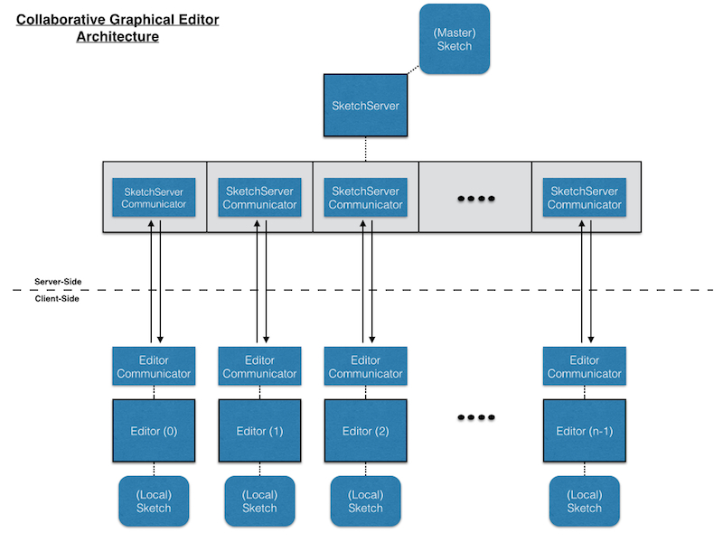

## Introduction ##

As promised in SA-4, we're going to build a collaborative graphical editor. Multiple
clients connect to a server, and whatever editing any of them does, the others see.
So I can add an ellipse, a friend on another computer can recolor and move it, etc.
In addition to being collaborative, the graphical editor is more functional than
the SA-4 one (and for extra credit, you can flesh it out even more), in that it
handles multiple objects at a time, *and* can draw rectangles and line segments in
addition to ellipses.

The basic client/server set-up is much like that of the chat server. Each client
editor has a thread for talking to the sketch server, along with a main thread for
user interaction (there, getting console input; here, handling the drawing). The
server has a main thread to get the incoming requests to join the shared sketch,
along with separate threads for communicating with the clients. The client tells
the server about its user's drawing actions. The server then tells all the clients
about all the drawing actions of each of them.

{:refdef: style="text-align: center;"}

{: refdef}

There is one twist, to make this work nicely. A client never actually finishes a
drawing action on its own. Instead, it requests the server for permission to do that
action, and the server then tells all the clients (including the requester) to do it.
So rather than actually recoloring a shape, the client tells the server "I'd like to
color this shape that color", and the server then tells *all* the clients to do
just that. That way, **the server has the one unified, consistent global view of the
sketch, and keeps all the clients informed.**

## Implementation Notes ##

Since this code builds on SA-4, I will post my sample solution. **NOTE:** If you
choose to look at my solution, then of course you are not permitted to revise your
own for resubmission for a possibly improved score.

A scaffold, <a href="resources/editor-provided.zip">editor-provided.zip</a>, is provided. It includes
a number of files:

* **Editor**: main client program (similar structure to SA-4)
* **EditorCommunicator**: for messages to/from the server
* **Sketch**: holds an entire drawing (a list of shapes)
* **SketchServer**: central keeper of the master sketch; synchronizing the various Editors
* **SketchServerCommunicator**: for messages to/from a single editor (one for each such client)
* **Message**: handles parsing the string-based communication and performing an appropriate update to the sketch
* **Shape**: superclass for a graphical shape (with color), with subclasses **Ellipse**, **Rectangle**, and **Segment**
* **MyIPAddressHelper**: helper class for getting your machine's IP address (so you can connect to your friend's sketch server when it is running)
* **EchoServer**: another helper class useful in development / debugging; allows you to see how
  messages are being sent out and echos them back to you so that when your EditorCommunicator
  reads a line back, you can test to see if you are parsing a message correctly and
  updating your local sketch correctly.
* **collaborative-editor-architecture.pdf**: an annotated document which helps to visualize
  and explain some of the big components involved in this lab. The code is not overly
  complex, but there are a lot of moving pieces in this lab. Reference this document
  often as it should help answer a lot of questions that will come up as you work through
  this lab assignment.

Add your code to these. You can change type signatures for some of the "your code here"
methods if you want, and feel free to add more; it's just to give the structure.
The code isn't particularly complicated, but there are a lot of moving parts, and
you need to be clear on the protocol (request a sketch update to the server and act
on a command from the server).

### Some hints for how to approach the implementation: ###

* We've provided an [annotated architecture diagram](resources/collaborative-editor-architecture.pdf)
which should help you to understand the big components in this lab and how they interact.

* Ellipse and Segment are finished; Rectangle should be straightforward if you
understand Ellipse. (Segment.contains() is interesting reading for your spare time.)

* The structure of the Editor looks just like that in SA-4, but works with a Sketch
instead of a single Shape, and in some cases, makes requests instead of directly
manipulating a shape. This is an important concept to wrap your head around for this
assignment.

* The shape currently being drawn is not part of the sketch yet, and must be handled
separately. On the other hand, the selection can be kept as an index into the sketch's
list of shapes.

* In the sketch, you will need to complete the methods to see which shape contains
a point (determined by the mouse press), and to draw the shapes. Be careful with front-to-back
order &mdash; look for the topmost containing shape, but draw the bottommost shapes
first so that the later ones cover them.

* As described, drawing actions are sent to the server and then back to the client
and the other clients. "Move" can be handled somewhat differently (for efficiency,
really) &mdash; only when it's been dragged and released, ask the server to move
the object there (rather than each step along the way). (You're welcome to do it
each step of the way, but it's not required.)

* Each shape will have a unique index in the Sketch, throughout its lifetime. To
ensure this:

    * To add a shape, the Editor sends a request to the server to add a shape to the
    end of the shape list. The server will then send back an indication to add, including
    the shape's actual index in the list. Thus all editors have the same index for the
    same shape.

    * To delete a shape, its index in the Sketch is set to null. Thus all Shapes after
    it keep the same index. This also means you need to be careful when drawing a Sketch,
    as there may be nulls within it!

    * Recolor and move use the predetermined index.

* Drawing commands are sent via Strings, using PrintWriter.println() on one side
to communicate with BufferedReader.readLine() on the other side. You might want to
make use of the toString() methods of the Shapes. Recall that we give you a complete
version of Ellipse and Segment so understanding how their toString() methods work
should make it easy to create a consistent toString() for your Rectangle class.

* The Message class takes a String-based command (sent via writer to reader) and
parses it to determine what action to perform and update the Sketch accordingly.
**I recommend just using a simple string for the messages (no XML)**, with the
various pieces separated by spaces or commas. Then, for example, you can unpack
the pieces into an array by using the **String.split()** method, and access the
pieces by indexing into the array. You can also convert a String to an integer
via Integer.parseInt(). Ex:

    ```java
    String[] tokens = String.split("a b 1 2");
    // tokens == ["a","b","1","2"]
    // tokens[0] == "a", tokens[2] == "1", ...
    // Integer.parseInt(tokens[2]) == 1
    ```

* One thing to be careful with when comparing strings (e.g., to decide which action
to perform for a message) is that you have to test equality with the method equals(),
not with ==. For example, tokens[0].equals("a") would return true, but unfortunately
tokens[0]=="a" would not.

* For your convenience, we provide an EchoServer which you can run in place of a
SketchServer. The idea here is that you can run the EchoServer to test your Editor
and EditorCommunicator before worrying about the server-side of things and how to
go about handling multiple Editors. A wise way to approach this assignment is to
get the client (Editor/EditorCommunicator) working before working on the server-side
parts. When the EchoServer is running, it will read in input that your EditorCommunicator
sends via a PrintWriter and will "echo" it back so that your EditorCommunicator can
read it in via a BufferedReader. This should help you while developing/testing your
message protocol for updating a sketch, and that you are actually updating your
local sketch correctly according to recieved messages. Once these pieces seem to be
working correctly, you can stop using the EchoServer and focus on the SketchServer/SketchServerCommunicator.

* When a new client joins, they need to be filled in on the state of the world &mdash;
i.e., what shapes are already there.

## Exercises ##

For this lab assignment, you are allowed to work with one partner. Note that you do
not have to work with a partner, and if you do, you will both be given the same
grade; there is no penalty (or bonus). You should weigh whether you will get more
out of this assignment working alone or with someone else. If you choose to work
with someone else, pick your partner carefully, and make sure it is someone you
will be able to coordinate with, work well with, etc. Re-read the course policies.

1. Finish off the missing pieces in Editor, EditorCommunicator, Sketch, and Rectangle.

2. Devise a set of string-based messages by which the clients and server will communicate
   drawing actions, along with the Message class for
   parsing these messages and invoking the appropriate actions on the Sketch to update it.

    The methods you write are up to your design, but should be fairly straightforward
    reflections of editor commands to add, delete, move, and recolor.

3. Use the EchoServer to test your Editor, EditorCommunicator, Sketch, Rectangle, and Message classes.
   By using the EchoServer, you essentially have a single-machine drawing program which
   acts on echoed messages that it sends out and gets back rather than sending/receiving
   messages sent from a SketchServer. This shoudld allow you to focus on the "client-side"
   part of this lab and make sure it is working before you try to implement the
   "server-side" components. Test it!

4. Now all that is left to implement is the SketchServerCommunicator. There isn't
   much code to write but you do have to do a few things to handle multiple instnaces
   of Editors connecting (e.g., telling a client the current state of the world when
   they first connect, and getting and handling messages from the client).

     From here, you'll just have to "hook them up and let them go."" Start up a server
     instance first. Then start an editor. Test on your own machine (set serverIP to "localhost"),
     and with a friend (give them your IP address or vice versa). Once your server seems
     to be handling multiple Editors being connected and it is accurately managing the
     master Sketch and keeping all the Editors synchronized, take a screenshot of a
     collaboratively edited sketch. If you're working independently, you can just have
     two Editors running on your own machine (i.e., self-collaboration).

5. Consider possible synchronization issues. What unexpected/undesired behaviors
   are possible? Can you actually make any of them happen? What else might happen
   if the Sketch didn't have synchronized methods? Write a short (approximately a
   paragraph) response.

### Extra Credit ###

You may obtain extra credit for extending and enhancing the editor. Only do this
once you are completely finished with the specified version. Make a different file
for the extra credit version, and document what you did and how it works. Some ideas:

* Support other common graphical editor commands, e.g., bring to front and send to
  back (note that you'll need to keep a separate list of the drawing order), group
  and ungroup, undo and redo, etc.
* Allow a client to "lock down" a shape, so that nobody else can modify it until
  the lock is released. (Draw such shapes differently to distinguish them.)
* Set up an access control, so that a client can specify with what other clients
  they are willing to share a sketch.

## Submission Instructions ##

Submit your completed versions of all the classes, thoroughly documented. Also submit
a snapshot of a collaborative driawing session and a document with your brief
dicussion of synchronization issues.

## Grading Rubric ##

Total of 100 points

### Correctness (70 points) ###

<table class="rubric">
 <tr><th>5</th><td>Rectangle geometry</td></tr>
 <tr><th>5</th><td>Rectangle display</td></tr>
 <tr><th>10</th><td>Editor listeners</td></tr>
 <tr><th>5</th><td>Request protocol (methods) from Editor to EditorCommunicator</td></tr>
 <tr><th>5</th><td>Sketch drawing</td></tr>
 <tr><th>5</th><td>Containment testing</td></tr>
 <tr><th>5</th><td>Protocol (strings) between EditorCommunicator and ServerCommunicator</td></tr>
 <tr><th>10</th><td>Message: converting to/from String and updating Sketch</td></tr>
 <tr><th>10</th><td>ServerCommunicator (initial synchronization, run loop)</td></tr>
 <tr><th>5</th><td>EditorCommunicator run loop</td></tr>
 <tr><th>5</th><td>Initialization of client by server</td></tr>
</table>

### Structure (10 points) ###

<table class="rubric">
 <tr><th>4</th><td>Good decomposition of methods</td></tr>
 <tr><th>3</th><td>Proper used of instance and local variables</td></tr>
 <tr><th>3</th><td>Proper use of parameters</td></tr>
</table>

### Style (10 points) ###

<table class="rubric">
 <tr><th>3</th><td>Comments for new methods (purpose, parameters, what is returned)</td></tr>
 <tr><th>4</th><td>Good names for methods, variables, parameters</td></tr>
 <tr><th>3</th><td>Layout (blank lines, indentation, no line wraps, etc.)</td></tr>
</table>

### Testing (10 points) ###

<table class="rubric">
 <tr><th>5</th><td>Snapshot of a collaborative drawing</td></tr>
 <tr><th>5</th><td>Discussion of synchronization</td></tr>
</table>
