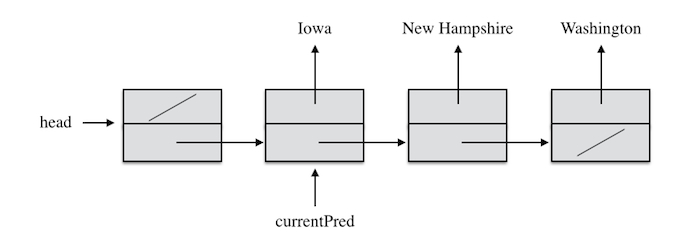
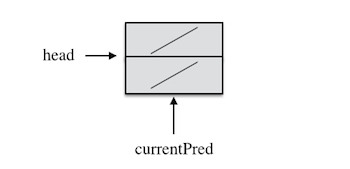

## Introduction ##

I suggest start on this problem set early. If you start early, you are likely not
to find it difficult at all. On the other hand, if you start late and make some
mistakes in manipulating references (which is easy to do when dealing with linked
lists), it may be too late to get help.

This assignment will give you experience with low-level data structure manipulations.
Most of the time we will be using pre-packaged implementations of ADTs to solve
problems.  However, being able to write your own data structures to implement an
ADT, when necessary, is a useful skill.  It is also important to understand something
about what is being hidden inside ADTs in order to be able to make intelligent tradeoffs.

## Modify <code>SLL.java</code> ##

We saw that a major drawback to <code>SLL.java</code> is the fact that deletion
is an <em>O</em>(<em>n</em>) operation, because of the need to find the predecessor
of the current item in order to delete it. In class I briefly mentioned a way
to get around this problem by using a dummy list header and keeping track
of the item <em>before</em> the current item. In this part of the assignment you
will modify [SLL.java](resources/SLL.java)
(which "implements" [CS10LinkedList.java](resources/CS10LinkedList.java)) to use
this representation. I suggest renaming the class. Mine is called <code>HeaderSLL</code>,
but you can choose whatever name that you like.

You could still call the instance variable <code>current</code>, but it is less
confusing to call it <code>currentPred</code> or some such name.  This is an excellent
chance to use refactoring in Eclipse. Select the name "current" in its declaration,
choose "Rename" from within the Refactor menu, change the name, and hit return.
All instances of the variable get renamed. The comments don't need to change,
because we still have the same idea of current. We have just changed how we represent it.

For the basic assignment you should eliminate the <code>tail</code> instance variable.
Updating this efficiently turns out to be trickier than it would first appear.
Keeping track of the tail of the list will be extra credit.

Our SLL with dummy header and currentPred is shown below.  The first element in
the linked list (with <code>data</code> field <code>null</code>) is not part of
the list represented. It is like the sentinel in <code>SentinelDLL</code>. It is
there to make operations easier.  This represents a list with 3 elements, not 4.

Note that the current item is "NH", because <code>currentPred</code> refers to
the element before it in the list.  Note that using this representation, deleting
the current item will be the same no matter which item is deleted. You simply change
the <code>next</code> field in the element referenced by <code>currentPred</code>.
This is the advantage of having a dummy list head!

So what should an empty list look like? The following shows <code>head</code>,
<code>currentPred</code>, and the dummy list header. Note that <code>currentPred</code>
references the dummy list header rather than being null. But if you follow
<code>next</code> from the dummy list header you get null, so this indicates that
there is no current. This is the situation that will arise naturally if you remove
the only item in a list, so it is more convenient than using <code>currentPred == null</code>
as the test for no current.

Draw pictures of what the list should look like before and after various operations.
Use them to figure out the names of fields that need to be changed and the values
that they need to be changed to.  In many cases the only change needed is to use
<code>currentPred.next</code> in places that <code>SLL.java</code> used <code>current</code>.

### Testing ###

Run your program with [ListTest.java](resources/ListTest.java) to demonstrate that
it works.  Notice that you have to change one line in <code>ListTest.java</code>
in order to be able to test your implementation. Figure out which line it is and
fix it.

Make sure to test all of the boundary cases - adding and removing at the front of
the list, the end of the list, the middle of the list, etc. Make sure that things
work correctly for an empty list.  Your testing should not be random, but should
be clearly organized and complete enough to convince us that your program works
correctly.

### Extra Credit ###

Create an instance variable <code>tail</code> and maintain it correctly as
you do adds and removes.  One thing that you will need to decide is
whether <code>tail</code> should point to the last element in the list or
to the element before the last element. (Note that <code>head</code> and
<code>currentPred</code> point to the element before the one that they really
mean.)

It is easy to introduce subtle bugs.  Test your code carefully.

Please turn in a solution to the standard problem separately from the extra
credit solution (i.e., keep the two solutions as different files). Solving the
standard problem and then modifying it to use <code>tail</code> is probably easier
than starting with the tail instance variable. Furthermore, by keeping them as
two separate solutions, you will not be penalized in your regular grade for errors
in the extra credit part.

## Submission Instructions ##

Submit via Canvas the following files:

* Your modification of the <code>SLL</code> class.
* Test run for your modified <code>SLL</code> class.

## Grading Rubric ##

On programming assignments it is important to write the code well enough that it
compiles and runs, enabling you to test it thoroughly and tune it to perfection.
Therefore, starting with this problem set, there will be a much more severe
deduction of points for code that does not compile and for code that compiles and
runs but does not accomplish much.

Total of 100 points

### Correctness (70 points) ###

<table class="rubric">
  <tr><th>10</th><td>Modify <code>clear</code></td></tr>
  <tr><th>10</th><td>Modify <code>add</code></td></tr>
  <tr><th>10</th><td>Modify <code>remove</code></td></tr>
  <tr><th>10</th><td>Modify <code>getLast</code></td></tr>
  <tr><th>10</th><td>Modify <code>addFirst</code></td></tr>
  <tr><th>10</th><td>Modify <code>isEmpty</code>, <code>hasCurrent</code>, and <code>hasNext</code></td></tr>
  <tr><th>10</th><td>Modify the other methods</td></tr>
</table>

### Style (15 points) ###

<table class="rubric">
  <tr><th>5</th><td>Comments at top, explaining how your version represents the linked list.</td></tr>
  <tr><th>5</th><td>Good names for methods, variables, parameters</td></tr>
  <tr><th>5</th><td>Layout (blank lines, indentation, etc.)</td></tr>
</table>

### Testing (15 points) ###

<table class="rubric">
  <tr><th>15</th><td>A run demonstrating the correctness of the modified <code>SLL</code> class.</td></tr>
</table>

### Extra Credit (20 points) ###

<table class="rubric">
  <tr><th>20</th><td>Adding tail reference and updating efficiently and correctly</td></tr>
</table>
