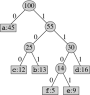
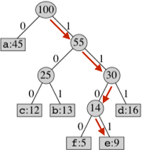
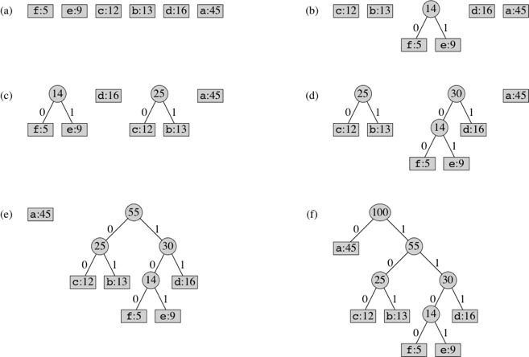

In this assignment, you will use Huffman encoding to compress and decompress files.
This brings together trees, maps, priority queues, and file I/O, all to help save
the bits!

All of the provided code for this lab can be found here: <a href="resources/compression.zip">compression.zip</a>

## Background ##

File compression compacts the contents of a file (or bunch of files, as when you
turn in a zip file of this homework) to save disk space and transfer time. Some
compression schemes (like jpeg for images) are "lossy", in that they throw away
information. Other compression schemes (like zip) are "lossless" &mdash; you get
back exactly what you put in, but it's just stored in a more compact manner.

One of the earliest schemes for lossless file compression was invented by Huffman
(as a term project!). Instead of using 7 bits to encode each character, as
[ASCII](http://www.asciitable.com/) does, it uses a variable-length encoding of
characters. Frequently occurring characters get shorter code words than infrequently
occurring ones. (A code word is the sequence of 0's and 1's used to encode the character.)

Huffman encoding gives the smallest possible fixed encoding of a file. A fixed
encoding means that a given letter is represented by the same code wherever it
appears in the file. Some more recent schemes that do better than Huffman's are
adaptive, which means that how a letter is encoded changes as the file is processed.

Pages **595-597** of the textbook contain a description of how Huffman encoding works
and even gives you psuedocode for how to build the Huffman code tree.

## Huffman Encoding ##

A problem with variable-length encodings is figuring out where a code word ends.
For instance, if we used '1' for 'E', '10' for 'F' and '00' for 'X' we would be
in trouble. When decoding the file we would not know whether to interpret '1' as
'E', or as the start of the code for 'F'. Huffman Encoding removes this ambiguity
by producing <em>prefix-free</em> codes. This means that for any given code word,
adding bits to the end cannot produce another code word. Hence no code word is a
prefix of another. When the computer observes a series of bits that corresponds
to a code word, it knows that it cannot be part of a larger code word, and can
safely interpret the series of bits as its corresponding character.

At this point the purpose and value or Huffman Encoding should be fairly clear.
So how do we do it? The task is to generate a set of prefix-free codes whose
lengths are inversely correlated with the frequency of the encoded character.
There are two clever parts of the algorithm, the use of a binary tree to generate
the codes, and the construction of the binary tree using a priority queue.
Specifically we will construct a tree such that each character is a leaf and the
path from the root to that character gives that character's code word, where a
left child is interpreted as a 0 and a right child as a 1.

For example, in this tree, the codeword for e is 1101:

{:refdef: style="text-align: center;"}

{: refdef}

{:refdef: style="text-align: center;"}

{: refdef}

The number to the right of a colon in a leaf of this figure gives the frequency
of the character. The number in an internal node gives the sum of the frequencies
of the leaves in its subtree. We'll soon see why we need this information.

### Generate a Frequency Table ###

The first step in creating the code for a given file is to learn what the character
frequencies are. This is fairly simple. First we create a <em>Map</em> with characters
as *keys* and frequencies as *values*. Then we read the file one character at a
time. We add the character to the map if it is not there and increment the
corresponding map value if it is there. At the end we will have a map that maps
each character to the number of times that it appears in the file. (Note: you
should recall that in Java you will have to use appropriate wrapper classes to
store the character and the frequency, because you cannot use primitives in a
<code>Map</code>.)

### Put Singleton Trees in Priority Queue ###

We now create a size-1 (singleton) tree for each character. The data consists of
two values, a character and its frequency. We then add all these singleton trees
to a priority queue. The priority queue is set up to return the tree with the
lowest frequency when asked to remove.

You can use the binary tree code from class. Because you need to store two values
and a tree node has only one <code>data</code> you will have to create a class
that stores a *character* and a *frequency*. This new class will be the data type
for the tree. Youshould provide accessor methods as needed.

You can use whatever priority queue implementation you like. I found it easiest
to use Java's <code>PriorityQueue</code> class, which implements a heap-based
priority queue. Note that the things that you are comparing are the frequency
counts in the root nodes of two trees. It is simplest to write a separate
<code>TreeComparator</code> class that implements the Comparator interface. The
only method that you need to implement is <code>compare</code>, which takes two
tree nodes and returns -1, 0, or 1 depending on whether the first has a smaller
frequency count, the counts are equal, or the second has the smaller
frequency count. You pass a <code>TreeComparator</code> object as the second
parameter of the <code>PriorityQueue</code> constructor. The first parameter is
the initial size for the queue. Look up <code>PriorityQueue</code> in the
[Java documentation](http://docs.oracle.com/javase/7/docs/api/).

### Tree Creation ###

Notice that all leaf paths in a tree are unique. We represent the paths as a
sequence of bit values, '0' for following the left path to the left child and '1'
for following the right path. This way we create a variable length bit code for
each leaf-node character. We also see that a path to a leaf L cannot contain the
bit code for a path to any other leaf L', because if it did then then L' would
not be a leaf.

In creating the tree we would like to have the lowest frequency characters be
deepest in the tree, and hence have the longest bit codes, and the highest frequency
characters be near the top of the tree. Use the priority queue to achieve this
goal, as follows:

1. Extract the two lowest-frequency trees <span class="math"><em>T</em><sub>1</sub></span>
   and <span class="math"><em>T</em><sub>2</sub></span> from the priority queue.
2. Create a new tree <span class="math"><em>T</em></span> by creating a new root
   node <span class="math"><em>r</em></span>, attaching <span class="math"><em>T</em><sub>1</sub></span>
   as <span class="math"><em>r</em></span>'s left subtree, and attaching
   <span class="math"><em>T</em><sub>2</sub></span> as <span class="math"><em>r</em></span>'s
   right subtree. (Which of <span class="math"><em>T</em><sub>1</sub></span> and
   <span class="math"><em>T</em><sub>2</sub></span> is the left or right subtree
   does not matter.)
3. Assign to the new tree <span class="math"><em>T</em></span> a frequency that
   equals the sum of the frequencies of <span class="math"><em>T</em><sub>1</sub></span>
   and <span class="math"><em>T</em><sub>2</sub></span>.
4. Insert the new tree <span class="math"><em>T</em></span> into the priority
   queue, with its frequency as its key.</li>

Each time steps 1–4 execute, the number of trees in the priority queue reduces by
one. We keep repeating the above four steps until only one tree remains in the
priority queue. This tree is our Huffman *code tree*.

<!--
We use our priority queue to achieve this.
We remove the two lowest frequency trees and create a new empty parent tree. We
attach the two trees as the parent tree's children and assign the parent tree's
root element a frequency equal to the sum of the frequencies of the two children.
We then add the new tree back into the queue. We repeat this until only one tree
remains in the queue. This is our *code tree*.
-->

Here is an example that shows the steps. In each part, the tree roots appear in
order of increasing frequency. Part (a) shows the singleton trees for the first
six characters of the alphabet. Parts (b)–(f) show the result of executing steps
1–4 above, with part (f) showing the final Huffman code tree.

{:refdef: style="text-align: center;"}

{: refdef}

### Code Retrieval ###

We now have a fully constructed tree. The exact proof for why the tree is so
efficient can be found online or in most algorithms textbooks, so we will not go
through it. However, it should be intuitive that since we built up from the lowest
frequency nodes, the lower a character's frequency, the deeper its leaf node will
be in the tree.

The tree encodes all of the information about the code for each character, but
given a character it is a bother to search through the tree to find it in a leaf
and trace its path from the root. To make encoding fast we want a <code>Map</code>
that pairs characters with their code words. That is, we want to pair each character
with a string of '0's and '1's that describes the path from the root to that character.

You can construct the entire map during a single traversal of the tree. You just
have to keep track of a "path so far" parameter as you do the traversal. I will
let you work out the details. There are less efficient ways to solve the problem,
but for full credit you need to produce the code map during a single traversal
of the code tree.

### Compression ###

To compress you will repeatedly read the next character in your text file, look
up its code word in the code map that you computed above, and then write the
sequence of 0's and 1's in that code word as bits to an output file. Reading and
writing files is not hard, but is a bit detailed. This will be described below.

### Decompression ###

Decompression is similar to compression, in that you read from one file and write
to another. To decode you will run down the code tree until you get to a leaf.
Start at the root and read the first bit from the compressed file. If it is a '0'
go left and if it is a '1' go right. Repeatedly read a bit and go left or right
until you reach a leaf. You have now decoded your first character. Get the character
out of the current tree node's data and write it to the output file. Then go back
to the root and repeat the process. When there are no more bits to read the file
will be decompressed. (Hopefully you just wrote out a character and returned to
the root at this point. If not something is wrong.) You can compare your input
file and decompressed file to verify that they are identical.

You may have noticed that we have cheated a bit: we kept the code tree that we
used for compression around and later used it for decompression. In a practical
compression application (e.g. zip) you will have one compress method and an
independent decompress method. The code tree has to be somehow included in the
file during compression so that it can be read and used for decompression. Doing
this is extra credit (see below).

## Reading and Writing Files ##

For compression you need to first read characters from a file and then write bits
to a different file. For decompression you read bits from a file and write characters
to a different file. Fortunately the Java library has classes that make it easy
to read characters from a file and write characters to a file. You've already
worked with the <code>BufferedReader</code> before; to use it here, just say:

```java
BufferedReader input = new BufferedReader(new FileReader(pathName));
```

where "pathName" is the full name of the file on your computer. (More on path
names later.) This will open a file and save a buffer and information about the
current position in the file within a <code>BufferedReader</code> object referenced
by <code>input</code>. To read a character you call <code>input.read()</code>.
The <code>read</code> method returns an <code>int</code> that holds the Unicode
encoding of the character. You just have to cast it to be a <code>char</code>.
When the file is empty <code>read</code> returns the value -1.

Similarly for output:

```java
BufferedWriter output = new BufferedWriter(new FileWriter(decompressedPathName));
```

where <code>decompressedPathName</code> is the name of the output file that you
want to create. To write a character <code>c</code> you call <code>output.write(c)</code>.

When you have finished reading or writing a file you should close it by calling
<code>close()</code> (e.g. <code>input.close()</code> or <code>output.close()</code>).
This frees up resources and cleans things up. If you don't close the output file
the last buffer may not get written and the file can be left in an inconsistent
state!

### Reading and Writing Bits ###

Unfortunately the Java library does not have classes to read and write bits. To
remedy this situation I have written classes to read and write bits and provided
them to you. You don't have to read them, although you might find it interesting
to do so. The tricky part is that we can only read and write bytes to files, so
if we have a number of bits that is not a multiple of 8 the last byte will be
only partially full. How can we tell how may of those bits are useful and how
many are garbage?

I have supplied classes BufferedBitReader and BufferedBitWriter, which are used in
a manner very similar to the classes above. The way to open a reader and a writer is:

```java
BufferedBitReader bitInput = new BufferedBitReader(compressedPathName);
BufferedBitWriter bitOutput = new BufferedBitWriter(compressedPathName);
```

To read call <code>bitInput.readBit()</code> and get back an <code>int</code>
which equals 0 or 1 (or -1 when there are no more bits to read). To write call
<code>bitOutput.writeBit(bit)</code>, where <code>bit</code> is an <code>int</code>
which had better be equal to 0 or 1.

There is also a <code>close</code> method for each of these classes. Call it when
you are done reading or writing the file. If you do not close the output file I
can guarantee that you will not be able to correctly read it later.

### Handling Exceptions ###

All of the methods above may potentially throw an <code>IOException</code>. Because
this is a checked exception you need to include <code>try</code> and <code>catch</code>
blocks. Think carefully about where you want to catch errors. It may be easier to
handle them in the main method than in a method that it calls.

You should also include <code>finally</code> blocks to close files.

### Getting a File's Path Name ###

To get the complete path name of a file it is easiest to use a file chooser. The
following method will return the path name of the file you choose from a standard
file chooser window. If you pass the constructor an argument, it starts with that
folder; else it starts with your home folder. "." indicates the current folder
where the Java project is, to make it easy to get to wherever you want the files
to be stored.

```java
/**
 * Puts up a fileChooser and gets path name for file to be opened.
 * Returns an empty string if the user clicks "cancel".
 * @return path name of the file chosen  
 */
public static String getFilePath() {
    JFileChooser fc = new JFileChooser("."); // start at current directory

    int returnVal = fc.showOpenDialog(null);
    if(returnVal == JFileChooser.APPROVE_OPTION) {
        File file = fc.getSelectedFile();
        String pathName = file.getAbsolutePath();
        return pathName;
    }
    else {
        return "";  
    }
}
```

You will be dealing with three files: the **original** text file, the **compressed** text
file, and the **decompressed** text file. I suggest that you get the original file
path name from the chooser above and then generate the names of the other two by
putting "\_compressed" and "\_decompressed" after the file name. So if your original
file were "WarAndPeace.txt" the compressed file would be "WarAndPeace_compressed.txt"
and the decompressed file would be "WarAndPeace_decompressed.txt". This makes it
easier to keep track of the relationships between your various test files. (Look
up the <code>String</code> class's substring method and use it to construct the
new names.)

## Exercises ##

For this assignment, you may work either alone, or with one other partner. Same
discussion as always about partners.

Provided in <a href="resources/compression.zip">compression.zip</a> are the bit
reader and writer, the binary tree from class (modified to have getter methods
for the children), and two documents for testing (the US Constitution and
<i>War &amp; Peace</i>).

1. Implement the compression method (and any helper methods and classes)
2. Implement the decompression method (and any helper methods and classes)
3. Create small test files to help debugging, including boundary cases. When those
   results look good, try the US Constitution and <i>War &amp; Peace</i>

### Suggestions ###

This is ***not*** the kind of program where you can write out all the code, click the
run button, select WarAndPeace.txt, and expect to be able to tell from the files
printed where the bugs are in your program.

* Start with a short file (a couple of dozen characters), preferably one with a
  range of character frequencies. Use a <code>System.out.println</code> to print
  out the frequency map. (The Java <code>Map</code> implementations have a <code>toString</code>
  that gives reasonable output.)
* Then print the code tree. (You did override <code>toString</code> in your class that
  holds the character and its frequency, didn't you?)
* Also print out the code map.
* My sample solution currently has all of these print statements in it, within the
  bodies of if-statements that check whether a boolean debugging flag is set. It
  could be interesting to see the frequency numbers for WarAndPeace.txt and to see
  how much the codeword length varies.
* You can also put print statements to print out every character or bit read from
  files and written to files. Again, you should either comment them out before you
  compress WarAndPeace.txt, or put the print statements under the control of a
  *debugging flag*.
* Also, in my implementation, many of the methods are *static*.

### Extra Credit ###

You are now able to compress and decompress files using Huffman encoding. However,
you used the same tree to both to encode to decode. Normally the tree that you
used to encode the file will not be around for you to use it to decode the file.
For a practical system (similar to zip) the code tree has to be saved and
reconstructed. Note that when you are decoding the frequencies do not matter,
only the tree shape and the order of the characters at the leaves.

For extra credit implement a way to write out the code tree and then read it back in and
regenerate it. You should write out the tree when you compress a file and read
it in when you decompress a file. For the basic extra credit write a separate
file to store the information needed to reconstruct the tree. For substantial
additional extra credit write this information at the front of the file that contains
the encoded characters, so that the file contains all of the information needed
to decompress it.

When I say "write out the tree" I mean write out enough information to be able
to regenerate the tree. One option is to use some sort of parenthesized notation
that you then parse to reconstruct the tree. The trick of writing the tree in
preorder and inorder could work, but you would need to generate unique names at
the internal nodes that do not conflict with each other or with characters at
the leaves. You could reconstruct the tree from frequency data, but you may have
to be careful about the way that you deal with equal frequencies. I am sure that
there are many other possibilities.  You would like your representation to be
compact, because the goal is to compress the file.

## Submission Instructions ##

Turn in your code, thoroughly documented; your test files (original, compressed,
and uncompressed); and the compressed and uncompressed versions of the Constitution.
In the "Comments" field give the compressed size of WarAndPeace.txt, but <em>do not</em>
include the output.

## Acknowledgement ##

Some of the text for this assignment writeup is modified from a writeup by
Delaney Granizo-Mackenzie

## Grading Rubric ##

Total of 100 points.

### Correctness (70 points) ###

<table class="rubric">
 <tr><th>10</th><td>Generates frequency map</td></tr>
 <tr><th>5</th><td>Creates a priority queue of singleton trees</td></tr>
 <tr><th>15</th><td>Builds the code tree</td></tr>
 <tr><th>10</th><td>Traverses the code tree to generate a <code>Map</code> from characters to code words</td></tr>
 <tr><th>10</th><td>Reads the input file, compresses it, and writes the compressed file.</td></tr>
 <tr><th>15</th><td>Reads the compressed file, decompresses it, and writes the decompressed file.</td></tr>
 <tr><th>5</th><td>Handles boundary cases correctly.</td></tr>
</table>

### Structure (10 points) ###

<table class="rubric">
 <tr><th>4</th><td>Good decomposition into objects and methods</td></tr>
 <tr><th>3</th><td>Proper use of instance and local variables</td></tr>
 <tr><th>3</th><td>Proper use of parameters</td></tr>
</table>

### Style (10 points) ###

<table class="rubric">
 <tr><th>3</th><td>Comments for classes and methods</td></tr>
 <tr><th>4</th><td>Good names for methods, variables, parameters</td></tr>
 <tr><th>3</th><td>Layout (blank lines, indentation, no line wraps, etc.)</td></tr>
</table>

### Testing (10 points) ###

<table class="rubric">
 <tr><th>5</th><td>Output from your small test case and from your boundary case(s)</td></tr>
 <tr><th>5</th><td>Output from USConstitution.txt</td></tr>
</table>
