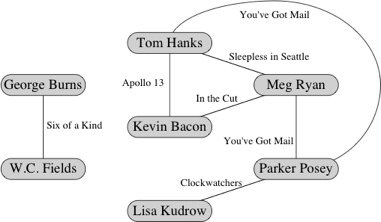

**NOTE:** You should not attempt to start coding this lab assignment until
*after* you have completed [short assignment 9](../../sa/sa9/sa9.html).

All the provided files can be found here: <a href="resources/bacon.zip">bacon.zip</a>.

This problem set tackles the important social network problem of finding an actor's
"Bacon number". Starting with an actor, see if they have been in a movie with
someone who has been in a movie with someone who has been in a movie ... who has
been in a movie with Kevin Bacon. They're usually at most 6 steps away. There
are plenty of other 6-degrees-of-separation phenomena in social networks. In a
geekier version, the center of the universe is Paul Erdos, a profilic author and
coauthor, and people are characterized by their <a href="http://www.oakland.edu/enp">Erdos numbers</a>.
The highest known finite Erdos number is 13. Remarkably, there are a
<a href="http://en.wikipedia.org/wiki/Erdős–Bacon_number">number of people</a> who
have both small Erdos numbers and small Bacon numbers (number = steps away).
Dan Kleitman has total Erdos-Bacon number of 3 (Erdos 1, Bacon 2), but the Bacon
number is due to a role as an extra. Danica McKellar has an Erdos-Bacon number
of 6, and is both a professional actress (<i>The Wonder Years</i> and <i>West Wing</i>)
and wrote a published math paper as well as supplemental math texts designed for
teenage girls (<i>Math Doesn't Suck</i>, <i>Kiss My Math</i>, and
<i>Hot X: Algebra Exposed</i>).

## Background ##

In this problem you will write a program to play the Kevin Bacon game. The vertices
in this network are actors and the edge relationship is "appeared together in a
movie". The goal is to find the shortest path between two actors. Traditionally
the goal is to find the shortest path to Kevin Bacon. The following output
from the sample solution shows how the game is played:

```
To quit the program, type return in answer to a question.
Enter the name of an actor: Diane Keaton
Diane Keaton's number is 2
Diane Keaton appeared in Hanging Up (2000) with Meg Ryan
Meg Ryan appeared in In the Cut (2003) with Kevin Bacon

Enter the name of an actor: Buster Keaton
Buster Keaton's number is 5
Buster Keaton appeared in Limelight (1952) with Claire Bloom
Claire Bloom appeared in Haunting, The (1963) with Julie Harris
Julie Harris appeared in Requiem for a Heavyweight (1962) with Mickey Rooney
Mickey Rooney appeared in Erik the Viking (1989) with Tim Robbins
Tim Robbins appeared in Mystic River (2003) with Kevin Bacon

Enter the name of an actor:
```

So based on the data set we supply for this problem, Diane Keaton's Bacon Number
is two, and Buster Keaton's Bacon Number is five.

The easiest way to play the Kevin Bacon game is to do what is called breadth-first
search (BFS) in the movie data graph. This builds a tree of shortest paths from
every actor who can reach Kevin Bacon back to Kevin Bacon. Or more generally,
given a root BFS builds a shortest-path tree from every vertex that can reach the
root back to the root. It is a tree where every vertex points to its parent, and
the parent is the next vertex in a shortest path to the root.

To implement BFS we use a queue. We also need an undirected graph, which can be
represented using the class <code>AdjacencyListGraphMap</code> from class. The
result of our BFS is the shortest-path tree described above. You will be developing
a class <code>DirectedAdjListMap</code> for the short assignment, and should use
this to represent the tree. If you wish you may use the sample solution which
will be posted on Friday.

The pseudocode describing BFS is:

```
insert root into an empty queue Q and into a new directed graph T

until Q is empty
  dequeue Q to get next vertex v to process
    for each edge e that is incident to v in G
      let v' be the other end of the edge
      if v' is not in T
        add v' to T and add an edge with the same label as e from v' to v in T
        enqueue v' in Q
return T
```

When you are done, T holds a shortest-path or BFS tree. To find the Bacon number
of an actor, look the actor up in T. If there is no vertex for that actor in T,
then the actor is not connected to the root. If the actor is there, follow edges
of T back to the root, printing movies (edge labels) and actors (vertices) along
the way.

## Exercises ##

For this assignment, you may work either alone, or with one other partner. Same
discussion as always about partners.

1. Implement BFS as described above. Test your function on a simple graph with
the following vertices and edges:

    ```
    vertices:
      "Kevin Bacon", "actor1", "actor2", "actor3", "actor4", "actor5", "actor6"

    edges:
      ("Kevin Bacon", "actor1", "movie1")
      ("Kevin Bacon", "actor2", "movie1")
      ("actor1", "actor2", "movie1")
      ("actor1", "actor3", "movie2")
      ("actor3", "actor2", "movie3")
      ("actor3", "actor4", "movie4")
      ("actor5", "actor6", "movie5")
    ```

2. Read in a larger dataset from <a href="resources/bacon.zip">bacon.zip</a> (thanks
   to Brad Miller at Luther College) and construct a graph from it. The three main
   files, actors.txt, movies.txt, and movie-actors.txt are large &mdash; 9,235 actors,
   7,067 movies, adn 21,370 movie-actor pairs, resulting in 32,337 edges. So
   while you are developing your program use the smaller versions: actorsTest.txt,
   moviesTest.txt, movie-actorsTest.txt, whose data represent the graph specified
   above. Visually, the graph produced from the smaller files looks like this:

    {:refdef: style="text-align: center;"}
    
    {: refdef}

     In this small graph, Tom Hanks and Meg Ryan have Kevin Bacon numbers of 1,
     Parker Posey's Kevin Bacon number is 2, and Lisa Kudrow's Kevin Bacon number
     is 3. W.C. Fields and George Burns have *infinite* Kevin Bacon numbers, since
     there is no path between them and Kevin Bacon. A query for Lisa Kudrow could
     produce the following output:

    ```
    Enter the name of an actor: Lisa Kudrow
    Lisa Kudrow's Kevin Bacon number is 3.
    Lisa Kudrow appeared in Clockwatchers (1997) with Parker Posey.
    Parker Posey appeared in You've Got Mail (1998) with Tom Hanks.
    Tom Hanks appeared in Apollo 13 (1995) with Kevin Bacon.
    ```

     In fact, there are two paths with three edges between Lisa Kudrow and Kevin
     Bacon. Instead of going through Tom Hanks, the path could have gone through Meg
     Ryan. That's OK, because we don't need all the paths with fewest edges to Kevin
     Bacon; we just need one of them.

     The files are all formatted the same way. Each line has two quantities
     separated by a "|". In the actors file the quantities are actorID and actorName.
     In the movies file they are movieID and movieName. In the movies-actors file
     they are movieID and actorID, indicating that the actor associated with actorID
     appeared in the movie associated with movieID.

     Use the file contents to build a graph whose vertices are labeled with actor
     names (not IDs). Create an edge between two actors if they appeared in the
     same movie, and label that edge with the name of that movie. You should assume
     that no movie appears twice in the movies file and that no actor appears twice
     in the actors file. It is OK for there to be multiple edges between a pair of
     actors if they appeared together in multiple movies. You may find it useful
     to create maps for mapping IDs to actor names and IDs to movie names. You can
     also use a map to figure out which actors appeared in each movie, and can use
     that information to add the appropriate edges to the graph. This may take a
     little thought, but try it by hand on the small data set given above.

     A piece of advice about processing the lines of the input files. For each
     line of each file, you will need to find the string to the left of the pipe
     symbol and the string to the right of the pipe symbol. I suggest using the
     familiar split method that we've used before for String objects. One catch here
     is that the pipe character is a special character that you will need to "escape".
     In such a case, a line like this should work:

        line.split("\\|");

     where line is some String from a file that has data separated by pipes.

     This is just an FYI for those of you that haven't dealt much with escaping
     characters in Strings -- you can find more info about this on the web or in
     the book.

3. Implement the Bacon game. Perform BFS on the graph with "Kevin Bacon" as root
   and hold onto the BFS tree returned. Then ask for a series of actors. For each
   one, print out the path between that actor and the source, or say that none exists.
   This will require following a path from the chosen actor in the BFS tree back to
   the root. (See above for an example of how this might be formatted.) If the user
   gives a name that is not in the original graph (not the tree) say so and prompt again.

    Test your program on the movieTest.txt, actorTest.txt, and movie-actorTest.txt
    files. Make sure to demonstrate that you program works for boundary conditions.
    When you are sure that your program works on the test data, change it to use the
    movie.txt, actor.txt, and movie-actor.txt files. Demonstrate that your program
    works for these as well.

#### Some hints... ####

* From the three input files, you will need to form an undirected graph (use
  <code>AdjacencyListGraphMap</code>), which we call the **Bacon graph** (though there's
  nothing special about Kevin Bacon's place in the graph). It should be like the
  one above for the test files.

* Don't go defining your own/new classes for graphs. Use <code>AdjacencyListGraphMap</code>
  and <code>DirectedAdjacencyListMap</code> (which you wrote in sa9) as needed.
  (You may used the sample solution to sa9 instead of your code if you prefer.)

* The graph classes takes generic types <code>V</code> and <code>E</code>. <code>V</code>
  is the type of the information stored in each vertex; you'll want it to be String
  because it's an actor's name. <code>E</code> is the type of information stored
  in each **edge** (in addition to the vertices on which it is incident); you'll
  want it to be String again, this time because it's the title of a movie.

* The main program given in sa9 for testing your DirectedAdjacencyListMap methods
  gives examples of how to create a graph, add vertices and edges, iterate through
  incident edges, and catch exceptions. You might want to look at it.

#### Some extra credit suggestions (other possibilities welcome too): ####

  * Compute some interesting statistics about this graph. Some possible examples:
  Find an actor with the largest finite Bacon number for this data set. Find the
  average Bacon number for those actors with finite Bacon numbers. Find the
  destination actor that minimizes either longest path length or average path
  length from all other actors.

  * It is annoying that if you don't get the exact form of the name you will not
  find the actor. For example, if you type "Timothy Allen" instead of "Tim Allen",
  "Kate Blanchett" instead of "Cate Blanchett" or "Katherine Hepburn" instead of
  "Katharine Hepburn" you will not find the actor. Devise some sort of scheme
  for finding "near matches" and reporting near matches to the name entered, so
  the user can re-enter the correct form of the name.

  * This movie data is a bit out of date now. Find a newer or more comprehensive
  dataset (perhaps by way of querying some web service). Or do a six-degree-of-separation
  game with a different social network.

  * Reformat the data into Gephi format. Then set up a Bacon game Gephi module,
  that plays the game on a graph loaded into the software.

## Submission Instructions ##

Turn in your code and test results. The code should implement BFS, read the files
and produce the graph, and play the game. The tests should show the graph constructed
from the hand-coded example and from the Test files, and example runs playing the game.

## Grading rubric ##

Total of 100 points.

### Correctness (70 points) ###

<table class="rubric">
  <tr><th>5</th><td>Reads data files</td></tr>
  <tr><th>5</th><td>Cross-indexes IDs to names</td></tr>
  <tr><th>10</th><td>Creates the graph</td></tr>
  <tr><th>10</th><td>BFS: loop over queue to visit</td></tr>
  <tr><th>10</th><td>BFS: maintain tree</td></tr>
  <tr><th>15</th><td>Path trace from actor back to Kevin Bacon</td></tr>
  <tr><th>10</th><td>Interactive interface (read names, print results)</td></tr>
  <tr><th>5</th><td>Handles boundary cases correctly</td></tr>
</table>

### Structure (10 points) ###

<table class="rubric">
 <tr><th>4</th><td>Good decomposition into objects and methods</td></tr>
 <tr><th>3</th><td>Proper use of instance and local variables</td></tr>
 <tr><th>3</th><td>Proper use of parameters</td></tr>
</table>

### Style (10 points) ###

<table class="rubric">
 <tr><th>3</th><td>Comments for classes and methods</td></tr>
 <tr><th>4</th><td>Good names for methods, variables, parameters</td></tr>
 <tr><th>3</th><td>Layout (blank lines, indentation, no line wraps, etc.)</td></tr>
</table>

### Testing (10 points) ###

<table class="rubric">
  <tr><th>5</th><td>Include all of the test runs specified above.</td></tr>
  <tr><th>5</th><td>Demonstrate that the code works for boundary cases</td></tr>
</table>
