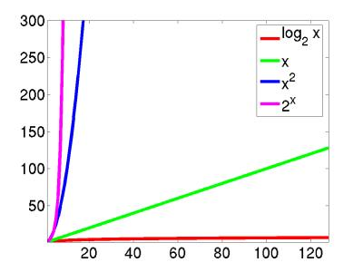
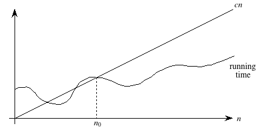

We spent the past couple of lectures looking at linked lists and talking about various
operations (add, remove, search), and one of the last topics that we looked at had
to do with looking at variations in how a Singly Linked List could be implemented. This
came up as a result of finding out that some operations that are easy to do in
Doubly Linked Lists with a Sentinal are *not* as easy to do in Singly Linked Lists.
As you'll see when you work through lab 3 (released today), some of the updates you
will make to the implementation of a SLL are in fact to make certain operations more
*efficient*. People have also asked insightful questions during lecture as to how
*efficient* certain things are that we've done in Java &mdash; today, we
will talk about this very issue!

Specifically, today we'll do a quick overview / review of the basic ways to characterize
algorithmic complexity (both time and space).  Chapter 4 of our textbook provides
much more detail that we simply don't have time to cover in lecture, so please
check that out also!

## Outline
{:.no_toc}

* Outline
{:toc}

## Orders of growth

Let's consider the following four algorithms on an array whose length is <i>n</i>.
(I'm assuming you're familiar with these algorithms; give a yell if not.)

* Binary search runs in time proportional to <i>log(n)</i>

* Sequential search runs in time proportional to <i>n</i>

* Many sorting algorithms (such as selection sort) run in time proportional to <i>n</i>&sup2;.
So does any algorithm that deals with all the pairs of numbers runs in time proportional
to <i>n</i>&sup2; (think of a round-robin tournament).    For example, given {1, 2, 3, 4, 5}, compute:

    <table>
    <tr><td>1+1</td><td>2+1</td><td>...</td><td>5+1</td></tr>
    <tr><td>1+2</td><td>2+2</td><td>...</td><td>5+2</td></tr>
    <tr><td>1+3</td><td>2+3</td><td>...</td><td>5+3</td></tr>
    <tr><td>1+4</td><td>2+4</td><td>...</td><td>5+4</td></tr>
    <tr><td>1+5</td><td>2+5</td><td>...</td><td>5+5</td></tr>
    </table>

    There are <i>n</i> rows and <i>n</i> columns, so <i>n</i>\*<i>n</i> entries.

* Algorithms that deal with all possible combinations of the items
run in time 2<i>n</i>.   
For example, given {1, 2, 3, 4, 5}, compute:

    1. 1, 2, 3, 4, 5
    2. 1+2, 1+3, 1+4, 1+5, 2+3, 2+4, 2+5, 3+4, 3+5, 4+5
    3. 1+2+3, 1+2+4, 1+2+5, 1+3+4, 1+3+5, ...
    4. 1+2+3+4, ...
    5. 1+2+3+4+5, ...

    (Also think of all possible ways that <i>n</i> coin tosses could turn out, or all possible games of chess.)

Now, computers are always getting faster, but these "orders of growth" help us
see at a glance the inherent differences in run-time for different algorithms.
Supposing a computer could do a single operation in 0.0001 second, we'd have the
following total amounts of time, for various problem sizes and various orders of growth.

<table>
<tr><th>order</th><th>10</th><th>50</th><th>100</th><th>1000</th></tr>
<tr><td><i>log(n)</i></td><td>0.0003 s</td><td>0.0006 s</td><td>0.0007 s</td><td>0.001 s</td></tr>
<tr><td><i>n</i></td><td>0.001 s</td><td>0.005 s</td><td>0.01 s</td><td>0.1 s</td></tr>
<tr><td><i>n</i>&sup2;</td><td>0.01 s</td><td>0.25 s</td><td>1 s</td><td>1.67 min</td></tr>
<tr><td>2<i>n</i></td><td>0.1024 s</td><td>3570 yrs</td><td>4x1018 yrs</td><td>forget about it</td></tr>
</table>

Clearly, when designing algorithms we need to be careful. For example, a brute-force
chess algorithm has runtime 2<i>n</i> which makes it completely impractical.
Interestingly, though, this type of complexity can help us. In particular, the
reason that it is difficult for someone to crack your password is because the
best known algorithm for cracking passwords runs in 2<i>n</i> time
(specifically factoring large numbers into primes).

## Big O, &Theta; and &Omega;

So if we're willing to characterize an overall "order of growth", as above, we
can get a handle on the major differences.  This notion of "grows like" is the
essence of the running time &mdash; linear search's running time "grows like"
<i>n</i> and binary search's running time "grows like" <i>log(n)</i>.  Computer
scientists use it so frequently that we have a special notation for it: "big-Oh"
notation, which we write as "<i>O</i>-notation."

For example, the running time of linear search is always at most some linear
function of the input size <i>n</i>.  Ignoring the coefficients and low-order
terms, we write that the running time of linear search is <i>O</i>(<i>n</i>).
You can read the <i>O</i>-notation as "order."  In other words, <i>O</i>(<i>n</i>)
is read as "order <i>n</i>."  You'll also hear it spoken as "big-Oh of <i>n</i>"
or even just "Oh of <i>n</i>."

Similarly, the running time of binary search is always at most some logarithmic
function of the input size <i>n</i>.  Again ignoring the coefficients and low-order
terms, we write that the running time of binary search is <i>O</i>(lg <i>n</i>),
which we would say as "order log <i>n</i>," "big-Oh of log <i>n</i>," or "Oh of
log <i>n</i>."

In fact, within our <i>O</i>-notation, if the base of a logarithm is a constant
(like 2), then it doesn't really matter.  That's because of the formula

> log<i>a</i> <i>n</i> = (log<i>b</i> <i>n</i>) / (log<i>b</i> <i>a</i>)

for all positive real numbers <i>a</i>, <i>b</i>, and <i>c</i>.  In other words,
if we compare log<i>a</i> <i>n</i> and log<i>b</i> <i>n</i>,
they differ by a factor of log<i>b</i> <i>a</i>, and this factor is a
constant if <i>a</i> and <i>b</i> are constants.  Therefore, even though we use
the "lg" notation within <i>O</i>-notation, it's irrelevant that we're really
using base-2 logarithms.

<i>O</i>-notation is used for what we call "asymptotic upper bounds."
By "asymptotic" we mean "as the argument (<i>n</i>) gets large."  By
"upper bound" we mean that <i>O</i>-notation gives us a bound from
above on how high the rate of growth is.

Here's the technical definition of <i>O</i>-notation, which will
underscore both the "asymptotic" and "upper-bound" notions:

> A running time is <i>O</i>(<i>n</i>) if there exist
> positive constants <i>n</i>0 and <i>c</i> such that for all
> problem sizes <i>n</i> &#x2265; <i>n</i>0, the running time
> for a problem of size <i>n</i> is at most <i>cn</i>.

Here's a helpful picture:

The "asymptotic" part comes from our requirement that we care only about what
happens at or to the right of <i>n</i>0, i.e., when <i>n</i> is large.
The "upper bound" part comes from the running time being <em>at most</em> <i>cn</i>.
The running time can be less than <i>cn</i>, and it can even be a lot less.
What we require is that there exists some constant <i>c</i> such that for sufficiently
large <i>n</i>, the running time is bounded from above by <i>cn</i>.

For an arbitrary function <i>f</i>(<i>n</i>), which is not necessarily linear,
we extend our technical definition:

> A running time is <i>O</i>(<i>f</i>(<i>n</i>)) if there exist positive constants
> <i>n</i>0 and <i>c</i> such that for all problem sizes <i>n</i> &#x2265; <i>n</i>0,
> the running time for a problem of size <i>n</i> is at most <i>c</i> <i>f</i>(<i>n</i>).

A picture:

Now we require that there exist some constant <i>c</i> such that for sufficiently
large <i>n</i>, the running time is bounded from above by <i>c</i> <i>f</i>(<i>n</i>).

Actually, <i>O</i>-notation applies to functions, not just to running times. But
since our running times will be expressed as functions of the input size <i>n</i>,
we can express running times using <i>O</i>-notation.

In general, we want as <strong>slow</strong> a rate of growth as possible, since
if the running time grows slowly, that means that the algorithm is relatively
fast for larger problem sizes.

We usually focus on the <strong>worst case</strong> running time, for several reasons:

* The worst case time gives us an upper bound on the time
  required for <strong>any</strong> input.

* It gives a <strong>guarantee</strong> that the algorithm
  <strong>never</strong> takes any longer.

* We don't need to make an educated guess and hope that the
  running time never gets much worse.

You might think that it would make sense to focus on the "average case" rather
than the worst case, which is exceptional.  And sometimes we do focus on the average
case.  But often it makes little sense.  First, you have to determine just what
<em>is</em> the average case for the problem at hand.  Suppose we're searching.
In some situations, you find what you're looking for early.  For example, a video
database will put the titles most often viewed where a search will find them quickly.
In some situations, you find what you're looking for on average halfway through
all the data&hellip;for example, a linear search with all search values equally
likely.  In some situations, you usually don't find what you're looking for.

It is also often true that the average case is about as bad as the
worst case.  Because the worst case is usually easier to identify than
the average case, we focus on the worst case.

Computer scientists use notations analogous to <i>O</i>-notation for "asymptotic
lower bounds" (i.e., the running time grows <em>at least</em> this fast) and
"asymptotically tight bounds" (i.e., the running time is <em>within a constant
factor</em> of some function).  We use &Omega;-notation (that's the Greek leter
"omega") to say that the function grows "at least this fast".  It is almost the
same as Big-O notation, except that is has an "at least" instead of an "at most":

> A running time is <i>&Omega;</i>(<i>n</i>) if there exist positive constants
> <i>n</i>0 and <i>c</i> such that for all problem sizes <i>n</i> &#x2265; <i>n</i>0,
> the running time for a problem of size <i>n</i> is at least <i>cn</i>.

We use &Theta;-notation (that's the Greek letter "theta") for asymptotically tight bounds:

> A running time is &Theta;(<i>f</i>(<i>n</i>)) if there exist positive constants
> <i>n</i>0, <i>c</i>1, and <i>c</i>2 such that
> for all problem sizes <i>n</i> &#x2265; <i>n</i>0, the running time
> for a problem of size <i>n</i> is at least <i>c</i>1 <i>f</i>(<i>n</i>)
> and at most <i>c</i>2 <i>f</i>(<i>n</i>).

Pictorially,

In other words, with &Theta;-notation, for sufficiently large problem sizes, we
have nailed the running time to within a constant factor.  As with <i>O</i>-notation,
we can ignore low-order terms and constant coefficients in &Theta;-notation.

Note that &Theta;-notation subsumes <i>O</i>-notation in that

> If a running time is &Theta;(<i>f</i>(<i>n</i>)), then it is also <i>O</i>(<i>f</i>(<i>n</i>)).

The converse (<i>O</i>(<i>f</i>(<i>n</i>)) implies &Theta;(<i>f</i>(<i>n</i>)))
does not necessarily hold.

The general term that we use for either <i>O</i>-notation or &Theta;-notation is
<strong>asymptotic notation</strong>.

### Recap

Both asymptotic notations&mdash;<i>O</i>-notation and &Theta;-notation&mdash;provide
ways to characterize the <strong>rate of growth</strong> of a function <i>f</i>(<i>n</i>).
For our purposes, the function <i>f</i>(<i>n</i>) describes the running time of
an algorithm, but it really could be any old function.  Asymptotic notation describes
what happens as <i>n</i> gets large; we don't care about small values of <i>n</i>.
We use <i>O</i>-notation to bound the rate of growth from above to within a constant
factor, and we use &Theta;-notation to bound the rate of growth to within constant
factors from both above and below.

We need to understand when we can apply each asymptotic notation.  For example,
in the worst case, linear search runs in time proportional to the input size <i>n</i>;
we can say that linear search's worst-case running time is &Theta;(<i>n</i>).
It would also be correct, but less precise, to say that linear search's worst-case
running time is <i>O</i>(<i>n</i>).  Because in the best case, linear search finds
what it's looking for in the first array position it checks, we cannot say that
linear search's running time is &Theta;(<i>n</i>) in <em>all</em> cases.  But we
<em>can</em> say that linear search's running time is <i>O</i>(<i>n</i>) in <em>all</em> cases,
since it never takes longer than some constant times the input size <i>n</i>.

## Working with asymptotic notation

Although the definitions of <i>O</i>-notation and &Theta;-notation may seem a bit
daunting, these notations actually make our lives easier in practice.  There are
two ways in which they simplify our lives.

I won't go through the math that follows in class.  You may read it, in the context
of the formal definitions of <i>O</i>-notation and &Theta;-notation, if you wish.
For now, the main thing is to get comfortable with the ways that asymptotic notation
makes working with a function's rate of growth easier.

#### Constant factors don't matter

Constant multiplicative factors are "absorbed" by the multiplicative
constants in <i>O</i>-notation (<i>c</i>) and &Theta;-notation
(<i>c</i>1 and <i>c</i>2).  For example, the
function 1000<i>n</i>2 is &Theta;(<i>n</i>2),
since we can choose both <i>c</i>1 and <i>c</i>2
to be 1000.

Although we may care about constant multiplicative factors in practice, we focus
on the rate of growth when we analyze algorithms, and the constant factors don't
matter.  Asymptotic notation is a great way to suppress constant factors.

#### Low-order terms don't matter, either

When we add or subtract low-order terms, they disappear when using asymptotic notation.
For example, consider the function <i>n</i>2 + 1000<i>n</i>.  I claim that
this function is &Theta;(<i>n</i>2).  Clearly, if I choose <i>c</i>1 = 1,
then I have <i>n</i>2 + 1000<i>n</i> &#x2265; <i>c</i>1<i>n</i>2,
so this side of the inequality is taken care of.

The other side is a bit tougher.  I need to find a constant <i>c</i>2 such
that for sufficiently large <i>n</i>, I'll get that <i>n</i>2 + 1000<i>n</i> &#x2264;
<i>c</i>2<i>n</i>2.  Subtracting <i>n</i>2 from
both sides gives 1000<i>n</i> &#x2264; <i>c</i>2<i>n</i>2 &ndash;
<i>n</i>2 = (<i>c</i>2 &ndash; 1) <i>n</i>2.
Dividing both sides by (<i>c</i>2 &ndash; 1) <i>n</i> gives 1000 / (<i>c</i>2 &ndash; 1) &#x2264; <i>n</i>.
Now I have some flexibility, which I'll use as follows.  I pick <i>c</i>2 = 2,
so that the inequality becomes 1000 / (2 &ndash; 1) &#x2264; <i>n</i>, or 1000 &#x2264; <i>n</i>.
Now I'm in good shape, because I have shown that if I choose <i>n</i>0 = 1000 and <i>c</i>2 = 2,
then for all <i>n</i> &#x2265; <i>n</i>0, I have 1000 &#x2264; <i>n</i>,
which we saw is equivalent to <i>n</i>2 + 1000<i>n</i> &#x2264;
<i>c</i>2<i>n</i>2.

The point of this example is to show that adding or subtracting low-order terms
just changes the <i>n</i>0 that we use.  In our practical use of
asymptotic notation, we can just drop low-order terms.

#### Combining them

In combination, constant factors and low-order terms don't matter.  If we see a
function like 1000<i>n</i>2 &ndash; 200<i>n</i>, we can ignore the
low-order term 200<i>n</i> and the constant factor 1000, and therefore we can
say that 1000<i>n</i>2 &ndash; 200<i>n</i> is &Theta;(<i>n</i>2).

#### When to use <i>O</i>-notation vs. &Theta;-notation

As we have seen, we use <i>O</i>-notation for asymptotic upper bounds and &Theta;-notation
for asymptotically tight bounds.  &Theta;-notation is more precise than <i>O</i>-notation.
Therefore, we prefer to use &Theta;-notation whenever it's appropriate to do so.

We shall see times, however, in which we cannot say that a running time is tight
to within a constant factor both above and below.  Sometimes, we can only bound a
running time from above.  In other words, we might only be able to say that the
running time is no worse than a certain function of <i>n</i>, <em>but it might be
better</em>.  In such cases, we'll have to use <i>O</i>-notation, which is perfect
for such situations.

## List analysis

Both list implementations support the same interface. When would we choose one
over the other?

**Linked list:** efficient if we're adding / removing / getting / setting at the front
of the list. Constant time, in fact. But in the worst case we might have to advance
all the way through the list — Θ(n).

**Growing array:** efficient if we're getting / setting an index already within
the size of the filled in elements. Adding / removing at the end is efficient
(except when we have to grow), but in the worst case we might have to shift over
the entire array — Θ(n). What about that growing bit? While any individual growing
step will be slow, it doubles the length of the array, so will last a while. Thus
we won't have to grow it again till we add as many elements to the array as we
already have. Thus on average, it's not so expensive.

We can make this argument tighter, and argue that n add operations will never
take more than O(n) time. This is O(1) amortized time. Amortization is what
accountants do when saving up to buy an expensive item like a computer. Suppose
that you want to buy a computer every 3 years and it costs `$1500`. One way to think
about this is to have no cost the first two years and `$1500` the third year. An
alternative is to set aside `$500` each year. In the third year you can take the
accumulated `$1500` and spend it on the computer. So the computer costs `$500` a year,
amortized. (In tax law it goes the other direction - you spend the `$1500`, but
instead of being able to deduct the whole thing the first year you have to spead
it over the 3 year life of the computer, and you deduct `$500` a year.)

For the growing array case, we can think in terms of tokens that can pay for copying
an element. We charge 3 tokens for each add. One pays for adding the item to the
array and two are set aside for later. Suppose that we have just expanded the array
from size n to size 2n and copied the items in the old array to the first n positions
of the new array. We have no accumulated tokens. The last n positions of the array
are empty, so we will be able to do n add operations before the new array is full
with 2n items in it. Each add sets aside 2 tokens. After n add operations we will
have accumulated 2n tokens. That is enough to pay for copying all 2n things in the
array when we do the next add and have to double the array size again. Therefore
the cost is O(1) per add operation, amortized. (The current implementation of
ArrayList in Java makes the new array 3/2 times the size of the old array to waste
less space, but the argument can be modified to show that a charge of 4 tokens works.)
