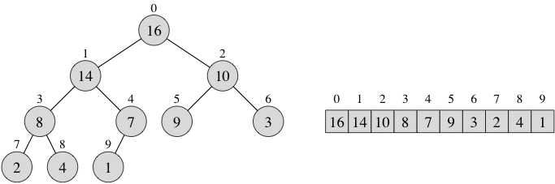

## Outline
{:.no_toc}

* Outline
{:toc}
# February 4: Prioritizing #

<a href="../13/13.html">[prev]</a>
<a href="../15/15.html">[next]</a> 

We have seen how to keep things in last-in/first-out (LIFO) or first-in/first-out (FIFO) 
order. But what if we actually have specific priorities, such that the "most important" 
thing in should be the first out? That's what priority queues are for.

<ul class="outline">
 <li><a href="#pq">Priority queues</a></li>
 <li><a href="#al">ArrayList implementations</a></li>
 <li><a href="#heap">Heaps</a></li>
 <li><a href="#heapsort">Heapsort</a></li>
</ul>

All the code files for today: 
<a href="resources/MinPriorityQueue.java">MinPriorityQueue.java</a> |
<a href="resources/ArrayListMinPriorityQueue.java">ArrayListMinPriorityQueue.java</a> |
<a href="resources/SortedArrayListMinPriorityQueue.java">SortedArrayListMinPriorityQueue.java</a> |
<a href="resources/HeapMinPriorityQueue.java">HeapMinPriorityQueue.java</a> |
<a href="resources/Heapsort.java">Heapsort.java</a> |
<a href="resources/Heapsort.ppt">Heapsort.ppt</a>

<!-- We have this file but don't reference it in the course notes...
    <a href="resources/SortedArrayMinPriorityQueue.java">SortedArrayMinPriorityQueue.java</a>
-->

<h2>Priority queues</h2>

A <em>priority queue</em> is a queue which instead of being FIFO is Best Out. "Best" 
is defined by a priority. For a typical priority queue, low priority numbers are 
removed first. That may seem backwards, but think of "you are our number one 
priority!" That's better than being their number two or three priority.

There are hundreds of applications of priority queues. They come up quite commonly in 
computer systems (high-priority print jobs, various priority levels of jobs running 
on a time sharing system, ...). They are used in finding shortest paths and other 
search problems. And a priority queue gives you an easy way to sort &mdash; put 
everything into the priority queue, then take them out one at a time. They come 
out in sorted order.

Min-priority queues also form the heart of discrete event simulators, which 
simulate systems in which things happen at various moments in time. The simulation 
runs through time, where the time of each occurrence is nondecreasing (i.e., 
the simulated time either increases or stays the same&mdash;it never backs up). 
An event can cause another event to occur at some later time. A min-priority queue 
keeps track of the events that have yet to occur, with the key of an element 
being the time that its event is to occur. When an event is created, the insert 
method adds it to the min-priority queue. The extractMin method tells us the next 
event to occur, removing it from the queue so that we don't try to process it 
more than once. Sometimes, the result of an event is to allow some other event, 
already scheduled, to occur even earlier; in this case, the decreaseKey method 
changes the time that the other event occurs to move it earlier.

<a href="resources/MinPriorityQueue.java">MinPriorityQueue.java</a> contains the 
interface for a <strong>min-priority queue</strong>. Here, each element has a value, 
which we call its <strong>key</strong>. The way that we have defined the interface, 
the generic type is E extends Comparable&lt;E&gt; &mdash; as we saw with BSTs, 
this lets us rely on a compareTo() method of the elements, to establish the 
priority order. The MinPriorityQueue interface supports the following operations:

<ul>
 <li> isEmpty, a predicate that tells whether the priority queue is empty.</li>
 <li> insert, which inserts an element into the priority queue.</li>
 <li> minimum, which returns the element in the priority queue with the smallest key, but leaves the element in the priority queue.</li>
 <li> extractMin, which returns the element in the priority queue with the smallest key and removes it from the priority queue.</li>
</ul>

(Note - for some applications it is useful to also have a decreaseKey operation, 
which reduces the priority value in a given node, but this complicates the job of 
implementing a priority queue. You will see how to handle this if you take CS 31.)

We can also define a <strong>max-priority queue</strong>, which replaces the latter 
operations by maximum and extractMax (and increaseKey if you include it). We will 
focus on min-priority queues, but they are really the same thing.

Java provides a class java.util.PriorityQueue, although surprisingly no interface 
for a general priority queue. This implementation is based on a heap, which we 
will see later today. However, as usual Java chooses different names. The correspondence 
is:

<ul>
 <li>isEmpty remains isEmpty</li>
 <li>insert becomes add</li>
 <li>minimum becomes peek</li>
 <li>extractMin becomes remove</li>
</ul>

Remember that with the **Comparable** interface, we use the one.compareTo(other) to 
decide if one is "less than" (the value is negative), "equal to" (the value is 0), 
or "greater than" (the value is positive) the other. There is another way to compare two 
objects: the **Comparator** interface. *The book discusses this on p. 363*. You implement 
the method compare(a, b) and give the same negative, zero, or positive result as 
in compareTo. The Java PriorityQueue class will use "natural order" (meaning the 
results of compareTo) if you call the constructor with no arguments. If you want 
to use a Comparator you call a constructor that takes two arguments: the initial 
size of the queue and a Comparator object. This is more flexible, because you 
can define different orders for different purposes.

<h2>ArrayList implementations</h2>

<h3>Unsorted arraylist</h3>

The simplest way to implement a min-priority queue is by an arraylist whose 
elements may appear in any order: <a href="resources/ArrayListMinPriorityQueue.java">ArrayListMinPriorityQueue.java</a>. 
The methods of this class are straightforward.

The private method indexOfMinimum computes and returns the index in the array of 
the element with the smallest key. This method is called by the minimum and 
extractMin methods. extractMin seems a bit strange. Instead of removing the 
smallest element it moves the last element to the place where the smallest 
element was and then removes the last element. It does this because removing the 
last element is faster than removing an element from the middle of the arraylist.

Let's look at the worst-case running times of the min-priority queue operations 
in this implementation. We express them in terms of the number <i>n</i> of elements 
that will ever be in the min-priority queue at any one time.

<ul>
 <li> isEmpty just returns a boolean indicating whether
    the size of the arraylist is zero. This
    method takes constant time, or &Theta;(1).</li>
 <li> insert just adds a new reference at the end of
    the arraylist, and so it takes &Theta;(1) amortized time.</li>
 <li> Both the minimum and extractMin
    methods call indexOfMinimum to find the element
    with the smallest key. This helper method takes &Theta;(<i>n</i>)
    time to search through <i>n</i> elements, and therefore
    so do minimum and extractMin.</li>
</ul>

<h3>Sorted arraylist</h3>

The biggest disadvantage of implementing a min-priority queue by an unsorted 
arraylist is that minimum and extractMin take &Theta;(<i>n</i>) time. We can 
get the running time of these operations down to &Theta;(1) if we keep the 
arraylist sorted between operations. 
<a href="resources/SortedArrayListMinPriorityQueue.java">SortedArrayListMinPriorityQueue.java</a> 
gives this implementation. An important detail is that it is sorted in **decreasing** 
order, so that the last position is the minimum.

The minimum method is simpler now: it just returns the element in position size-1 
of the arraylist. The extractMin method removes and returns the element in position 
size-1. Thus both of these operations take &Theta;(1) time.

The tradeoff is that, although minimum and extractMin now take only &Theta;(1) 
time, we find that insert takes <i>O</i>(<i>n</i>) time. So we have not improved 
matters by maintaining the array as sorted, unless we are making a lot more calls 
to minimum and extractMin than to insert. In practice, the number of calls to 
extractMin is often the same as the number of calls to insert, so we gain no 
overall advantage from keeping the array sorted.

So can we do better? Yes, we can use a data structure called a **heap**.

<h2>Heaps</h2>

Heaps are based on binary trees. Recall that we call the unique node above a 
node, say node <i>i</i>, the <strong>parent</strong> of <i>i</i>. The nodes 
below node <i>i</i> are the <strong>children</strong> of <i>i</i>. In a 
<strong>binary tree</strong>, every node has 0, 1, or 2 children. The line we 
draw between two nodes represents an <strong>edge</strong>.

A <strong>heap</strong> is an array that we can view as a "nearly complete" 
binary tree. In other words, we fill in the tree from the root down toward the 
leaves, level by level, not starting a new level until we have filled the previous 
level. This is the <strong>shape property</strong> of a heap. For example, here's 
a heap and its representation in an array (the same representation works for an 
arraylist). Each node of the heap has its index in the array appearing above the 
node, and its contents appear within the node.

It's easy to compute the array index of a node's parent, left child, or right 
child, given the array index <i>i</i> of the node:

<ul>
 <li> The parent is at index (<i>i</i>-1)/2 (using integer division).</li>
 <li> The left child is at index 2*<i>i</i> + 1.</li>
 <li> The right child is at index 2*<i>i</i> + 2.</li>  
</ul>

We will always store a heap in an array, but given this simple scheme for determining 
parent and child indices, it's always easy to interpret the array as a binary 
tree. If we were going to be excruciatingly accurate, we would always refer to 
"the node indexed by <i>i</i>," but we will instead use the less cumbersome 
language "node <i>i</i>."

There are actually two kinds of heaps: max-heaps and min-heaps. In both kinds, 
the values in the nodes satisfy a <strong>heap property</strong>, the specifics 
depending on whether we're talking about a max-heap or a min-heap.

### Max-heap ###

In a <strong>max-heap</strong>, the nodes satisfy the <strong>max-heap property</strong>: 
<blockquote>For every node <i>i</i> other than the root, the value in the parent 
of node <i>i</i> is greater than or equal to the value in node <i>i</i>.</blockquote> 
In other words, the value in a node is at most the value in its parent. The largest 
value in a max-heap must be at the root. A <strong>subtree</strong> consists of 
a node and all the nodes below it, either directly or indirectly, and therefore 
the largest value in a subtree must be at the root of the subtree. The heap in 
the figure above is a max-heap.

### Min-heap ###

A <strong>min-heap</strong> is defined in the opposite way, so that the 
<strong>min-heap property</strong> is <blockquote>For every node <i>i</i> other 
than the root, the value in the parent of node <i>i</i> is less than or equal to 
the value in node <i>i</i>.</blockquote> In other words, the value in a node is 
at least the value in its parent. The smallest value in a min-heap must be at the 
root.

### Height of a heap ###

We define the <strong>height</strong> of a heap to be the number of edges on the 
longest path from the root down to a leaf. (Recall that a leaf is a node with 
no children.) The height of a heap with <i>n</i> nodes is &Theta;(lg <i>n</i>). 
(More precisely, the height is the greatest integer less than or equal to lg <i>n</i>.) 
Showing this property is not too hard, and the book does so on p. 371.

### Operations on a heap ###

We want to allow two operations on a max-heap: **insert** a new item, and **delete** 
the maximum item. In both operations we want to maintain both the shape and heap 
properties. The trick is for both operations to fix the shape first, and then 
to fix the heap property.

Let's consider insert. Suppose we want to insert 15 in the heap shown above. By 
the shape property, it should go into the position to the right of the value 1, 
which would be position 10 in the array. (Representing the heap in an ArrayList 
makes this insertion particularly easy.) So if we put 15 into position 10 the 
shape property is statisfied.

But what about the heap property? Everything is fine, with the possible exception 
that the newly inserted item might be bigger than its parent. (It is in our example.) 
But that is easy to fix &mdash; swap the parent and the newly inserted child. 
But the new parent may be bigger than its parent (originally its grandparent). 
We repeatedly swap until the newly inserted item is less than or equal to its 
parent or reaches the root. (In our example this would be when it arrives in 
node 1, where 14 was originally.)

What about deleting the maximum? Well, we know where the maximum is &mdash; it is 
at the root, position 0 of the array. But simply removing it would leave a hole, 
which is not allowed. Also, the heap has one fewer item, so the rightmost leaf 
at the bottom level has to disappear. We can fix both of these shape problems by 
moving the rightmost leaf (last item in the occupied portion of the array) to 
the root (position 0) and decrementing the size of the occupied portion of the array.

What does this do to the heap property? The left and right subtrees of the root 
are both valid heaps. But the root might be smaller than one or both of its 
children. Again, this is easy to fix &mdash; swap the root with its larger child. 
Its larger child will be bigger than the current root, everything in its subtree, 
and the smaller child (and thus everything in the smaller child's subtree). 
Thus it is the largest thing in the array and should be the new root. But this 
moves the problem down into the subtree - the value swapped into the subtree's 
root may violate the heap property of the subtree. But this is the same problem &mdash; 
we can repeat the operation until the thing moved to the root is a leaf or larger 
than its child or children. (Recursion can be used for both this and for insertion.)

An implementation of a min-heap in an arraylist is in 
<a href="resources/HeapMinPriorityQueue.java">HeapMinPriorityQueue.java</a>. It 
shows how to implement the operations described above.

Let's look at the worst-case running times of the min-priority queue operations 
in this implementation. We express them in terms of the number <i>n</i> of elements 
that will ever be in the min-priority queue at any one time.

<ul>
 <li> isEmpty just returns a boolean indicating whether
    the size of the arraylist is zero. This
    method takes constant time, or &Theta;(1).</li>
 <li> insert first adds a new reference at the end of
    the arraylist, which takes &Theta;(1) amortized time. It then has
    to bubble the value up the heap until it is less than its parent. 
    This takes at most the height of the heap swaps, which takes <i>O</i>(lg <i>n</i>) time.</li>
 <li> The minimum method just has to return what is in position 0 
    of the arraylist. This takes &Theta;(1) time.</li>
 
 <li> The extractMin
    method returns the element in position 0 and puts the last element in its place.
    This takes &Theta;(1) time. However, it then has to restore the heap property,
    so it has to trickle the new root down until it is smaller than both children or is a leaf.
    This also takes at most the height of the heap swaps, which takes <i>O</i>(lg <i>n</i>) time.</li>
</ul>

<h2>Heapsort</h2>

In addition to supporting priority queues, a heap is also the basis of a sorting 
algorithm called <strong>heapsort</strong>. Its running time is <i>O</i>(<i>n</i> lg <i>n</i>), 
and it sorts in place. That is, it needs no additional space for copying things 
(as mergesort does) or for a stack of recursive calls (quicksort and mergesort). 
It is a version of Selection Sort, but instead of running through the entire 
remaining array to find the next smallest item it uses a heap to organize information.

Heapsort has two major phases. First, given an array of values in an unknown order, 
we have to rearrange the values to obey the max-heap property. That is, we have 
to build a heap. Then, once we've built the heap, we repeatedly pick out the 
maximum value in the heap&mdash;which we know is at the root&mdash;put it in an 
appropriate slot in the array (by swapping it with the value in that slot), and 
restore the max-heap property. Note how convenient this is&mdash;the next spot 
to be filled in in selection sort (chosing maximums rather than minimums) goes 
precisely at the place where the heap has to shrink to maintain the shape property!

The code for heapsort is in <a href="resources/Heapsort.java">Heapsort.java</a>. 
At the bottom, you can see some private methods that help out other methods in 
the class: swap, leftChild, and rightChild.

<h3>How to build a heap</h3>

The obvious way to build a heap is to start with an unordered array. The first 
item is a valid heap. We can then insert the second item into the heap, then 
the third, etc. After we have inserted the last item we have a valid heap. This 
works fine and leads to an <i>O</i>(<i>n</i> lg <i>n</i>) heapsort. However, we 
can avoid implementing the insert code and speed up the algorithm a bit by using 
the code to restore the heap property after a deletion instead. The idea seems 
a bit strange at first, but it is really quite clever.

The code to restore a heap after a deletion is in maxHeapify method. It takes 
three parameters: the array *a* holding the heap and indices *i* and *lastLeaf* into 
the array. The heap is in the subarray a[i..lastLeaf], and when maxHeapify is 
called, we assume that the max-heap property holds everywhere except possibly 
among node i and its children. maxHeapify restores the max-heap property everywhere.

maxHeapify works as follows. It computes the indices left and right of the left 
and right children of node i, if it has such children. Node i has a left child 
if the index left is no greater than the index lastLeaf of the last leaf in the 
entire heap, and similarly for the right child.

maxHeapify then determines which node, out of node i and its children, has the 
largest value, storing the index of this node in the variable *largest*. First, if 
there's a left child, then whichever of node i and its left child has the larger 
value is stored in largest. Then, if there's a right child, whichever of the 
winner of the previous comparison and the right child has the larger value is 
stored in largest.

Once largest indexes the node with the largest value among node i and its children, 
we check to see whether we need to do anything. If largest equals i, then the 
max-heap property already is satisfied, and we're done. Otherwise, we swap the 
values in node i and node largest. By swapping, however, we have put a new, 
smaller value into node largest, which means that the max-heap property might 
be violated among node largest and its children. We call maxHeapify recursively, 
with largest taking on the role of i, to correct this possible violation.

Notice that in each recursive call of maxHeapify, the value taken on by i is one 
level further down in the heap. The total number of recursive calls we can make, 
therefore, is at most the height of the heap, which is &Theta;(lg <i>n</i>). 
Because we might not go all the way down to a leaf (remember that we stop once 
we find a node that does not violate the max-heap property), the total number 
of recursive calls of maxHeapify is <i>O</i>(lg <i>n</i>). Each call of maxHeapify 
takes constant time, not counting the time for the recursive calls. The total 
time for a call of maxHeapify, therefore, is <i>O</i>(lg <i>n</i>).

Now that we know how to correct a single violation of the max-heap property, we 
can build the entire heap from the bottom up. Suppose we were to call maxHeapify 
on each leaf. Nothing would change, because the only way that maxHeapify changes 
anything is when there's a violation of the max-heap property among a node and 
its children. Now suppose we called maxHeapify on each node that has at least one 
child that's a leaf. Then afterward, the max-heap property would hold at each of 
these nodes. But it might not hold at the parents of these nodes. So we can call 
maxHeapify on the parents of the nodes that we just fixed up, and then on the 
parents of <em>these</em> nodes, and so on, up to the root.

That's exactly how the buildMaxHeap method works. It computes the index lastNonLeaf 
of the highest-indexed non-leaf node, and then runs maxHeapify on nodes by decreasing 
index, all the way up to the root.

You can see how buildMaxHeap works on our example heap, including all the changes 
made by maxHeapify, by running the slide show in <a href="resources/Heapsort.ppt">Heapsort.ppt</a>. 
Run it for 17 transitions, until you see the message "Heap is built."

Let's analyze how long it takes to build a heap. We run maxHeapify on at most 
half of the nodes, or at most <i>n</i>/2 nodes. We have already established that 
each call of maxHeapify takes <i>O</i>(lg <i>n</i>) time. The total time to build 
a heap, therefore, is <i>O</i>(<i>n</i> lg <i>n</i>).

Because we are shooting for a sorting algorithm that takes <i>O</i>(<i>n</i> lg <i>n</i>) 
time, we can be content with the analysis that says it takes <i>O</i>(<i>n</i> lg <i>n</i>) 
time to build a heap. It turns out, however, that a more rigorous analysis shows 
that the total time to run the buildMaxHeap method is only <i>O</i>(<i>n</i>). 
Notice that most of the calls of maxHeapify made by buildMaxHeap are on nodes 
close to a leaf. In fact, about half of the nodes are leaves and take no time, a 
quarter of the nodes are parents of leaves and require at most 1 swap, an eighth 
of the nodes are parents of the parents of leaves and take at most 2 swaps, and 
so on. If we sum the total number of swaps it ends up being <i>O</i>(<i>n</i>).

<h3>Sorting once the heap has been built</h3>

The second phase of sorting is given by the heapsort method in 
<a href="resources/Heapsort.java">Heapsort.java</a>. After it calls buildMaxHeap 
so that the array obeys the max-heap property, this method sorts the array. You 
can see how it works on the example by running the rest of the slide show in 
<a href="resources/Heapsort.ppt">Heapsort.ppt</a>.

Let's think about the array once the heap has been built. We know that the largest 
value is in the root, node 0. And we know that the largest value should go into 
the position currently occupied by the last leaf in the heap. So we swap these 
two values, and declare that the last position&mdash;where we just put the largest 
value&mdash;is no longer in the heap. That is, the heap occupies the first 
<i>n</i>-1 slots of the array, not the first <i>n</i>. The local variable lastLeaf 
indexes the last leaf, so we decrement it. By swapping a different value into 
the root, we might have caused a violation of the max-heap property at the root. 
Fortunately, we haven't touched any other nodes, and so we can call maxHeapify 
on the root to restore the max-heap property.

We now have a heap with <i>n</i>-1 nodes, and the <i>n</i>th slot of the 
array&mdash;a[n-1]&mdash;contains the largest element from the original array, 
and this slot is no longer in the heap. So we can now do the same thing, but 
now with the last leaf in a[n-2]. Afterward, the second-largest element is in a[n-2], 
this slot is no longer in the heap, and we have run maxHeapify on the root to 
restore the max-heap property. We continue on in this way, until the only node 
that we have not put into the heap is node 0, the root. By then, it must contain 
the smallest value, and we can just declare that we're done. (This idea is 
analogous to how we finished up selection sort, where we put the <i>n</i>-1 
smallest values into the first <i>n</i>-1 slots of the array. We then declared 
that we were done, since the only remaining value must be the largest, and it's 
already in its correct place.)

Analyzing this second phase is easy. The while-loop runs <i>n</i>-1 times (once 
for each node other than node 0). In each iteration, swapping node values and 
decrementing lastLeaf take constant time. Each call of maxHeapify takes <i>O</i>(lg <i>n</i>) 
time, for a total of <i>O</i>(<i>n</i> lg <i>n</i>) time. Adding in the <i>O</i>(<i>n</i> lg <i>n</i>) 
time to build the heap gives a total sorting time of <i>O</i>(<i>n</i> lg <i>n</i>).
