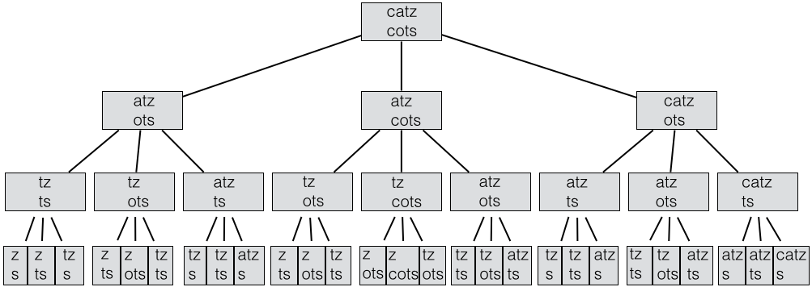

MS Word and other programs do spelling correction. Have you ever wondered how
they do it? Today we'll look at some relevant techniques.

## Outline
{:.no_toc}

* Outline
{:toc}

All the code files for today:
<a href="resources/EditDistance.java">EditDistance.java</a> |
<a href="resources/StringPair.java">StringPair.java</a> |
<a href="resources/Spelling.java">Spelling.java</a>

## Edit Distance

What does it mean for two words or two names to be "close" to one
another?  There are many possible definitions, but an easy one to
implement is called "edit distance". It is the number of editing
operations needed to convert one word or name into the other. The
operations are **insert** a character, **delete** a character, **replace** a
character, or **swap** two adjacent characters (so "thier" can be
converted to "their" in one operation).

This file contains two methods that solve this problem recursively:
<a href="resources/EditDistance.java">EditDistance.java</a>. Each function
looks at the first character of s1 and s2. If they match, they then find
the edit distance between remaining strings. If not, they try all of the
possible operations to make the first characters match and then solve
the remaining subproblems. (Note that match and replace have the same
subproblem, but their contributions to the edit distance differ by
one.) The one that solves the problem in the fewest edits is the one
chosen. We first look at a simple recursive implementation of this
idea:

```java
public static int naiveEditDistance(String s1, String s2) {
    int matchDist;    // Edit distance if first char. match or do a replace
    int insertDist;   // Edit distance if insert first char of s1 in front of s2.
    int deleteDist;   // Edit distance if delete first char of s2.
    int swapDist;     // Edit distance for twiddle (first 2 char. must swap).

    if (s1.length() == 0)
        return s2.length(); // Insert the remainder of s2
    else if (s2.length() == 0)
        return s1.length(); // Delete the remainder of s1
    else {
        matchDist = naiveEditDistance(s1.substring(1), s2.substring(1));
        if (s1.charAt(0) != s2.charAt(0))
            matchDist++; // If first 2 char. don't match must replace

        insertDist = naiveEditDistance(s1.substring(1), s2) + 1;
        deleteDist = naiveEditDistance(s1, s2.substring(1)) + 1;

        if (s1.length() > 1 && s2.length() > 1 && s1.charAt(0) == s2.charAt(1) && s1.charAt(1) == s2.charAt(0))
            swapDist = naiveEditDistance(s1.substring(2), s2.substring(2)) + 1;
        else
            swapDist = Integer.MAX_VALUE; // Can't swap if first 2 char. don't match

        return Math.min(matchDist, Math.min(insertDist, Math.min(deleteDist, swapDist)));
    }
}
```

Works great, on small strings. But exponential run time growth - look at tree
for "catz" and "cots". Works fine. But "Kate Blanchet" and "Cate Blanchett"
takes minutes.

{:refdef: style="text-align: center;"}

{: refdef}

So what can we do? Avoid re-computing subproblems by **memoizing**.
We keep a map of solved subproblems. To solve a subproblem, we first
look up the problem in the map of solved subproblems. If we find the
subproblem in the map we use the corresponding answer. If not, we
solve the problem and add the solution to the map.

We do this in the method <code>memoizedEditDistance</code> and its
helper function <code>editDist</code>.  We use the class
<a href="resources/StringPair.java">StringPair.java</a> to hold the pair of
strings in a subproblem. Here are the differences from the basic version.

```java
private Map<StringPair, Integer> solvedProblems;

public int memoizedEditDist(String s1, String s2) {
    solvedProblems = new HashMap<StringPair, Integer>();

    return editDist(s1, s2);
}

private int editDist(String s1, String s2) {
    ...
    else {
        StringPair pair = new StringPair(s1, s2);
        Integer result = solvedProblems.get(pair);

        if (result != null) // Did we find the subproblem in the map?
            return result;  // If so, return the answer
        else {
            ...

            int dist = Math.min(matchDist, Math.min(insertDist, Math.min(deleteDist, swapDist)));

            solvedProblems.put(pair, dist); // Save the result for future

            return dist;
        }
    }
}
```

Much faster - all pairs of final segments of strings get tested,
but only m*n of those (where m and n are the lengths of input
strings). For simplicity of implementation, we use a different
implementation of map, which we will cover next class.

The general idea is called **"dynamic programming"**. Will see ways to
do it without using a Map in CS 31. The basic idea is to keep a
matrix of the subproblem answers and fill it in using an order that
guarantees that a subproblem's solution is known before you use it to
fill in another place in the table.

## Spelling Corrector

Norvig worked up a quick spell corrector while on a plane ride! It is written
in the language Python, and the description is at
<a href="http://www.norvig.com/spell-correct.html">http://www.norvig.com/spell-correct.html</a>.

Rael Cunha converted it to a
<a href="http://raelcunha.com/spell-correct.php">Java spell corrector</a>.
He was trying to keep it short and got it down to 35 lines of code. With comments
added: <a href="resources/Spelling.java">Spelling.java</a>.

First, some theory. There are two things to be considered. First,
how far away are you from a correctly spelled word? Edit distance is
a reasonable choice here, although other measures that took into
account common typos and mis-spellings would give a more accurate measure.

Norvig just looks at words with minimum edit distance. Then how
does he pick one? He picks the one that is most common in English.
How does he determine this? He creates <a href="resources/big.txt">big.txt</a>, a
file of a number of books from the Project Gutenberg (128,000 lines,
about a million words) and lists of the most frequent words in
Wiktionary and the British National Corpus. He then runs statistics!
It includes lots of Sherlock Holmes, <em>War and Peace</em>, etc. It
was missing some common words (e.g. kangaroo), so I appended the Unix
spell dictionary /usr/share/dict/words to get <a href="resources/bigger.txt">bigger.txt</a>.

**His algorithm:**

1. Find all words of minimum edit distance.
2. Return the one that occurs most frequently in big.txt.

Let's see what the code does (see <a href="resources/Spelling.java">Spelling.java</a>).
First, <code>nWords</code> is a hash map of words with frequencies,
mapped to lower case. It is initialized in the <code>Spelling</code>
class constructor. A <code>BufferedReader</code> is used to read in a
file line by line. The <code>Pattern</code> class allows us to look
for regular expressions, and the particular pattern <code>\w+</code>
matches any number of letters and numbers. It is compiled and saved in <code>p</code>.  

The for loop reads each line in the file, converts it to lower case, and calls
the method <code>matcher</code> on it. This method creates a <code>Matcher</code> object
from the pattern that can be used to identify the words in the line. The method
<code>find</code> finds the next word in the line, returning true as long as there is one.  The
method <code>group</code> retrieves the word that <code>find</code> found. Finally, there is
a very compact line that updates the frequency map. It calls <code>put</code> with the word as
the key and with value one more than the count associated with the word if the word
is in the map or 1 if it is not. The <code>?</code> is a conditional expression.
It evaluates the boolean expression before the <code>?</code> and uses it to
select the expression before the <code>:</code> if the expression is true or the
one after the <code>:</code> if the expression is false.

We now look at the <code>correct</code> method. It would be too slow to compute
the edit distance to hundreds of thousands of words, even with memoization or
dynamic programming. So Norvig reverses the process! He first sees if the word
is correct. If so he returns it.

If not, he computes all things with edit distance 1 from the word and looks them
up in <code>nWords</code>. If he finds a word he puts it into a new map
<code>candidates</code>, but the key is the frequency and the value is the word.
Note that this is the reverse of the <code>nWords</code> map, and results in only
the last word of a given length being saved. If he finds valid words he returns
the one that occurred most frequently.

For each word that is edit distance 1 from <code>word</code> he finds all things that are
an additional edit distance of 1. In this way he finds all things of edit distance
2 from the original word (plus the original word, but we know that is not in the dictionary.)
Just as with the list of words of edit distance 1 he looks up each new word in the dictionary
and adds it to <code>candidates</code>. If any words are found he returns the most frequently
occurring one. If not he returns the original word. I found it awkward to return the same
thing for correct and for not within edit distance 2 of any word in the dictionary, so I
prepended a "?" to the word if it is not found.

Norvig did some experiments that showed 99% of the time mis-spellings are within
edit distance 2 of the correct word. His spell corrector gets about 67% of the
words correct. The first version of the paper reported much better results, but
there was a subtle bug in his experiment that made the results look better than
they were - see the link above.

So how does he generate all words of edit distance 1 from a given word? This
is done by the method <code>edits</code>. He creates a list of everything that
he can get by dropping a letter from <code>word</code> (delete), swapping each pair
of adjacent letters, replacing each letter in <code>word</code> by all possible
letters, and inserting each possible letter in each possible position.

**Final questions - how to improve the spell checker?**

1. Use a better "distance model" that takes into account types of
   errors and their relative frequencies, common mis-spellings.
2. Take word in context.  "ther cat" vs "ther is".  First case likely
   to be "the" or "their", second "there".
