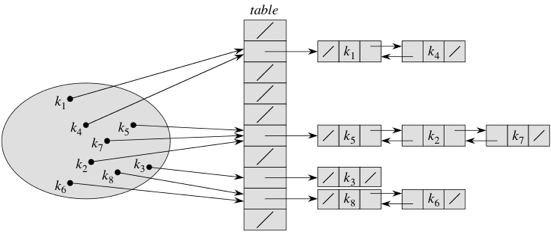

We saw that maps and sets are very useful ADTs, allowing us to quickly find
things (and potentially associated data). While binary search trees provide one
efficient implementation (assuming they're balanced), and lists a simple
implementation, hash tables provide a third alternative with some trade-offs.

## Outline
{:.no_toc}

* Outline
{:toc}

## Hashing

The <code>HashSet</code> and <code>HashMap</code> classes use a data structure
called a <strong>hash table</strong>. The idea can be illustrated by how the Sears
catalog store in West Lebanon used to keep track of catalog orders to be picked
up. They had 100 pigeonholes behind the order desk, numbered 0 to 99. When a customer
arrived, the clerk would ask the customers for the last two digits of the customer's
phone number. Given a number, the clerk would look in the corresponding pigeonhole
for the order form. Even if there were several hundred order forms in the system,
each pigeonhole contained only a few forms, and the clerk could search through
these quickly. This approach effectively split a set of hundreds of items into 100
sets of a few items each. The trick was to find a hash function that would assign
each order form to a particular pigeonhole in a way that spread the order forms
fairly evenly among them. The last two digits of the customer's phone number worked
well for this purpose.

> **Question:** Why would the first two digits have been a poor choice?

We can do a similar approach inside the computer. For a map, we want to use the key
of the (key, value) pair to figure out where we are going. For a set, we use the
object itself; in other words, the object <em>is</em> the key. So we'll talk about
storing keys in the hash table, possibly with an associated value. In order to
implement this idea, we need two things:

* A table structure in which to store the data. The table is simply a Java array.
* A way to get from a key to a particular spot in the table. The way this is done
is via a <strong>hash function</strong> <span class="math"><em>h</em></span>,
which maps a key <span class="math"><em>k</em></span> to an index
<span class="math"><em>h</em>(<em>k</em>)</span> in the table. Ideally, the hash
function spreads the objects fairly evenly over the table.

Now, if each key mapped to a distinct index in the table, we'd be done. That would
be like all Sears customers having the last two digits of their phone numbers be
unique. But they are not.

When multiple keys map to the same table index, we have a <strong>collision</strong>.
Now, you might think that with 100 slots in the table, we'd have to get close to
100 keys inserted into the table before we'd be likely to have a collision. And
you would be incorrect. Have you ever heard of the [Birthday Paradox](http://betterexplained.com/articles/understanding-the-birthday-paradox/)?

> If you randomly select people, how many do you have to select before there is
> at least a 50% chance that at least two of them have the same birthday?

Again, you might think that the number is close to 365. Or maybe it's around half
of 365: 183? Nope. It's much smaller than that. Much, much smaller. In fact, it's
just 23. In terms of hashing, if we have 365 slots in the table and randomly
insert keys, once we have inserted 23 keys, we have at least a 50% chance of a
collision. Of course, for a 100% chance, we'd have to insert 366 keys.

"Randomly" distributed keys don't do what you might expect.  If you "randomly"
distribute <em>n</em> keys into a table of size <em>n</em>, your might expect to
find one item in most of the slots, with very few empty slots.  In fact, about
<em>n/e</em> of the slots are empty (where <em>e</em> = 2.71..., the base of the
natural logarithm). So over a third of the slots are expected to be empty!
The expected length of the longest list is <em>Θ</em>(log <em>n</em>/ log log <em>n</em>).
(To see how to compute these take CS 30.)

### Chaining

So how can we handle collisions? There are a couple of ways. The first one is
called <strong>chaining</strong>. Instead of storing each element directly in
the table, each slot in the table references a linked list. The linked list for
slot <span class="math"><em>i</em></span> holds all the keys <span class="math"><em>k</em></span>
for which <span class="math"><em>h</em>(<em>k</em>) = <em>i</em></span>. Here's
the idea:

{:refdef: style="text-align: center;"}

{: refdef}

The keys are <span class="math"><em>k</em><sub>1</sub>, <em>k</em><sub>2</sub>, …, 
<em>k</em><sub>8</sub></span>. We show each linked list as a noncircular, doubly
linked list without a sentinel, and table slots without a linked list are
<code>null</code>. Of course, we could make a circular, doubly linked list for
each table slot instead, and have each table slot reference one such list, even
if the list is empty. In some situations, especially when we only insert into
the hash table and never remove elements, singly linked lists suffice.

How many items do we expect to look at when searching for a item? For unsuccessful
search (it wasn't in the map or set), we would look at everything in the appropriate
list. But how many elements is that? If the table has <span class="math"><em>m</em></span>
slots and there are <span class="math"><em>n</em></span> keys stored in it, there
would be <span class="math"><em>n</em>/<em>m</em></span> keys per slot on average,
and hence <span class="math"><em>n</em>/<em>m</em></span> elements per list on
average. We call this ratio, <span class="math"><em>n</em>/<em>m</em></span>,
the <strong>load factor</strong>, and we denote it by <span class="math"><em>α</em></span>.
If the hash function did a perfect job and distributed the keys perfectly evenly
among the slots, then each list has <span class="math"><em>α</em></span> elements.
In an unsuccessful search, the average number of items that we would look at is
<em>α</em>.  For a successful search we find the element (so always do 1 comparison),
and look at about half of the elements in the list.  This means that for successful
search you look at about 1 + <em>α</em>/2 items.  Either way the running time would
be <span class="math">Θ(1 + <em>α</em>)</span>. Why &quot;<span class="math">1 + </span>&quot;?
Because even if <span class="math"><em>α</em> &lt; 1</span>, we have to account
for the time computing the hash function <span class="math"><em>h</em></span>,
which we assume to be constant, and for starting the search. (Of course, if
<span class="math"><em>α</em> &lt; 1</span>, then we cannot perfectly distribute
the keys among all the slots, since a list cannot have a fraction of an element.)

Now, what if the keys are <em>not</em> perfectly distributed? Things get a little
trickier, but we operate on the assumption of <strong>simple uniform hashing</strong>,
where we assume that any given key is equally likely to hash into any of the
<span class="math"><em>m</em></span> slots, without regard to which slot any other
key hashed into. When we say &quot;any given key,&quot; we mean any <em>possible</em>
key, not just those that have been inserted into the hash table. For example, if
the keys are strings, then simple uniform hashing says that any string—not just
the strings that have been inserted—is equally likely to hash into any slot. Under
the assumption of simple uniform hashing, any search, whether successful or not,
takes <span class="math">Θ(1 + <em>α</em>)</span> time on average.

Of course, the worst case is bad. It occurs when all keys hash to the same slot.
It can happen, even with simple uniform hashing, but of course it's highly unlikely.
But the possibility cannot be avoided.  If an adversary puts <em>n*m</em> items
into the table then one of the slots will have at least <em>n</em> items in it.
He or she then makes those <em>n</em> items the data for the problem that you are
dealing with, and you are stuck. (There is an idea called universal hashing, which
basically computes a different hash code every time you run the program, so that
data that is slow one time might be fast the next.)

Should the worst case occur, the worst-case time for an unsuccessful search is
<span class="math">Θ(<em>n</em>)</span>, since the entire list of <span class="math"><em>n</em></span>
elements has to be searched. For a successful search, the worst-case time is
still <span class="math">Θ(<em>n</em>)</span>, because the key being searched for
could be in the last element in the list.

How about inserting and removing from a hash table with chaining? To insert key
<span class="math"><em>k</em></span>, just compute <span class="math"><em>h</em>(<em>k</em>)</span>
and insert the key into the linked list for slot <span class="math"><em>h</em>(<em>k</em>)</span>,
creating the linked list if necessary. That takes <span class="math">Θ(1)</span> time.
How about removing an element? If we assume that we have already searched for it
and have a reference to its linked-list node, and that the list is doubly linked,
then removing takes <span class="math">Θ(1)</span> time. Again, that's after having
paid the price for searching.

Note that if <span class="math"><em>n</em></span> gets much larger than
<span class="math"><em>m</em></span>, then search times go up. How can we avoid this?
The same way that we do for an <code>ArrayList</code>. When the table gets too full,
we create a new one about double the size and rehash everything into the new table.
What is &quot;too full&quot;? Java implementations typically start the table with
size 11 and double the table size when <span class="math"><em>α</em></span> exceeds 0.75.

Everything is peachy now, right? Yes, except that we are now counting on the table
having several empty slots. In other words, we're wasting lots of space, to say
nothing of all the links within the lists. If memory is at a premium, as it would
be in an embedded system or handheld device, we might regret wasting it.

### Open Addressing

The second way to handle collisions is called <strong>open addressing</strong>.
The idea is to store everything in the table itself, even when collisions occur.
**There are no linked lists.**

How can we store everything in the table even when there's a collision? One simple
scheme is called <strong>linear probing</strong>. Suppose we want to insert key
<span class="math"><em>k</em></span> and that
<span class="math"><em>h</em>(<em>k</em>) = <em>i</em></span>, but slot
<span class="math"><em>i</em></span> is already occupied. We cannot put key
<span class="math"><em>k</em></span> there. Instead, we probe (look at) slot
<span class="math"><em>i</em> + 1</span>. If it's empty, put key <span class="math"><em>k</em></span>
there. If slot <span class="math"><em>i</em> + 1</span> is occupied, probe slot
<span class="math"><em>i</em> + 2</span>. Keep going, wrapping around to slot 0
after probing slot <span class="math"><em>m</em> − 1</span>. As long as
<span class="math"><em>n</em> &lt; <em>m</em></span>, i.e., <span class="math"><em>α</em> &lt; 1</span>,
we are guaranteed to eventually find an empty slot. If the table fills, that is,
if <span class="math"><em>α</em></span> reaches 1, then increase the table size
and rehash everything.

Searching with linear probing uses the same idea as inserting. Compute
<span class="math"><em>i</em> = <em>h</em>(<em>k</em>)</span>, and search slots
<span class="math"><em>i</em>, <em>i</em> + 1, <em>i</em> + 2, …</span>, wrapping
around at slot <span class="math"><em>m</em> − 1</span> until either we find key
<span class="math"><em>k</em></span> or we hit an empty slot. If we hit an empty
slot, then key <span class="math"><em>k</em></span> was not in the hash table.

Linear probing is a nice idea, but it has a couple of problems. One is how to
remove a key from the hash table. We cannot just remove it from its slot. Why not?
Let's take the following situation. We insert keys <span class="math"><em>k</em><sub>1</sub></span>,
<span class="math"><em>k</em><sub>2</sub></span>, and <span class="math"><em>k</em><sub>3</sub></span>,
in that order, where
<span class="math"><em>h</em>(<em>k</em><sub>1</sub>) = <em>h</em>(<em>k</em><sub>2</sub>) = <em>h</em>(<em>k</em><sub>3</sub>)</span>.
That is, all three keys hash to the same slot, but <span class="math"><em>k</em><sub>1</sub></span>
goes into slot <span class="math"><em>i</em></span>, <span class="math"><em>k</em><sub>2</sub></span>
goes into slot <span class="math"><em>i</em> + 1</span>, and <span class="math"><em>k</em><sub>3</sub></span>
goes into slot <span class="math"><em>i</em> + 2</span>. Then we remove key
<span class="math"><em>k</em><sub>2</sub></span>, which opens up a hole in slot
<span class="math"><em>i</em> + 1</span>. Then we search for key <span class="math"><em>k</em><sub>3</sub></span>.
What's going to happen? We probe slot <span class="math"><em>i</em></span>, see
that it holds <span class="math"><em>k</em><sub>1</sub></span>, not <span class="math"><em>k</em><sub>3</sub></span>,
and then probe slot <span class="math"><em>i</em> + 1</span>. Because slot
<span class="math"><em>i</em> + 1</span> is now empty, we conclude that
<span class="math"><em>k</em><sub>3</sub></span> is not in the hash table. Wrong!
How can we correct this error? We need some way to mark a slot as having held a key
that we have since removed, so that it should be treated as full during a search
but as empty during insertion. So if we remove many keys, we can end up with all
(or almost all) of the "empty" slots being marked, and unsuccessful searches can
go on for a very long time.

But there's another, more insidious, problem. It's called <strong>clustering</strong>.
Long runs of occupied slots build up, increasing the average search time. Clusters
arise because an empty slot preceded by <span class="math"><em>t</em></span> full
slots gets filled next with a probability of <span class="math">(<em>t</em> + 1)/<em>m</em></span>.
That's because the probability of hashing to any of the <span class="math"><em>t</em></span>
slots is <span class="math">1/<em>m</em></span> (and there are <span class="math"><em>t</em></span>
of them), plus the next key could hash directly into that empty slot. And that's
not the only way that clusters grow. Clusters can coalesce when one cluster grows
and meets with another cluster.

There are various schemes that help a little. One is <strong>double hashing</strong>,
where we take two different hash functions <span class="math"><em>h</em><sub>1</sub></span>
and <span class="math"><em>h</em><sub>2</sub></span> and make a third hash
function <span class="math"><em>h</em>ʹ</span> from them:
<span class="math"><em>h</em>'(<em>k</em>,<em>p</em>) = (<em>h</em><sub>1</sub>(<em>k</em>) + <em>ph</em><sub>2</sub>(<em>k</em>)) bmod <em>m</em></span>.
The first probe goes to slot <span class="math"><em>h</em><sub>1</sub>(<em>k</em>)</span>,
and each successive probe is offset from the previous probe by the amount
<span class="math"><em>h</em><sub>2</sub>(<em>k</em>)</span>, all taken modulo
<span class="math"><em>m</em></span>. Now, unlike linear or quadratic probing, the
probe sequence depends in two ways upon the key, and as long as we design
<span class="math"><em>h</em><sub>1</sub></span> and <span class="math"><em>h</em><sub>2</sub></span>
so that if <span class="math"><em>h</em><sub>1</sub>(<em>k</em><sub>1</sub>) = <em>h</em><sub>1</sub>(<em>k</em><sub>2</sub>)</span>
it's really unlikely that <span class="math"><em>h</em><sub>2</sub>(<em>k</em><sub>1</sub>) = <em>h</em><sub>2</sub>(<em>k</em><sub>2</sub>)</span>,
we can avoid  clustering. Again, we must choose our hash functions
<span class="math"><em>h</em><sub>1</sub></span> and <span class="math"><em>h</em><sub>2</sub></span>
carefully.

When we analyze open addressing, we use the assumption of <strong>uniform hashing</strong>,
which says that the probe sequence <span class="math"><em>h</em>ʹ(<em>k</em>, 0), 
<em>h</em>ʹ(<em>k</em>, 1), <em>h</em>ʹ(<em>k</em>, 2), …, <em>h</em>ʹ(<em>k</em>, 
<em>m</em> − 1)</span> used when searching or inserting is equally likely to be any
permutation of the slot numbers <span class="math">0, 1, 2, …, <em>m</em> − 1</span>.
In other words, each possible probe sequence is equally likely.

The result is that the average number of probes in an unsuccessful search or when
inserting is approximately <span class="math">1/(1-<em>α</em>)</span>. This number
gets very large as <span class="math"><em>α</em></span> approaches 1. If the hash
table is 90% full, then about 10 probes are needed. The average number of probes
for a successful search isn't so hot, either: <span class="math">-(1/<em>α</em>) log(1/(1-<em>α</em>))</span>.
That's a little better than the number of probes for an unsuccessful search; when
the hash table is 90% full, it comes to a little over 2.5 probes.

## Computing Hash Functions

The problem now is how to compute the mapping from keys to spots in a table.
This mapping is what the hash function does. A good hash function has three
desirable properties:

* It can be computed quickly.
* It spreads the universe of keys fairly evenly over the table.
* Small changes in the key (e.g. changing a character in a string or changing the
  order of the letters) should usually result in a different hash value.

Java computes hash functions in two steps. The first is to have every object have
a hashCode() method. This returns an int. The default is often the address of the
object in memory. Then we have to map this integer into an entry in the table.
This is called the compression function.

A simple compression function is to take the hashcode mod the table size. This
works well when the table size is a prime, but not so well otherwise. In that
case the book suggests computing [(ai + b) mod p] mod N, where i is the hashcode,
p is a prime &gt; N, and a and b are chosen at random between 1 and p-1 (or can
also let b be 0). But this is taken care of in the implementation of Java's
library.

Java gives us the responsibility to come up with a good hashcode. In particular,
if you define equals for an object it is very important that you <b>override
hashCode so that two items considered equal have the same hashcode</b>. This is
because if you insert an item in the table and then look for it using something
that is equal to the item you expect to find it. If the hashcodes are different
you won't find it. You will be looking in the wrong bucket.

So how can you compute hash codes, particularly for composite objects (have several
instance variables or are strings or arrays or ...). A simple option is to sum all
of the pieces, or sum the hashcodes of the pieces. However, this means that
shuffling the order (say of a string) does not change the hashcode. It probably
should! A better idea for computing the hash code of what we can view as a tuple
(x<sub>0</sub>, x<sub>1</sub>, ..., x<sub>k-1</sub>) is to pick a positive number
a (book suggests that 33, 37, 39, and 41 are good choices) and compute the
polynomial x<sub>0</sub>a<sup>k-1</sup> + x<sub>1</sub>a<sup>k-2</sup> + ... + x<sub>k-1</sub>.
Book shows how to do this using Horner's rule, which basically means starting
with a running total at x<sub>0</sub> and for j = 1 to (k-1) multiplying by a and
adding x<sub>j</sub>.

```java
public int hashcode() {
  final int a = 37;

  int sum = x[0];
  for (int j = 1; j < s; j++)
    sum = a * sum + x[j];

  return sum;
}
```

The book also shows a way to use cyclic shifts for this purpose. For the curious,
there is a lot of literature on hashing, including Knuth's
<em>Art of Computer Programming, Vol. 3</em>.
