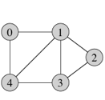
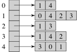
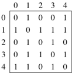

## Introduction

A graph represents a set of relationships among things. The vertices represent
the things and the edges the relationships. There are gazillions of applications
where a graph is the appropriate ADT to use. These include road maps (vertices
are intersections and edges are roads between them), airline routes (vertices are
the airports and edges are scheduled flights between them), the world-wide web
(vertices are web pages and edges are hyperlinks), and networks (vertices are
computers and edges represent connections). In society, vertices are people and
edges their relationships &mdash; friend, partner, sibling, parent/child, etc.
So a social network like Facebook can be represented by a graph with vertices for
people who created Facebook pages and edges connecting people who have "friended"
one another. Likewise people with Twitter accounts could be the nodes with an
edge from A to B if A follows B.

Although we'll mostly focus on programming with graphs, I think it's helpful to
look at them. One cool example: <a href="http://griffsgraphs.com/2012/07/03/graphing-every-idea-in-history/">civilization social network</a>.
I'll show some other graphs in class. There are a number of good (and freely available)
graph visualization packages out there, including <a href="http://cytoscape.org">Cytoscape</a>
and <a href="https://gephi.org">Gephi</a>.

### Installing the Graph Code

We will use the code from our textbook. Download the <a href="http://net3.datastructures.net/lib5/net-datastructures-5-0.jar">jar file</a>
from the <a href="http://net3.datastructures.net">book website</a> and add it to
your project (as with JavaCV, way back at the start of the term &mdash; menu
Project | Properties | Java Build Path | Libraries | Add External JARS....). Then
in your code, say "<code>import net.datastructure.\*;</code>" at the top of your
Java file. Note that the files from the book instead say "<code>package net.datastructures;</code>".

Other than the modified <a href="resources/AdjacencyListGraphMap.java">AdjacencyListGraphMap.java</a>,
which has a main() so you can run to test the graph operations, you don't actually
need to pull these files into Eclipse &mdash; they're part of the jar file. But
if you do, you'll either have to set up the package, or change that line to the
"import" line.

All the code files for today:
<a href="resources/Graph.java">Graph.java</a> |
<a href="resources/AdjacencyListGraphMap.java">AdjacencyListGraphMap.java</a> |
<a href="resources/Position.java">Position.java</a> |
<a href="resources/AdjacencyListGraph.java">AdjacencyListGraph.java</a>

## Outline
{:.no_toc}

* Outline
{:toc}

## Graph Interface

Note that there are two basic styles of graphs &mdash; one where the relationship
is symmetric and the other where it is asymmetric. Facebook is a symmetric
relationship &mdash; if A is B's friend, then B is A's friend also. Others are
asymmetric. If A follows B on Twitter it does not imply that B follows A. In a
graph of people where the relation is "child-of" it is never the case that if A
is a child of B that B is a child of A. Unrequited love is another case where the
relationship is assymetric. Symmetric relationships lead to undirected graphs. An
edge is <em>between</em> A and B. Asymmetrical relationships lead to directed
graphs. An edge is <em>from</em> A <em>to</em> B, and there is no implication
that there is also an edge from B to A (though there might also be one). There
are also mixed graphs, where some edges are undirected and others are directed.
A road graph with some one-way streets is an example.

We will first deal with undirected graphs. We will come back to directed graphs
next class. *The book defines a number of graph terms on pp. 612-618. Please read these!*

The book gives an ADT definition in the interface <a href="resources/Graph.java">Graph.java</a>.
Note that is generic in terms of the types of things serving as vertices and edges.
For example, <code>V</code> could be <code>String</code> if it's just a name, or
an actual object if it's a whole <code>Person</code> instance. Likewise, we can
have elements for the edges, e.g., holding information about the relationship between
two people. There are then interfaces <code>Vertex&lt;V&gt;</code> and <code>Edge&lt;E&gt;</code>
that package up these generic types into things that go into a graph.

The interface has a number of useful methods (discussed in class). However, it is
missing one thing that is often useful &mdash; retrieving a vertex that has a
particular element value. The only way to do that here is to interate through
the vertices and test them. We will provide that extension below.

Given such a graph, there are many types of analyses we could do on it. Who's the
most "popular" (has the most edges)? Who are mutual acquaintances ("cliques" where
all have edges to each other)? Who is a friend-of-a-friend but is not yet a friend?
We'll look at some such problems over the next few classes (and the problem set).

A simple example of building and using a movie-costar graph with an implementation
that we'll discuss below (<a href="resources/AdjacencyListGraphMap.java">AdjacencyListGraphMap.java</a>).
The vertices are actors and the edges are movies, connecting pairs of actors that
costar in them.

```java
baconGraph.insertVertex("Kevin Bacon");
baconGraph.insertVertex("Laura Linney");
baconGraph.insertVertex("Tom Hanks");
baconGraph.insertVertex("Liam Neeson");
baconGraph.insertEdge("Kevin Bacon", "Laura Linney", "Mystic River");
baconGraph.insertEdge("Laura Linney", "Liam Neeson", "Kinsey");
baconGraph.insertEdge("Kevin Bacon", "Tom Hanks", "Apollo 13");

System.out.println("Degree of Kevin Bacon = " + baconGraph.degree("Kevin Bacon"));

System.out.println("Edges adjacent to Kevin Bacon:");
for(Edge<String> edge : baconGraph.incidentEdges("Kevin Bacon"))
    System.out.println(edge);

System.out.println("Renaming Laura Linney to L. Linney");
baconGraph.replace("Laura Linney", "L. Linney");
System.out.println("Getting Laura Linney: " + baconGraph.getVertex("Laura Linney"));

System.out.println("Removing L. Linney");
baconGraph.removeVertex("L. Linney");
```

## Representation

We will use the following graph to illustrate various options for representing
graphs:

{:refdef: style="text-align: center;"}

{: refdef}

### Edge List

What data structures can we use to represent a graph? The simplest is an <em>edge list</em>.
It can consist of a list of edge objects. Each edge object has a reference to a
value or label as its element. It has references to both incident endpoints. (A
vertex is incident to edge if it is an endpoint of that edge.) In the book's
representation the edges are saved in a linked list of positions, and the edge
knows where it is in that linked list. (This allows easy deletion.) The book also
has the vertices saved in a linked list, but there is no easy way to get from a
vertex to an edge.

In general, the operations of <code>insertVertex</code>, <code>insertEdge</code>,
and <code>removeEdge</code> will be fast as long as the edges and vertices are kept
in linked lists, and <code>replace</code> is always fast. <code>vertices</code>
and <code>edges</code> just have to return the list as type Iterable.

So which of the other operations are easy and hard? If there are <i>n</i> vertices
and <i>m</i> edges, how long will the various operations take? The fast operations
are <code>endVertices</code> and <code>opposite</code>. But <code>incidentEdges</code>
and <code>areAdjacent</code> may require searching the entire edge list, so
are O(<i>m</i>) time. At first glance <code>removeVertex</code> would seem to be
fast &mdash; just remove it from the linked list. But part of the method is
removing all edges incident to the vertex removed, so this will also take O(<i>m</i>)
time.

### Adjacency List

The obvious way to speed up the slow operations from the edge list structure is
to have some way to get from a vertex to the edges that it is incident to.
Traditionally the incident edges to a vertex are stored in a linked list, leading
to the name <em>adjacency list</em>. The book points out that the incident edges
could be stored in any collection. Here's an adjacency-list representation of the
graph from above, using arrays:

{:refdef: style="text-align: center;"}

{: refdef}

How does this change run times? Clearly <code>incidentEdges</code> is now very
fast &mdash; just return the collection (or a copy of it). To copy it or actually
iterate through the adjacency list for vertex v takes time O(degree(v)). Method
<code>removeVertex</code> has the same run time. Method <code>areAdjacent(v,w)</code>
requires going though the edges incident to one of the vertices and seeing if
the other is opposite to it. This can be done in time O(min(degree(v), degree(w)),
if there is a fast way of learning the degree of a vertex.

### Adjacency Matrix

The only method that takes more time than is absolutely needed to update the structure
is <code>areAdjacent(v,w)</code>. To speed this up we can create an <em>adjacency matrix</em>,
as long as the graph has no parallel edges. We combine this with the edge list
structure. We number the vertices from 0 to <i>n</i>-1. We create an <i>n</i> x <i>n</i>
matrix A where entry <code>A[i][j]</code> holds a reference to the edge from
vertex i to vertex j if it exists. Otherwise <code>A[i][j] == null</code>. (Note
that for an undirected graph <code>A[i][j] == A[j][i]</code>.)

{:refdef: style="text-align: center;"}

{: refdef}

This makes <code>areAdjacent(v,w)</code> a &Theta;(1) operation &mdash; look in
the matrix to see if there is an edge at the appropriate entry. However, <code>incidentVertices</code>
now takes &Theta;(<i>n</i>) time, because we have to look through an entire row
or column. And adding or removing a vertex requires rebuilding the entire matrix,
so take &Theta;(<i>n</i><sup>2</sup>) time.

The more usual definition of an adjacency matrix has only the matrix. The vertices
are implicitly named 0 to <i>n</i>-1 and the entries are boolean. True means an
edge exists and false means that no edge exists. If you want edge values (distances,
for instance), then the matrix would have either null or a reference to the value.
No edge objects exist. In this case enumerating all of the edges is a &Theta;(<i>n</i><sup>2</sup>)
time operation, because you have to look at all matrix entries.

## Implementation

The book uses a slightly different approach to data structures than we have been
using. We built our linked lists from <code>Element</code> objects, where <code>Element</code>
is an inner class. Elements are accessed within <code>SinglyLinked</code>, which
deals with their <code>data</code> and <code>next</code>. However, we provide no
access to <code>Element</code> objects from outside of the class. We instead only
allow <code>get()</code> and <code>set()</code> of the actual data by index, and
provide an iterator for walking down the list. Nobody needs to even know of the
existence of <code>Element</code>. Java does the same thing.

In constrast, Goodrich and Tamassia build up their lists, trees, graphs, etc. from
<code>Position</code> objects. <a href="resources/Position.java">Position.java</a>
is an interface with a single method: <code>element()</code>, which returns the
data stored in the object. Their node classes for lists (<code>Node</code>),
trees (<code>TreeNode</code>), etc. implement the <code>Position</code> interface.
They then let the user get a reference to a position.

We still can't do much with a position by itself. We can call the method <code>element</code>
on it to get the data saved within it. Or we can pass it to the class in which it
is a position (e.g., a <code>NodePositionList</code>), which will cast it to the
correct type (after verifying that it is the correct type!) and use it (e.g., to
move down the list). So while you might want to try to use the position yourself
(outside the class), you'll instead need to go to one extra step of passing it to
the class and asking it to use it. In the context of graphs, both <code>Vertex</code>
and <code>Edge</code> are <code>Position</code>s, storing vertex and edge data as
their elements, and maintaining information about where they are in the graph data
structure.

The book provides an adjacency list implementation in <a href="resources/AdjacencyListGraph.java">AdjacencyListGraph.java</a>.
It uses linked lists to hold edges and vertices. It also provides some other methods.
In particular, it provides <code>degree(v)</code> and <code>toString</code> for
the entire graph. Walk through code.

* Inner classes <code>MyVertex</code> and <code>MyEdge</code> store the data and
  implement the extended <code>Position</code> interface.
* Ignore details of <code>MyPosition</code> for now; we'll return to it next class.
* The class itself just stores lists of edges and vertices.
* Most methods go through this extra step of casting a position to a vertex or edge
  as appropriate, and then calling the appropriate method on that thing.
* Note linear search (on smaller degree vertex) for <code>areAdjacent</code>.
* Note maintenance of corresponding structure when remove edge or vertex.

The values in vertices are often names or other identifiers. It can be very helpful
to be able to find a particular vertex quickly, given its identifier. (We will
use this in implementing the Kevin Bacon game.) Therefore I have modified the
class to use a map instead of a linked list to hold the vertices. The key is the
value stored in the element. This only works if no two vertices have the same
element value. This code is in <a href="resources/AdjacencyListGraphMap.java">AdjacencyListGraphMap.java</a>.

This code supplies the method <code>getVertex(id)</code> which returns a <code>Vertex&lt;V&gt;</code>
object given the id for that vertex. This required changes to the instance variable
that holds the collection of <code>Vertex</code> objects and to the constructor.
It also required changes to <code>insertVertex</code> (must put into the map after
verifying that the name is not there already), <code>removeVertex</code> (must remove
from the map), and <code>replace</code> on a Vertex object (changing a vertex
name means updating the map, also, after verifying that the new name is not there
already).

I have also overloaded all of the other methods that take one or more <code>Vertex&lt;V&gt;</code>
parameters to take <code>V</code> parameters. These are all one-liners &mdash; they
simply call the original version, passing <code>getVertex(id)</code> where a
<code>Vertex&lt;V&gt;</code> parameter is needed.

All of these modifications are at the beginning of the file and are marked by
comments at the start and end of the section. The <code>main()</code> does the
kind of Kevin Bacon tests illustrated above.
