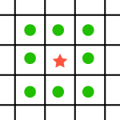

## Outline
{:.no_toc}

* Outline
{:toc}

All the code files for today:
[DrawingFrame.java](resources/DrawingFrame.java), [Smile3.java](resources/Smile3.java),
[smiley.png](resources/smiley.png), [smiley2.jpg](resources/smiley2.jpg),
[ImageProcessingCore.java](resources/ImageProcessingCore.java),
[ImageProcessing.java](resources/ImageProcessing.java)

## Announcements

* Short Assignment 0 due!
* Short Assignment 1 out.
* Our syllabus has been updated to include our graduate TA's office hours (Tuesday, 4 &ndash; 5pm and Friday, 2 &ndash; 5pm).
* I won't be holding a Tuesday office hour this term (don't worry, I still have 5-6 office hours/week :)

## Finish up from last time

Picking up from Monday, we want to add another image [smiley2.jpg](resources/smiley2.jpg) to
the "pictures" folder, and give [Smile3.java](resources/Smile3.java) a whirl.
Select one of the windows (give it the keyboard focus, e.g., by clicking on it with
your mouse), and hit a key.

Now we've defined our own class and created objects of it! In the main method, we
create two different smiley objects. As before "new" creates an object, now of
our own class, "Smile3". The objects are initialized by calling a method ("constructor")
of the same name as the class. (This is like __init__ for you Python people.)
The parameter values (e.g., "Choice A") are passed to the constructor, where they
may be used in initializing the object.

Each Smile3 object has two "instance variables": "name" and "numVotes". These are
declared before the methods — a template for what data will be stored in an object.
Python people are used to objects having instance variables (though not declaring them);
C people can think of them kind of like structs (though as we'll see, they're much more
powerful). Each object has its own copies of the instance variables — smileyA has a
name and a numVotes that are different from those of smileyB (as they should be!).
Thus when we call smileyA.vote(), only its tally is incremented, and an appropriate
message is printed.

Note that the constructor has a parameter called "name", which could be confused
with the instance variable "name". Specifying "this.name" in the body of the
constructor indicates that we want the instance variable (just like "self" for Python
people). But when there's no confusion, we can leave off the "this." and just give
the name of the instance variable (as with "numVotes" in the constructor).

The code to detect and respond to key presses is pretty funky looking, but don't
worry about it for now; we'll dive into that in a couple classes. Just note that
it calls the vote() method, which is where we increment the tally and print a message.

## Image processing

Our problem today is to process images in the kind of manner that we could with
software like Photoshop, except writing our own code to do it directly. So the
underlying data type is a representation of an image, and the main operations are
getting and setting the colors in the image. For example, we could take an image
of Baker and produce a kind of charcoal engraved looking version.

{:refdef: style="text-align: center;"}


{: refdef}

The code uses [baker.jpg](resources/baker.jpg) (an 800x600 version), a public
domain image in the [Dartmouth College](http://commons.wikimedia.org/wiki/Category:Dartmouth_College)
category of [Wikimedia commons](http://commons.wikimedia.org/). Save it into your
project/pictures folder as with the smiley face last time.

## Core code

Let's start with some basic skeletal code, [ImageProcessingCore.java](resources/ImageProcessingCore.java),
that's a lot like Smile3 from last time, just loading an image and displaying an
image. We'll be including a lot more functionality in this skeleton, ultimately
producing [ImageProcessing.java](resources/ImageProcessing.java). Note that the
filename and class names must match; use the "refactor" command in Eclipse when
you rename things.

The major difference between ImageProcessingCore.java and Smile3.java is that it
has a more complicated function to respond to different key presses. The only
choices for now are to save out the current image or to revert to the original
image. In order to be able to revert, we have to have held on to a copy of it
(which we fortunately did in the constructor), and then create a new copy. That
code is unfortunately quite ugly, but take it from me that all it's doing is copying.
The code to save a snapshot is also ugly due to the fact that the saving might
fail, but again you can ignore those details for now.

We got a taste of objects last time, and this code uses the same structure (even
though we'll only ever have one instance of our object). Be sure to read the
book for more details about class definitions. We again specify a "template" for
what goes in an object,  by declaring the instance variables. (The methods
themselves "go in" the object too, if you want to think of it that way.) We declare
the instance variables "private", which is in general a good idea &mdash; nobody
else should be directly mucking with an object's data.

The `process()` method handles a key press, performing an appropriate action. We
have a big (to get much bigger) "if - else if - ... - else" statement to decide
what to do (for those who care, there is a "switch" statement too). We'll have
a separate method for each different operation; they'll all operate on the "current"
instance variable, and then the `process()` method will tell the GUI about it (`setImage()`).

## Image representation as pixels

At the lowest level, images (as well as computer screens) are made up of discrete
rectangles called "pixels". If you zoom way in to a picture with an image editor,
you can see that. An image of size 800x600 has 800 pixels across by 600 down. And
note that the typical graphics coordinate system has the y coordinate increasing
from 0 at the top.</p>

<table>
<tr><th>0</th><th>1</th><th>2</th><th>3</th><th>...</th><th>799</th></tr>
<tr><th>1</th><td></td><td></td><td></td><td></td><td></td></tr>
<tr><th>2</th><td></td><td></td><td></td><td></td><td></td></tr>
<tr><th>...</th><td></td><td></td><td></td><td></td><td></td></tr>
<tr><th>599</th><td></td><td></td><td></td><td></td><td></td></tr>
</table>

Each pixel has a color. The primary colors for computer screens are red, green,
and blue; any color can be specified as a combination of them. For 8-bit color,
the color value ranges from 0 (none of that color) to 255 (full on). Thus:

<table>
<tr><th>red</th><th>green</th><th>blue</th><th>result</th></tr>
<tr><td>255</td><td>255</td><td>255</td><td>white</td></tr>
<tr><td>0</td><td>0</td><td>0</td><td>black</td></tr>
<tr><td>255</td><td>0</td><td>0</td><td><span style="color:#ff0000">bright red</span></td></tr>
<tr><td>0</td><td>255</td><td>0</td><td><span style="color:#00ff00">bright green</span></td></tr>
<tr><td>0</td><td>0</td><td>255</td><td><span style="color:#0000ff">bright blue</span></td></tr>
<tr><td>128</td><td>0</td><td>0</td><td><span style="color:#800000">not-as-bright red</span></td></tr>
<tr><td>0</td><td>128</td><td>0</td><td><span style="color:#008000">not-as-bright green</span></td></tr>
<tr><td>0</td><td>0</td><td>128</td><td><span style="color:#000080">not-as-bright blue</span></td></tr>
</table>

Other colors are given as combinations of red, green, and blue, as illustrated in
this [simple color table](resources/colors.html). (A web search will
return many such tools for determining color compositions.) Note that RGB is an
<em>additive</em> color model (e.g., red+green=yellow), suitable for mixing light
(as a computer display does), as opposed to, say, paints.

## Manipulating individual pixels

The code discussed in the following is added to the core code; the complete
version is [ImageProcessing.java](resources/ImageProcessing.java).

Java lets us access a pixel in a BufferedImage with the getRGB() method. To
conveniently access the red, green, and blue components, we create a Color
object with the returned value; it then provides `getRed()`, `getGreen()`, and
`getBlue()` methods. There are corresponding `set*()` methods.

Okay, let's try a simple image processing function, to dim an image. Recall that
larger values mean more of that color. So basically all we need to do is to scale
down the values (e.g., scaling by 3/4 would go from the bright colors to the
not-as-bright colors above). We need to do that for every pixel, and all three
color channels:

```java
for (int y = 0; y < current.getHeight(); y++) {
  for (int x = 0; x < current.getWidth(); x++) {
    // Get current color; scale each channel
    Color color = new Color(current.getRGB(x, y));
    int red = color.getRed()*3/4;
    int green = color.getGreen()*3/4;
    int blue = color.getBlue()*3/4;

    // Put new color
    Color newColor = new Color(red, green, blue);
    current.setRGB(x, y, newColor.getRGB());
  }
}
```

I'm assuming you're familiar with loops and nested loops from your previous
programming class, but ask a question if not. In our doubly-nested loop, we loop
over each row / y coordinate in the image; for each of those, we loop over each
column / x coordinate. We use a common loop structure for Java (and other C-type
languages), where we initialize (and declare) a loop counter variable (e.g., "y"),
loop while some condition holds ("y &lt; current.getWidth()"), and update the
loop counter ("y++"). Note that with 0-based indexing, for 600 rows we go from
0 to 599 (as in the table above), and thus the loop continuation test is &lt;
600 (or &le; 599, though the &lt; version is conventional). If you forget and
do &le; 600 or in some other context try to index the pixel at 600, you'll get
a nice error message.

A note about primitive vs. object types. Int (and char) are "primitive" types,
in that they don't refer to objects but rather just simple numbers (characters)
stored directly in memory. If a variable is of a primitive type, the variable
contains the actual data itself (the bit pattern representing the data). If a
variable is of type <em>reference</em> to an object, then it contains a reference,
and the data itself is stored elsewhere.

Why is this distinction important? My wife and I have a joint checking account.
We each have an ATM card. The cards are different and have different names on
them, but the refer to the same checking account. If I withdraw money with my
ATM card, there is less money in the account, and if my wife then looks at the
balance it will be smaller even though she did nothing with her ATM card. In
this analogy, the account is the object (and bank account objects are a common
example in textbooks). The ATM cards are the variables, each holding a reference
to the same account. Any changes made by either of us to the account via our ATM
card are seen by both. On the other hand, if my wife has her ATM card re-programmed
so that it refers to her personal account (changes the reference stored in the variable),
that won't affect my card or the account. She just will no longer be able to use
that ATM card to withdraw money from our account, because it no longer refers to
our account.

Okay, back to the code. We then wrap up that nested loop in the `dim()` method.
Note that since this is a method of the ImageProcessing class, it has access
to the "current" instance variable of the object.

How about `brighten()` &mdash; should be just the opposite, right? Same basic structure.
But there's a problem: we can't exceed 255. So we take the mininum of 255 and the scaled up value.

And for fun (by some definition of "fun") I included `scaleColor()` that does some
different scaling on different color channels. This introduces the "double"
primitive type, which holdes a floating point (fractional number). Useful for
specifying a scale, but we need to convert back to "int" for putting in our image.

Another example, `noise()`, adds random noise to each pixel. Same nested loop
structure, but now we set the pixel value by adding in a random number to the
original. Math.random() returns a number between 0 and 1, so we multiply it by
2 and subtract 1 to have it be between -1 and +1. We can then further scale to
increase the noise: <code>noise = scale * (2*Math.random() - 1)</code>. Here we
have to make sure not only that we don't go above 255 but also that we don't go
below 0. This is a common enough issue that I separated out a function constrain()
to return a value if it's within a range, or the appropriate boundary value if
it's outside the range.

```java
private static double constrain(double val, double min, double max) {
  if (val < min) {
   return min;
  }
  else if (val > max) {
   return max;
  }
  return val;
}
```

Notice the "if" structure and the use of "return", probably much like your
previous language. The "static" thing might be new; here it's indicating that
the function is not a method of an object, but rather just a standalone function.
So we invoke it without an object and a dot before its name, and it doesn't have
access to an object's state (e.g., "image").

A method `gray()` to convert to grayscale has the same structure, and uses a
different helper function to compute the luminosity (a weighted average of the
red, green, and blue values; see e.g., [Color FAQ](http://www.poynton.com/ColorFAQ.html).
That same value is stuffed into each color channel.

What other such filters can you think of? (SA-1 :).

## Accounting for geometry

So far we've treated each pixel the same, regardless of where in the image it is.
It would be easy enough to use "x" and "y" in any of the formulas, e.g., dimming
more toward the bottom. But let's go beyond that, and actually make one pixel's
value depend on those of others. To do so, we'll need to create a new image to
hold the result, so that our processing of one pixel doesn't mess up our processing
of another that depends on it (unless that were our intention).

For example, to `flip()` an image, just get the pixel and 0 and put it at 599,
1 at 598, ..., 599 at 0. Note the we have to be careful with the indexing! The
new row is the number of rows minus 1 (i.e., the last actual row) minus the old row
(extra credit: why?! :).

We can also `scramble()` an image a bit, by taking a pixel's value from some other
nearby pixel. We pick a random neighbor in some radius around the current
position, but constrain it not to be outside the image:

```java
int nx = (int) constrain(x + radius * (2*Math.random() - 1), 0, current.getWidth() - 1);
```

Finally we come to operations on a whole neighborhood around a pixel. The
neighborhood is often defined as those pixels immediately adjacent to the pixel
(N, NE, E, ..., NW).

{:refdef: style="text-align: center;"}

{: refdef}

Let's consider the values in the neigbhorhood around one pixel.

<table>
<tr><td>10</td><td>12</td><td>13</td></tr>
<tr><td>12</td><td>34</td><td>11</td></tr>
<tr><td>10</td><td>13</td><td>11</td></tr>
</table>

The one pixel's value is quite a bit higher than the others; this might be just
an artifact that should be smoothed out. To do so (blurring/smoothing out differences),
we can replace the value in the center with the average of all the values in its
neighborhood (including itself). Thus instead of 34 we'd have (10+12+13+12+34+11+10+13+11)/9 = 14,
which is much more like its neighbors.

The `average()` method does just that, with two additional nested loops over the
3x3 grid of the center pixel and its neighbors. Note that again we have to be
careful not to go outside the image boundaries; `Math.min()` and `Math.max()`
help with that, with much the same logic that we used for `constrain()`. I wrote
this code to have a generic "radius" parameter (the example is 1) to go to a
larger neighborhood (and blur even more), but your computer will grind to a halt
if you make it too big.

We can do other interesting effects with much the same neighborhood approach.
For example, to `sharpen()` an image, we subtract out the neighbors from the center.

<table>
<tr><td>-1</td><td>-1</td><td>-1</td></tr>
<tr><td>-1</td><td>9</td><td>-1</td></tr>
<tr><td>-1</td><td>-1</td><td>-1</td></tr>
</table>

The code is again parameterized by a radius, so the center is computed based on
the number of neighbors, which could go further out.

This approach of summing up values after multiplying by weights in some kind of
mask is known as "convolution" (with the verb "to convolve"), and is a powerful
image and signal processing technique.

## Java notes

Again, this isn't a comprehensive reference to the language; your book and the
on-line references provide much more detail. But hopefully it gives sufficient
intuition and an organizational structure. Give a yell if I've missed something
important.

<dl>

<dt>for loop</dt>
<dd>Java uses a C-style for-loop for iteratively repeating some statements. (It also has a for-each, like Python, that we'll see later.) The basic structure is "for (initialization; condition; step) { statements; }". The initialization is done once, before the loop starts. Then repeat: test the condition, and if it's true, do the statements, then do the step. (And then go back and test the condition again...) If the condition is false, the loop terminates. A common pattern is to use a "loop variable" that is declared and initialized, and then incremented each time through the loop: "for (int x=0; x&lt;xmax; x++) { ... }". </dd>

<dt>equality testing</dt>
<dd>== is really only appropriate for numbers and characters (primitive types), to see if something is "null", or to see if two object variables are referring to exactly the same instance (not instances that have the same data). Be forewarned (though we don't see it here yet) that an equals() method is the correct way to see if two objects (including Strings) have the same data.</dd>

<dt>primitive types vs. objects</dt>
<dd>Primitive types, including "int" (integer numbers), "double" and "float" (floating point numbers), "boolean", and "char" (a single character) are stored directly in a variable and are passed by value. Objects (including Strings) are stored as references to the actual data and passed that way. </dd>

<dt>type conversion</dt>
<dd>In some cases we can convert one type to another, e.g., saying that an "int" should be treated as a "double" (intuitively, 1 becomes 1.0). That conversion happens automatically, because it's safe &mdash; no loss of information. Going the other way might lose information, so requires a "type cast" (e.g., (int)1.6), saying to treat this "double" as an "int", throwing away the decimal part (so (int)1.6 becomes 1).</dd>

<dt>math</dt>
<dd>Usual mathematical (+, -, etc.) and logical (&amp; &amp;) operators are available. The Math package has additional useful functions, including min, max, random, etc. Some math can be combined with assignment, e.g., ++ (increment by 1), += (add rhs to the variable on lhs).</dd>

<dt>variable scope</dt>
<dd>Local variables declared inside a method are only there during that method invocation. In fact, they're only accessible within their containing curly braces. Make good use of local variables to contain temporary information &mdash; don't put something as an instance variable unless it needs to persist with the object.</dd>

<dt>static</dt>
<dd>A "static" variable or method "lives" outside of any particular object. A static method does not need (and is not called upon) any object.</dd>

<dt>capitalization</dt>
<dd>By convention, we name our classes so as to start with capital letters and our variables and methods to start with lowercase letters. We capitalize each word in a multi-word name ("ImageProcessing").</dd>

<dt>conditional</dt>
<dd>Java has the usual kinds of conditionals, with the test in parentheses, the "then" in braces, and optionally an "else" (which can be an "else if").</dd>

<dt>return</dt>
<dd>This exits a method immediately, and if the method returns a value, specifies what to pass back.  Methods that don't return values ("void" type) just have "return" all by itself to return early, or just naturally return at the end of the code block.</dd>

<dt>System.err</dt>
<dd>Same idea as System.out except it's meant for error messages.</dd>

</dl>
