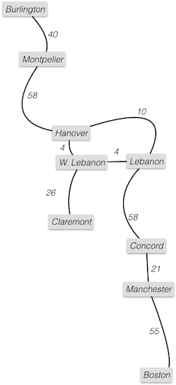

BFS works well to find paths with the minimum number of edges, as in the Kevin
Bacon Game. However, many times we will have graphs where the edges have weights,
e.g., in a map (of the cartographic kind) where the edges are roads connecting
cities, and we want shortest-distance routes.

## Outline
{:.no_toc}

* Outline
{:toc}

Code for today: <a href="resources/Dijkstra.java">Dijkstra.java</a> (from the book),
and a bunch of classes in <a href="resources/mazeSearch.zip">mazeSearch.zip</a>
with data in <a href="resources/mazes.zip">mazes.zip</a>.

## Dijkstra's Algorithm

There are a number of different path-finding problems, but we will discuss what
is called the "single-source shortest path" problem.  If there are no negative
edge weights, then this can be solved by a generalization of BFS called Dijkstra's
Algorithm, named after its inventor.  The book gives a good explanation of this
algorithm.  **You should read it!**

How could we have negative edge weights?  Well, one possibility is that the edge
weights are the costs to drive a car along the edge.  Sometimes people want to
fly and are willing to pay to have their car driven to their destination.  In this
case the cost of driving a car between two vertices can be negative.

If a graph has a cycle whose weight as you go around the cycle is negative then
there is no least-cost path.  Every time you go around the negative cycle the cost
gets less, so you can make the cost as small as you wish.  If there are no
negative-weight cycles then there are shortest paths, but computing them takes
a more complicated algorithm than Dijkstra's.  Take CS 31 to learn more about
these algorithms.

Dijkstra's algorithms is an example of a greedy algorithm.  At each step you take
what looks like the best choice, with no look-ahead.  Sometimes "greed is good"
and you get an optimal algorithm.  That happens with Dijkstra's algorithm.
Other times you get a good heuristic, but no guarantee of the optimal answer.

So how does Dijkstra's algorithm work?  Basically it grows a "cloud" of vertices
whose distance from the start vertex is known.  At each step it adds one vertex
to this cloud.  When all vertices are added we know the shortest distance to any
vertex.  (It is easy to construct a shortest-path tree as with BFS, if you want
to know the paths.)

The idea is to keep a priority queue of all of the vertices with the key for each
vertex being the best distance to the start vertex found so far.  This queue
starts with the start vertex having key 0 and every other vertex having key
INFINITY.  At each step, we:

* Remove the minimum entry from the queue and add its vertex v to the cloud, with
  the correct minimum distance being the key.  
* Check all vertices v' adjacent to v to see if we have found a shorter way to get
  there (by way of v instead of some other vertex).  (This is called "relaxation".)
  If the weight of the shortest path to v plus the weight of the v to v' edge is
  better than the currently best known path to v', then update the entry of v' in
  the priority queue.  (Note that this requires being able to find it in the priority
  queue; the book uses a heap with location-aware positions to achieve this.)

When all vertices have been added to the cloud we are done. \[Demo with the below
graph, focusing on Hanover/Leb./W. Leb.\].

{:refdef: style="text-align: center;"}

{: refdef}

One way to *clearly* show the steps of our solution is to use a table. Across the top
of the table I've labeled the columns with the names of the vertices in the graph. I've
labeled the rows with numbers corresponding to the "step" &mdash; this is just keeping
track of the number of times we go through the remove/relax part of Dijkstra's algorithm.
Also note that in the last column I have a column for the "closed set" &mdash; this is
essentially the "cloud" that we talked about in class. At each step, we pull one more
vertex into the cloud and at that point we are saying we know the shortest path from
the source to *that* vertex.

Initially, we set the distance to the source as 0 and the distance to all other
vertices as &infin; and put all of the vertices into a PQ with the distance as the key.
For each step of Dijkstra's algorithm, we (1) pull the next best vertex into the closed set (i.e., the thing with
the smallest key in the PQ), and (2) update the distances to adjacent vertices if
we've found a shorter path (i.e., "relaxation"). The last thing to notice is that we put
the name of the vertex that we came from in parentheses (i.e., the back pointer).

<center>
<table>
<tr> <th>step #</th><th>Hanover</th> <th>W. Lebanon</th> <th>Lebanon</th> <th>Claremont</th> <th>Concord</th> <th>Manchester</th> <th>Boston</th> <th>Closed Set</th> </tr>
<tr> <th>0</th> <td>0</td> <td>&infin;</td> <td>&infin;</td> <td>&infin;</td> <td>&infin;</td> <td>&infin;</td> <td>&infin;</td> <td>{}</td> </tr>
<tr> <th>1</th> <td>0</td> <td>4 (Hanover)</td> <td>10 (Hanover)</td> <td>&infin;</td> <td>&infin;</td> <td>&infin;</td> <td>&infin;</td> <td>{Hanover}</td> </tr>
<tr> <th>2</th> <td>0</td> <td>4 (Hanover)</td> <td>8 (W. Lebanon)</td> <td>30 (W. Lebanon)</td> <td>&infin;</td> <td>&infin;</td> <td>&infin;</td> <td>{Hanover, W. Lebanon}</td> </tr>
<tr> <th>3</th> <td>0</td> <td>4 (Hanover)</td> <td>8 (W. Lebanon)</td> <td>30 (W. Lebanon)</td> <td>66 (Lebanon)</td> <td>&infin;</td> <td>&infin;</td> <td>{Hanover, W. Lebanon, Lebanon}</td> </tr>
<tr> <th>4</th> <td>0</td> <td>4 (Hanover)</td> <td>8 (W. Lebanon)</td> <td>30 (W. Lebanon)</td> <td>66 (Lebanon)</td> <td>&infin;</td> <td>&infin;</td> <td>{Hanover, W. Lebanon, Lebanon, Claremont}</td> </tr>
<tr> <th>5</th> <td>0</td> <td>4 (Hanover)</td> <td>8 (W. Lebanon)</td> <td>30 (W. Lebanon)</td> <td>66 (Lebanon)</td> <td>87 (Concord)</td> <td>&infin;</td> <td>{Hanover, W. Lebanon, Lebanon, Claremont, Concord}</td> </tr>
<tr> <th>6</th> <td>0</td> <td>4 (Hanover)</td> <td>8 (W. Lebanon)</td> <td>30 (W. Lebanon)</td> <td>66 (Lebanon)</td> <td>87 (Concord)</td> <td>138 (Manchester)</td> <td>{Hanover, W. Lebanon, Lebanon, Claremont, Concord, Manchester}</td> </tr>
<tr> <th>7</th> <td>0</td> <td>4 (Hanover)</td> <td>8 (W. Lebanon)</td> <td>30 (W. Lebanon)</td> <td>66 (Lebanon)</td> <td>87 (Concord)</td> <td>138 (Manchester)</td> <td>{Hanover, W. Lebanon, Lebanon, Claremont, Concord, Manchester, Boston}</td> </tr>
</table>
</center>

For correctness proof see the book. Also, look briefly at the code,
<a href="resources/Dijkstra.java">Dijkstra.java</a>.

We add each vertex to the PQ once, remove it as the min once, and relax each edge
(and perhaps reduce a key) once.  So this is O(n*(insert time + deleteMin time) + m*(reduceKey time)).
So how long this is depends on the time to insert and deleteMin in a priority queue
and on the time to reduce a key.  The natural way to do this is to use a heap-based
PQ as the book does.  Then each operation takes O(log n), for a total of
O(n log n + m log n).

An alternate approach (that seems pretty stupid) is to keep an unordered list for
the PQ.  Then insert takes O(1), deleteMin takes &Theta;(n), and reduceKey takes
O(1) (if you have position-aware vertices so can find where a vertex is in the
list in O(1) time).  So this takes O(n<sup>2</sup> + m) time.  This is clearly
worse.  Except it isn't.  If the graph has lots of edges and m = &Theta;(n<sup>2</sup>)
this is &Theta;(n<sup>2</sup>).  The "clever" approach is &Theta;(n<sup>2</sup> log n)!
This was an embarrassment for decades.  Eventually a type of priority queue called
a Fibonacci Heap was invented, which has O(1) amortized time for reduceKey.  So
the run time is O(n log n + m), which is O(n<sup>2</sup>).

## A* search

Add Montpelier and Burlington to map above.  If you are looking for a path from
Hanover to Boston it makes no sense to calculate distances to Montpelier and
Burlington, although that is exactly what you do in Dijkstra's.  How do you know
not to bother?  You are going in the "wrong direction."  But how could Dijkstra's
algorithm know this?

{:refdef: style="text-align: center;"}

{: refdef}

If we are looking for the shortest path to a known goal we can use a generalization
of Dijkstra's algorithm called A* search to find the shortest path without taking
as much time as normal Dijkstra's.  The idea is to use an estimate the distance
remaining, and to add it to the distance traveled so far to get the key for the
city in the PQ.  For this case the normal Euclidean distance between Montpelier
and Boston would be something like 130 miles.  (Figure this Euclidean distance
from GPS coordinates of longitude and latitude.)  Adding this to the 45 miles
from Hanover to Montpelier would give 175 miles.  Therefore Boston (whose distance
will be 120 miles or so) would come out of the PQ before Montpelier.

Just as in Dijkstra's algorithm, in A* we have a PQ and a "cloud."  The cloud is
traditionally called the "closed set".  These are vertices where we know the best
path, so if we discover them again while searching we don't need to deal with them.
The second group is the "open set" corresponding to vertices in the PQ.  Just as
in Dijkstra's when we deleteMin from the PQ we move the corresponding vertex to
the cloud (closed set) and remove it from the PQ and the open set.  We then find
incident edges and relax them (update a adjacent vertex's current distance if we
have found a shorter path). But the key in the PQ is always distance so far plus
the estimate of the remaining distance.

For this to find the shortest path we need two things.  First, the estimate of
distance remaining must be <em>admissible</em>.  This means that we always underestimate
the true remaining distance or get it exactly.  Because of the triangle inequality
the Euclidean distance is an underestimate of the true travel distance.  In fact,
the ultimate underestimate of the remaining distance is 0.  This leads to normal
Dijkstra, because then we take the shortest distance traveled next.

The second requirement is that the cost estimate is monotone.  That means that
if we extend the path (thus increasing the distance travelled so far), the total
estimate is never less than the estimate before we extended the path.  This is
the generalization of "no negative edges."  Our Euclidean distance plus distance
so far estimate satisfies this, because if moving to an adjacent vertex increases
the distance so far by d it cannot reduce the Euclidean distance by more than d.
(It would reduce by exactly d if you were moving directly toward the goal.) Thus
the sum will not go down.  Using just Euclidean distance (without distance so far)
would fail to be monotone, so would not be not guaranteed to give shortest paths.

## Implicit graphs

We often deal with problems where the graph is implicit.  Consider a maze. There
is an underlying graph &mdash; the squares in the maze are the vertices and the
edges connect adjacent squares.  However, to convert the maze to a graph is more
effort than to find the shortest path, because we end up converting parts of the
maze that we would never visit.  What is worse is a puzzle like the 15-puzzle
(15 numbered tiles and a blank in a 4x4 frame, with the tiles able to slide into
the blank's position) or Rubic's Cube.  Here the size of the implicit graph is
potentially enormous.  Therefore we create vertex objects as we need them and find
adjacencies on the fly.  (For the 15-puzzle two configurations are adjacent if
they differ by sliding one tile into the blank position and for Rubic's cube two
configurations are adjacent if they differ by a twist.)

Suppose we want to find paths in a maze.  Here's a whole GUI application for
stepping through various searches: <a href="resources/mazeSearch.zip">mazeSearch.zip</a>;
and here are some example mazes: <a href="resources/mazes.zip">mazes.zip</a>
(the application assumes they're saved in the "data" folder parallel to the "src"
folder containing the code). Fire it up from "MazeSolver.java". Below we show you
an example of how the mazes are formatted:

```
**********
*S* **   *
*      * *
* **** * *
*   **** *
*** *T   *
**********
```

Note that ```*```s represent "walls", ```S``` and ```T``` represent the start and
goal, respectively, and empty spaces delineate the actual paths through the maze.

DFS can lead to very long paths.  (Example: maze5.)  BFS will guarantee finding
the shortest path, but can be very slow.  We can improve on DFS by using a
heuristic, e.g. the L1 (Manhattan) distance (shown below) from where we are to the target square.
(This means adding the x difference to the y difference between the two squares.)
If we use a PQ based on this distance we will tend to "zoom in" on the target.
However, this will not guarantee a shortest path. (Again demo the maze program.)
Can we do better?

```java
int dist = Math.abs(row-targetRow) + Math.abs(col-targetCol);
```

Using A* search we can find the shortest path without taking as much time as BFS.
The idea is to add a heuristic like the L1 distance to estimate the distance
remaining.  For our maze the L1 distance is an admissible estimate &mdash; we
move either horizontally or vertically in each step, so the number of steps needed
is at least the L1 distance.  Note we could also have used the Euclidean distance.
That would be a bigger underestimate, because the Euclidean distance will usually
be smaller than the L1 distance and will never be larger.  Demo on maze5, showing
that the square where the paths meet will be discovered from the right first, but
will be eventually included in the path from the left. Note that using a remaining
distance estimate of 0 gives BFS on the implicit maze graph, because the shortest
path is always expanded next.

### The Code

Now let's look at the code.  It uses a "sequencing" mechanism to keep track of what
to visit next.  The <code>Sequencer</code> interface basically generalizes the various
ways we've seen to establish order &mdash; stack, queue, priority queue.  Elements are
added to the Sequencer, and on request it returns the next one by whatever order
it maintains. Its elements are <code>SequenceItem</code> instances.  Here, they're
specialized to rows and columns in the maze, but we could make them generic by
requiring that they implement an appropriate interface.  Note that we define an
<code>equals</code> method to declare two items equal if their rows and columns
are equal, and we override <code>hashCode</code> so that the hashCodes of equal
items are equal.

The <code>stepMaze</code> method of <code>Maze</code> does the real work of the
application.  (Hopefully the GUI stuff makes sense and brings back good memories.)
It calls the sequencer to get the next maze square to be processed.  If the square
to be processed is the target it traces back the path, marking each square as on
the final path.  If not, and the square was not explored, it tries to add each of
its four potential neighbors to the sequencer (if they exist and are either empty
or the target) and marks the current square as explored.  This will prevent it
from being explored again later.

```java
public void stepMaze() {
  if (!isDone && theMaze != null)
    if (!seq.hasNext())
      isDone = true;
    else {
      SequenceItem current = seq.next();
      int row = current.getRow();
      int col = current.getCol();
      if (theMaze[row][col] == TARGET) {
        isDone = true;
        tracePath(current.getPrevious());
      }
      else if (theMaze[row][col] == EMPTY || theMaze[row][col] == START) {
        addIfValid(row-1, col, current);
        addIfValid(row+1, col, current);
        addIfValid(row, col-1, current);
        addIfValid(row, col+1, current);
        if (theMaze[row][col] == EMPTY) // Don't change START
          theMaze[row][col] = EXPLORED;           
      }
    }
}
```

The actual code for solving the maze would have been simpler if we were not creating
an interactive GUI.  The GUI requires spreading the solution out, separating out
the code for taking a step and making it act on the current "state" of the maze.
This step code would normally be part of a loop.  But here the loop is provided
by the GUI, either via the Step button or repeated calls from the Timer after
clicking Solve.

We have a bunch of different ways to search, via different subclasses of
<code>Sequencer</code>.  <code>StackSequencer</code> and <code>QueueSequencer</code>
use a stack and queue, respectively, to add and get the next item.
<code>DistSequencer</code> uses a priority queue, where the priority is the L1
distance to the target.  This distance gets saved in the key field in the
<code>PQSequenceItem</code> and is used when comparing items in the priority queue.
Finally <code>AStarSequencer</code> keeps track of the open set via a map from
<code>SequenceItem</code>s to entries in the PQ, so that when we find a shorter
distance we can find and update the appropriate PQ entry.  It uses an
<code>AdaptablePriorityQueue</code> (from the book) to allow the value of an entry's
key to be changed when relaxation finds a better path.  The <code>AStarSequenceItem</code>
has an instance variable to hold the path length and a method get it, because that
is part of the estimate.  
