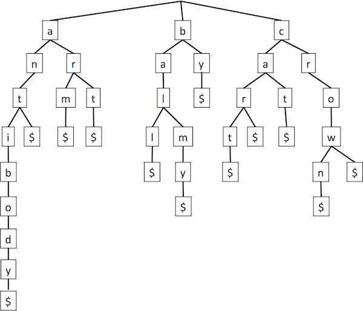
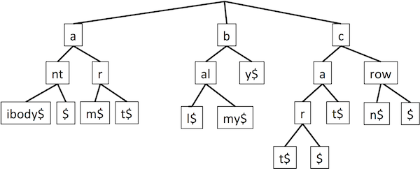
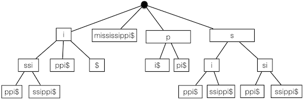

Matching/recognizing patterns in sequences is a fairly common problem in CS.
Specifically, we often would like to match/recognize substrings in a larger string.

Today, we'll sample both algorithm and data structure based approaches for various
string/substring matching problems.

## Outline
{:.no_toc}

* Outline
{:toc}

## Boyer-Moore algorithm

Suppose we are given two strings, a text and a query, and asked if the query is
a substring of the text; i.e., if the whole query appears anywhere in the text
(perhaps leaving out some characters before/after). The Java indexOf() method does
this, e.g., "abcdef".indexOf("cde") is 2, while "abcdef".indexOf("xyz") is -1 (not
found). Apparently the implementation uses a naive, brute-force search. For each
position in text, try to match the query there. In trying to match the query, first
see if character 0 of query matches the current position of text, then if character
1 of query matches the current position + 1 of text, etc. If the text is of length
<i>n</i> and the query of length <i>m</i>, the running time is O(mn), as we might
try matching all <i>m</i> query characters starting at all <i>n-m+1</i> positions
in text (we assume that <i>n</i> is larger than <i>m</i>).

A whole slew of different algorithms have been developed to do better than that,
in both theory and practice. Boyer-Moore is one that is practically very good (and
thus commonly applied), and versions of it require in theory only O(m + n) = O(n),
which is pretty amazing to me. We'll look at a more basic version that doesn't
achieve the linear running time in theory, but does work quite well in practice
for "reasonable" texts.

The key insight behind Boyer-Moore (and others) is that we can make use of the work
we did in partially matching the query to the text at a given position, before
discovering that not all of the query matched there. So consider the example with
text "abczefabcdef" and query "abcdef", trying to match at position 0 in the text:

```
012345678901
abczefabcdef
abcdef
```

Boyer-Moore actually works backwards through the query when trying to match at a
given position in the text. So we match the character 5 in the query ("f") against
text character 5, then 4 ("e") against 4, but then we hit a mismatch at 3 where the
query has "d" and the text has "z". But our query doesn't have any "z"s in it at
all! So it would be a complete waste of time to shift the query over one and try
to match starting with position 1 in the text, since we now know that the match
would need to have a "z" to place against the one in the text. Same with starting
at position 2 or 3, each of which would require a "z" in the query. So we should
start the next attempted match at position 4, past that bad letter.

That's the extreme case, but what about the case where it's a mismatch with a letter
that the query does have? Well, let's pick up after the shift due to "z":

```
012345678901
abczefabcdef
    abcdef
```

We first try to match the "f" in the query against the "d" in the text, but
immediately fail. So now we know we'll need a "d" there. And since we know we'll
be working backwards through the query, we know that the next possible place to
start the match requires shifting so that the "d" in our query would align with
that "d". That might or might not work (it does here), so we test it in the usual
way (starting from the end again). The point is that the shift gives us the next
position to try.

What if there were multiple "d"s in the query? Slight modification:

```
012345678901
abczefabddef
    abddef
```

Should we shift over so that the first or the second "d" in the query lines up with
the mismatched "d" in the text (at position 9)? Well, if we shifted over so that
the first one lined up, then we'd actually scoot right by the correct match, which
has the second one there! So in general, we shift based on the <em>last</em>
occurrence in the query of the character in the text that caused the mismatch.

And what if the last occurrence in the query of the mismatched character is already
after the mismatch?

```
012345678901
abcfefabddef
abddef
```

We wouldn't want to move backwards. So we can't make use of the partial match information,
and just advance the position by 1 as in the naive algorithm.

The final question is how to efficiently compute the last occurrence of the character.
That's done in a preprocessing step and stored in a HashMap (though there are other
ways that you could do this) &mdash; the map stores a ```Character``` as the key and
an ```Integer``` value corresponding to the last position in the query string where we
saw that character. If the character is encountered more than once, we just update
it with the most recently seen position in the query string.

Putting it all together, here's the code fragment from GTG (slightly updated/cleaned up):

```java
public static int findBoyerMoore(char[] text, char[] pattern) {
    int tLen = text.length;
    int pLen = pattern.length;

    // trivial search for empty string.
    if (pLen == 0)
        return 0;

    // Initialization.
    Map<Character, Integer> last = new HashMap<>();
    for (int i = 0; i < tLen; i++) {
        last.put(text[i], -1);   // set all chars, by default, to -1
    }        
    for (int i = 0; i < pLen; i++) {
        last.put(pattern[i], i); // update last seen positions
    }

    // Start with the end of the pattern aligned at index pLen-1 in the text.
    int tIdx = pLen - 1;  // index into the text
    int pIdx = pLen - 1;  // index into the pattern
    while (tIdx < tLen) { // match! return tIdx if complete match; otherwise, keep checking.
        if (text[tIdx] == pattern[pIdx]) {
            if (pIdx == 0)
                return tIdx; // done!
            tIdx--;
            pIdx--;
        } else { // jump step + restart at end of pattern
            tIdx += pLen - Math.min(pIdx, 1 + last.get(text[tIdx]));
            pIdx = pLen - 1;
        }
    }
    return -1; // not found.
}

public static void main(String[] args) {
    int matchPos = findBoyerMoore("abcfefabddef".toCharArray(), "abddef".toCharArray());
    System.out.println("mathch starting at position: " + matchPos);        
}
```

## Tries

Let's turn to a different string matching problem: looking up words in a dictionary.
We already saw a bunch of Map implementations that could handle that. But they
didn't take advantage of the content of the words, just their relative ordering
(for BST) or some funky numeric function of their characters (for hashing). A
<em>trie</em> provides an alternative data structure that allows efficient lookup
based on actual content of the strings in the Map (the word is a substring of
"retrieval", and is commonly pronounced "try" to distinguish from "tree").

A trie is a multi-way tree. Each node (other than the root) has a letter. To match
a string, start at the root, go to the child with the first letter, go to its
child with the second letter, etc. (So it's basically a special deterministic
finite automaton.) It is often assumed that each word ends in a special character
$, so that we can easily distinguish where a word ends when it can also have children
extending it (it's a prefix of another word). An example trie:

<center>

</center>

So to search for "art", start at the top, go to "a", then "r", then "t", then end-of-word "$".

Insertion works analogous to BSTs &mdash; follow the path to where the word should
be, then add nodes and edges to complete it. E.g., to insert "artistic", just pick
up at the "t" we found for "art".

How long do trie operations take? We have to take <i>n</i> steps down the tree for
a word of length <i>n</i>. Each step requires deciding which child to visit. But
if our alphabet has <i>d</i> letters, then there are at most <i>d</i> children.
So the total is O(dn). Finding the child could be sped up by e.g., storing them
in an array indexed by letter, but <i>d</i> is a constant anyway (and that would
take a lot of space). Key point: the overall time is proportional to the length
of the query word, independent of the number of words.

A trie can be compressed by recognizing that we need not separately store a node
with only one child, and in fact can group a whole substring that has no branches
inside it.

<center>

</center>

The number of nodes is reduced from O(n) (the number of letters) to O(s) (the number
of strings). Furthermore, rather than actually storing the actual letters in the
nodes, we can store just the indices into the underlying set of strings &mdash;
which string, start position, stop position. Then each node requires constant space.
The strings must still be stored, but externally to the trie.

In addition to serving as a Map, a trie can be used for sorting. Insert all the
words into a trie, then pull them out by a pre-order traversal (i.e., visiting
the children in alphabetical order, recursing to all the descendants of one child
before moving on to the next). Since the trie takes linear time to construct and
linear time to traverse, we have a linear time search. (If you're familiar with
radix sort, it's quite similar in spirit, and the linearity likewise follows from
exploitation of the fixed-sized alphabet instead of doing explicit inequality
comparisons.)

Another application is autocomplete. After you've typed the first few letters of
a word, you've gone part-way down the tree, and the leaf nodes under that node are
possible completions. To generate suggestions quickly, the inner node could store
the top few leaves according to some scoring scheme (e.g., usage frequency). Other
data structures, such as ternary search trees, have been developed to do basically
the same thing but requiring less storage space.

## Suffix trees

Now let's return to finding substrings. We can preprocess the text into a trie
containing all its suffixes. This is called a suffix trie or a suffix tree. The
canonical example of "Mississippi", compressed as discussed above for tries (though
still showing substrings rather than indices, for readability):

<center>

</center>

A somewhat complicated algorithm constructs it in O(n) time. An important note:
if we're setting up a database of text for searching, that's only done once, in
preprocessing.

Then to see if a query is a substring, we just see if we can follow a path through
the suffix tree that matches it, just like trie look-up. The point is that a substring
is a prefix of some suffix. This takes O(m) time for a length-<i>m</i> query.

There are lots of other applications for suffix trees. Note that unlike collisions
in a hash table, repeated entries in a trie or suffix tree are the same, and reveal
information. Thus, for example, to find the longest common substring: put both
strings into a single suffix tree ("generalized suffix tree"); label nodes with
which string they came from; see which doubly-labeled node is deepest. This can
work with multiple strings. Likewise the longest repeated substring of a string
is at a deepest node marked as appearing in two places in the string. Or the most
common repeated substring is the node with the most hits. To find the longest
palindrome: put the string and its reverse in generalized suffix tree; look for
longest common substring. In a different direction, suffix trees can be used for
compression. For example (Lempel-Ziv), rather than re-outputting a string that has
already been output, just point back to a previous occurrence (start and end indices).
