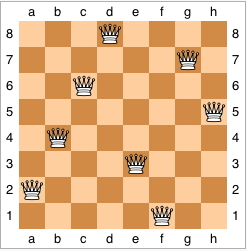

## Outline
{:.no_toc}

* Outline
{:toc}
# March 6: Backtracking #

<a href="../24/24.html">[prev]</a>
<a href="../1/1.html">[next]</a> 

<h2 id="backtracking">Backtracking</h2>

Sometimes instead of finding a single path or a single solution we want to find 
all solutions. A systematic way of doing this is called <strong>backtracking</strong>. 
It is a variant of depth-first search on an implicit graph. The typical approach 
uses recursion. At every choice point, loop through all the choices. For each 
choice, solve the problem recursively. Succeed if you find a solution; otherwise 
fail and backtrack to try an alternative.

Backtracking is a way of solving a problem by recursively exploring all possible 
solutions. The basic approach is:

```
procedure backtrack(partialSolution)

if partialSolution is a complete solution
  print partialSolution or add it to a list of solutions
else
  For all ways to extend partialSolution by one "step" 
    expand partialSolution by adding the next "step" to get partialSolution'
    if partialSolution' is valid
      backtrack(partialSolution')
    if necessary restore partialSolution to the state it was in before you updated it
```


<h3>Subset Sum</h3>

To beign, we will look at a program to solve the subset sum problem. We are given 
a list of positive integers (with no repetitions) and a target number. The goal is 
to find all subsets of the integers that sum to the target.

So what is a "step" in this problem? It is to decide whether to add the next number 
in the list to the subset or not.  So we will make two recursive calls, one where 
add the next number to the subset and one where we do not.  A complete solution is 
one that sums to the target.  A solution is still valid if the sum is at most the 
target.  (Because the integers are all positive there is no way to extend a subset 
to get a solution if the sum is already too large.)  The code for 
<a href="resources/SubsetSum.java">SubsetSum</a> is:

```java
public class SubsetSum {

    /**
     * Finds all subsets of the numbers in List that add up to target.
     * 
     * @param numbers  The list of positive integers (cannot have duplicates!)
     * @param pos      The current position in numbers to be considered
     * @param subset   The current subset
     * @param sum      The sum of the integers in subset
     * @param target   The goal number that the sum should equal
     */
    public static void findSubsets(List<Integer> numbers, int pos, 
            Set<Integer> subset, int sum, int target) {
        if(sum == target)
            System.out.println("Subset: " + subset);
        else if(sum < target && pos < numbers.size()) {  // Do nothing if sum too large
            Integer m = numbers.get(pos);
            subset.add(m);
            findSubsets(numbers, pos+1, subset, sum+m, target); // Include pos
            subset.remove(m);
            
            findSubsets(numbers, pos+1, subset, sum, target);  // Don't include pos
        }
    }
```


<h3 id="n-queens"><span class="math"><em>N</em></span>-queens</h3>

Let's consider the <strong><span class="math"><em>N</em></span>-queens problem</strong>. The goal is to place <span class="math"><em>N</em></span> queens on an <span class="math"><em>N</em> × <em>N</em></span> chessboard such that no two queens can capture one another. (Two queens can capture one another if they are in the same row, column, or diagonal.)

A truly brutish brute-force solution technique would be to consider <em>all</em> possible ways of placing <span class="math"><em>N</em></span> queens on the board, and then checking each configuration. This technique is truly awful, because for an <span class="math"><em>N</em> × <em>N</em></span> board, there are <span class="math"><em>N</em><sup>2</sup></span> squares and hence <span class="math">$N^2 \atopwithdelims() N$</span> possible configurations. That's the number of ways to choose <span class="math"><em>N</em></span> items (squares) out of <span class="math"><em>N</em><sup>2</sup></span>, and it's equal to <span class="math">$\displaystyle \frac{N^2!}{N!(N^2-N)!}$</span>. For an <span class="math">8 × 8</span> board, where <span class="math"><em>N</em> = 8</span>, that comes to 4,426,165,368 configurations.

Another, less brutish, brute-force solution takes advantage of the property that we must have exactly one queen per column. So we can just try all combinations of queens, as long as there's one per column. There are <span class="math"><em>N</em></span> ways to put a queen in column 1, <span class="math"><em>N</em></span> ways to put a queen in column 2, and so on, for a total of <span class="math"><em>N</em><sup><em>N</em></sup></span> configurations to check. When <span class="math"><em>N</em> = 8</span>, we have reduced the number of configurations to 16,777,216.

We can make our brute-force solution a little better yet. Since no two queens can be in the same row, we can just try all permutations of 1 through <span class="math"><em>N</em></span>, saying that the first number is the row number for column 1, the second number is the row number for column 2, and so on. Now there are &quot;only&quot; <span class="math"><em>N</em>!</span> configurations, which is 40,320 for <span class="math"><em>N</em> = 8</span>. Of course, for a larger board, <span class="math"><em>N</em>!</span> can be mighty large. In fact, once we get to <span class="math"><em>N</em> = 13</span>, we get that <span class="math"><em>N</em>!</span> equals 6,227,020,800, and so things are worse than the most brutish brute-force solution for <span class="math"><em>N</em> = 8</span>.

So let's be a little smarter. Rather than just blasting out configurations, let's pay attention to what we've done. Start by placing a queen in column 1, row 1. Now we <em>know</em> that we cannot put a queen in column 2, row 1, because the two queens would be in the same row. We also cannot put a queen in column 2, row 2, because the queens would be on the same diagonal. So we place a queen in column 2, row 3. Now we move onto column 3. We cannot put the queen in any of rows 1–4 (think about why not), and so we put the queen in row 5. And so on.

This approach is called <strong>pruning</strong>. At the <span class="math"><em>k</em></span>th step, we try to extend the partial solution with <span class="math"><em>k</em> − 1</span> queens by adding a queen in the <span class="math"><em>k</em></span>th column in all possible positions. But &quot;possible&quot; now means positions that don't conflict with earlier queen placements. It may be that no choices are possible. In that case, the partial solution cannot be extended. In other words, it's infeasible. And so we backtrack, undoing some choices and trying others.

Why do we call this approach pruning? Because you can view the search as a tree in which the path from the root to any node in the tree represents a partial solution, making a particular choice at each step. When we reject an invalid partial solution, we are lopping off its node <em>and the entire subtree that would go below it</em>, so that we have &quot;pruned&quot; the search tree. Early pruning lops off large subtrees. Effort spent pruning usually (but not always) pays off in the end, because of the exponential growth in number of solutions considered each time a choice is made.

Go through the backtracking for <span class="math"><em>N</em> = 4</span>:

Here is one solution for <span class="math"><em>N</em> = 8</span>, taken from Wikipedia:

<center>

</center>


<h3>Instant Insanity</h3>

We consider the puzzle called Instant Insanity.  It came out well
before Rubic's Cube and other really difficult puzzles.  The puzzle has
four cubes.  For each cube each of its six sides is colored red, blue,
green, or white.  (Show the puzzle.)  The puzzle is to make a tower 
of the cubes by stacking them one on top of another in a way that
each side of the tower has each color appearing once.

We use an object-oriented approach to the puzzle.  We want an
object type <a href="Cube.java"><code>Cube</code></a>
to hold an individual cube.  It holds the colors of the six faces
in instance variables, and allows us to rotate the cube, tip it 
90 degrees around the front-back axis so that the top becomes the left
face, and to flip it around the same axis so that the top becomes the
bottm.

Much of the work is done in the class 
<a href="CubeTower.java"><code>CubeTower</code></a>.  This object
contains all four cubes.  It supplies methods to rotate, flip, and 
tip particular cubes and a validity test to see if there are any 
conflicts.

The program <a href="Insane1.java"><code>Insane1</code></a>
is a really stupid, brute-force way to solve the puzzle.  It is clever 
enough to note that flipping each piece simultaneously will give another
solution and that rotating the tower, starting with either the original solution 
or the flipped solution, will give four solutions each.  Therefore it only
places the bottom cube in three positions, one for each top-bottom pair.

The other cubes are each placed in 24 positions. (4 rotations, 
flip, 4 rotations, flip back, rotate and tip. Repeat three times.  This actually
gets you back to where you started.)  There is no pruning.
Only when all 4 cubes are placed do we check for validity.  This results
in 43,276 calls to <code>placeCube</code>.  Not bad for a computer, but slow by hand.
(Thirty years ago it took a while even on a computer).

<a href="Insane2.java"><code>Insane2</code></a> has the sense to 
check for validity of the first k placements before proceeding to placement
k+1.  This improves things a whole lot.  It results in 1347 validity tests and
58 calls to <code>placeCube</code>.  This is not unreasonable to do by hand,
and takes virtually no time on a computer.

<a href="Insane3.java"><code>Insane3</code></a> adds additional pruning.
The idea is that there are partial solutions that have no conflicts on their sides that still
cannot be extended to a complete solution.  We would like to prune these, also.  
Whenever we place a cube we "bury" its top color and its bottom color, in the sense
that they are no longer available to appear on the sides. If we bury enough occurrances
of a color there will not be 4 copies of that color to appear on all four sides of the
tower, so the partial solution cannot be extended to a complete solution.  
<a href="Insane3.java"><code>Insane3</code></a> uses the object 
<a href="BuriedCount.java"><code>BuriedCount</code></a> to keep track of
how many of each color have been buried and whether a solution might still be possible.
It allows us to bury and unbury particular colors.
<a href="CubeTower.java"><code>CubeTower</code></a> has methods to bury and 
unbury the top and bottom faces of a cube and to ask <code>BuriedCount</code> 
whether a solution is still possible.  This reduces the number
of validity tests to 379 and the number of calls to <code>placeCube</code> to 37.  For
36 of these calls we bury, unbury, and test whether we have buried too much three times.
This is practical to do by hand.

Note - The idea of this backtracking is simple, but the details of how the cubes are placed and rotated gets complicated.  The N-queens backtracking is <em>much</em> simpler.  You should not be creating new classes or using data structures beyond an <code>ArrayList</code> and some arrays.


MORE NOTES:

In instant insanity the "step" was to place the next cube in each of the 24 possible orientations.  Unfortunately this was fairly complicated, and the basic simplicity of the program was hidden.

