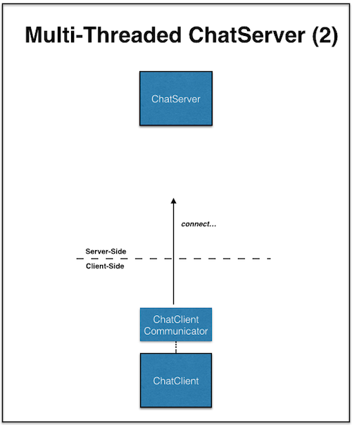

Today we'll move from using web services to providing our own. We'll create servers
to which clients can connect, and clients that properly connect with those servers.
Ultimately we'll end up with a little chat server that allows multiple clients to
talk with each other. To get there, we'll have to understand how to establish a
communication mechanism, as well as how to juggle multiple tasks. Again, relevant
Java tutorials are listed in case you want more in depth reading.

## Outline
{:.no_toc}

* Outline
{:toc}

All the code files for today:
[WWWSocket.java](resources/WWWSocket.java) |
[HelloServer.java](resources/HelloServer.java) |
[HelloClient.java](resources/HelloClient.java) |
[HelloMultithreadedServer.java](resources/HelloMultithreadedServer.java) |
[HelloServerCommunicator.java](resources/HelloServerCommunicator.java) |
[ChatClient.java](resources/ChatClient.java) |
[ChatClientCommunicator.java](resources/ChatClientCommunicator.java) |
[ChatServer.java](resources/ChatServer.java) |
[ChatServerCommunicator.java](resources/ChatServerCommunicator.java) |
[MyIPAddressHelper.java](resources/MyIPAddressHelper.java)

## Sockets

> Java tutorials on <a href="http://docs.oracle.com/javase/tutorial/networking/sockets">sockets</a>

Sockets enable two different programs to communicate with each other. One program
sends messages to the other program's socket, and the other responds to the first
program's socket. You can imagine a virtual wire connecting the two computers, with
its ends plugged into the sockets.

How do we get a socket? Typically, one side (the "server") is sitting there waiting
for someone (a "client") to give it a call. The server publicly distributes a way
to make that initial connection (like a published phone number). But since all
clients will be trying to reach the server there, once it makes a connection with
a new client, it shifts them over to their own connection.

**Question:** *what would happen if the server didn't move new clients over to a new
connection of their own?*

We can do this to directly access a WWW server, here www.cs.dartmouth.edu: [WWWSocket.java](resources/WWWSocket.java).
We need the address and the "port" on which the server is listening for incoming
connections, which is 80 for HTTP (If you are curious, Wikipedia posts a list of
["well-known" ports](https://en.wikipedia.org/wiki/List_of_TCP_and_UDP_port_numbers);
no need to memorize them since you can always look them up, but over time you'll
become familiar with some of the "big ones" like HTTP (80), HTTPS (443), SSH (22), etc.).
The server then creates the socket. Java provides a class, conveniently called "Socket"
that abstracts this process. It provides methods to give us an input stream and an
output stream, so we can use our usual IO methods to handle the communication.

This is the first time we've actually gotten input from the console (as opposed to
via GUI). System.in is kind of the counterpart to System.out. But to read discrete
lines of input, we wrap it up into a "Scanner", which provides a method nextLine()
returning a String representing the next line of input (after we press the "return"
key).

## Server

To make our own server, we do this same thing: listen on a particular port; when a
client connects to a ServerSocket for that port, create a Socket specifically for
them. This Socket then supports the communication via stream readers/writers.
The code: [HelloServer.java](resources/HelloServer.java). We need to use a port
that isn't in use by any other service; I'm just guessing that 4242 is safe (it's
not used by any of the popular services I know, but let me know if it causes issues
for you).

You can actually connect to this server via *[telnet](https://en.wikipedia.org/wiki/Telnet)*, if you happen to have that
installed on your machine. Start up the server in Eclipse, then from the command line
(Terminal on Mac and a lot of Unix-/Linux-based systems; and Windows Command Prompt
on Windows systems -- try googling how to open this application on your system if
you don't know how to do this already.):

```
> telnet localhost 4242
Trying ::1...
Connected to localhost.
Escape character is '^]'.
who is it?
chris
hi chris! anybody else there?
my cat
hi my cat! anybody else there?
^]
telnet> Connection closed.
```

Or we could write our own client, which is much like the WWW client above, but with
a different protocol, repeatedly sending and receiving: [HelloClient.java](resources/HelloClient.java).
Note that you can fire up both the server and the client in Eclipse (in that order)
and then switch between consoles with a little button on the side.

{:refdef: style="text-align: center;"}

{: refdef}

**Question:** *why is it important to start the server and the client in the order we described above?*

You can greet your friends by running the server on your machine, telling them your
IP address, and having their client create a Socket to that address rather than
"localhost". (How exactly to find your IP address depends on your OS, but it's
associated with your network interface connection (wi-fi/ethernet). For our examples,
and your convenience, I've added [MyIPAddressHelper.java](resources/MyIPAddressHelper.java)
which does the leg work of identifying the IP address of your machine that is running
the server; this should work but if you have problems, there are also websites that
can help, e.g., [amazonaws](http://checkip.amazonaws.com/) that will tell you your global IP, or
websites with instructions about how to find your IP on your current network through
your systems "System Preferences" ([Mac OS X](http://osxdaily.com/2010/11/21/find-ip-address-mac/),
[Windows](http://windows.microsoft.com/en-us/windows/find-computers-ip-address#1TC=windows-7)).

{:refdef: style="text-align: center;"}

{: refdef}

**(!) NOTE:** When creating a server that listens on some port number, you may encounter
this error: `java.net.BindException: Address already in use`. This means that you
already have a server running that is listening on that port number; if you kill the
running server and then try to re-run yours, it should work.

## Multithreaded server

> Java tutorials on <a href="http://docs.oracle.com/javase/tutorial/essential/concurrency/procthread.html">threads</a>

Our server so far can only talk with one client. To talk with multiple clients,
we kind of need multiple servers running. But how many, and how do we coordinate
their connections with the clients? The trick, as summarized in our initial
discussion, is to handle it on an as-needed basis. Each time someone connects to
our main listening port (via a server socket), we'll give them their own socket,
and also a separate instance to handle their communication. All these instances
need to be able to talk with their clients "at the same time". That is, they are
<em>concurrent</em>.

Java provides Thread mechanism to handle concurrently executing pieces of code
within the same application. (Note that this is much lighter weight than having
multiple applications running simultaneously, which is handled by your operating
system.) One way to establish a concurrently running thread is to have a class
inherit from Thread and override the run() method to provide its code. To start
a thread instance, we invoke its start() method.

{:refdef: style="text-align: center;"}

{: refdef}

Multithreaded code: [HelloMultithreadedServer.java](resources/HelloMultithreadedServer.java)
is the main server, and [HelloServerCommunicator.java](resources/HelloServerCommunicator.java)
handles the server's communication with one particular client. The server communicator
extends Thread and overrides the run() method to do the same thing we had in our
original single-threaded server: set up the communication channel through the socket,
and send and receive messages. The HelloMultithreadedServer.getConnections() method
just keeps listening to the main port and creating new sockets and communicators
whenever someone connects.

You can test this version by multiple telnets / multiple runs (instances) of the HelloClient
client program.

The server creates a separate thread to handle each connected client. When a client
disconnects, the input stream recognizes that and the while-loop terminates and
then the thread is finished (after some clean up). What if the server itself is
terminated? Without care, all the communicator threads can keep on going. While
that may not happen or may not matter, to be careful here we designate the
communicators as "daemon" threads, which means they don't really have a life of
their own, and when the main thread is done, they all terminate too.

{:refdef: style="text-align: center;"}

{: refdef}

## Chat server

> Java tutorials on <a href="http://docs.oracle.com/javase/tutorial/essential/concurrency/syncmeth.html">synchronized methods</a>

Our chat server builds on the multithreaded server and the client, but of course
has different behaviors. The idea is that a client connects and give their name.
Everyone who is already connected will be told of that person's entrance. Then
when someone types something, the server broadcasts it to everyone else (attributing
the message to that person, since they have given their name).

Starting with the server: [ChatServer.java](resources/ChatServer.java) and
[ChatServerCommunicator.java](resources/ChatServerCommunicator.java). The main
server fires of a communicator (for a specific client) pretty much the same way
that it did in the multithreaded hello server, but with the protocol of first
getting a name and then looping for the conversation.

ChatServer.getConnections() does our usual loop of listening to the port and creating
new communicators when clients connect. It keeps a list of all the currently running
communicators. So when a communicator is created, it is added to the list, and
when it is hung up on, it is removed from the list (see the clean-up section of
ChatServerCommunicator.run(). The communicator list enables the server, in the
broadcast() method, to send a message to all the other clients, when it receives
a message from one of them.

There's one thing you might have noticed in each of these methods (in addition to
the fact that I bothered to create such simple methods as addCommunicator() and
removeCommunicator()). They all have the keyword "synchronized". Synchronization
will be the topic of the next class, but this is a good opportunity to begin thinking
about issues when resources are shared. We have a list "comms" to which multiple
communicator threads have access. So it is possible that two could be trying to
modify it (and even a third trying to broadcast to it) at the same time. This could
lead to unexpected behaviors that we'll explore next class. The "synchronized"
keyword ensures that only one thread at a time is able to access that list.

The client: [ChatClient.java](resources/ChatClient.java) and
[ChatClientCommunicator.java](resources/ChatClientCommunicator.java). It's also a
bit more complicated, as it needs to be able to receive broadcasts from the server
while it's waiting for the next console input from the user. We let the main
thread (via ChatClient.handleUser()) handle the console input part. We fire off
a thread (via a new instance of ChatClientCommunicator) to listen for broadcasts
from the server. Why does that need to be in a separate thread from the client
itself? (Hint: is anything keeping the client tied up and unable to listen for
the input from the server?) One extra bit of cleanup is when the server hangs up,
the server-listening thread tells the main thread. (There are fancier ways to do
that, but this makes the point clear.)

Here is the basic progression:

{:refdef: style="text-align: center;"}



{: refdef}

{:refdef: style="text-align: center;"}

{: refdef}

## Java notes

<dl>

<dt>synchronized</dt>
<dd>Marks a method (or with a refined version, a code block) so that only one thread at a time is allowed to use any of an object's synchronized blocks. We'll spend the whole nextclass on synchronization.</dd>

</dl>
