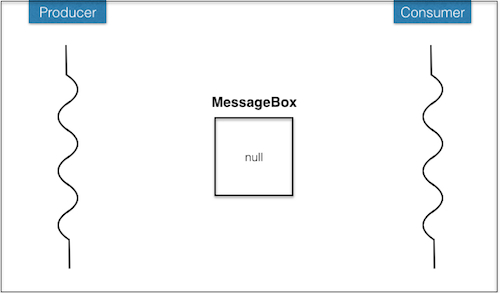
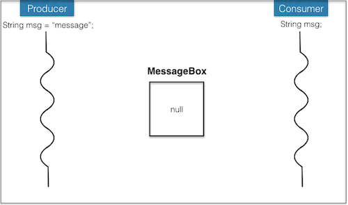
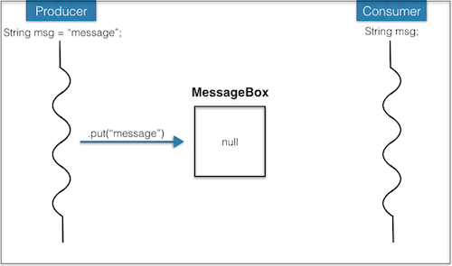
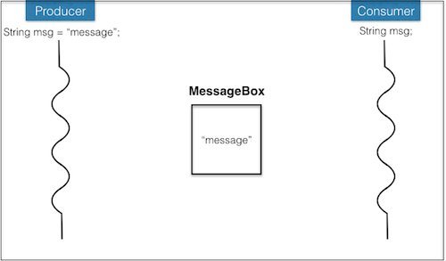
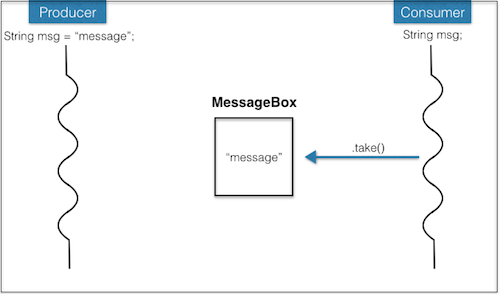
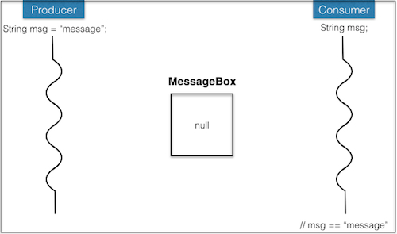
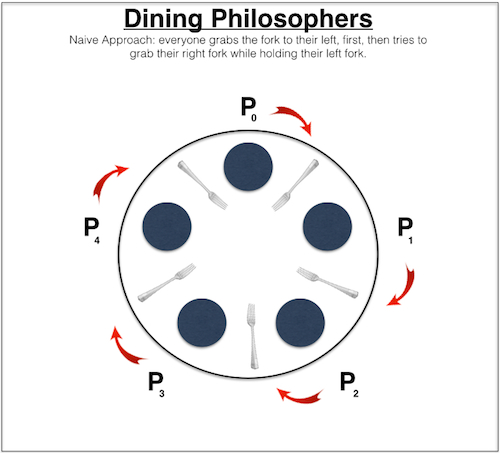
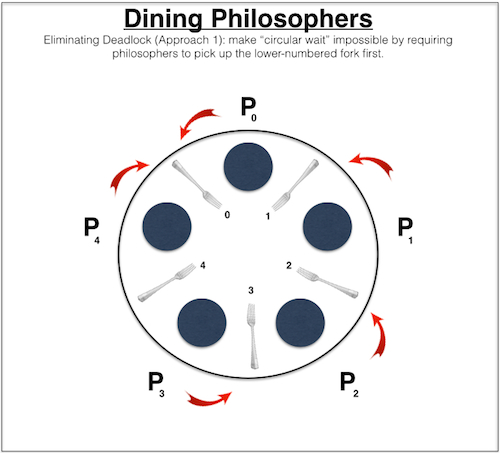
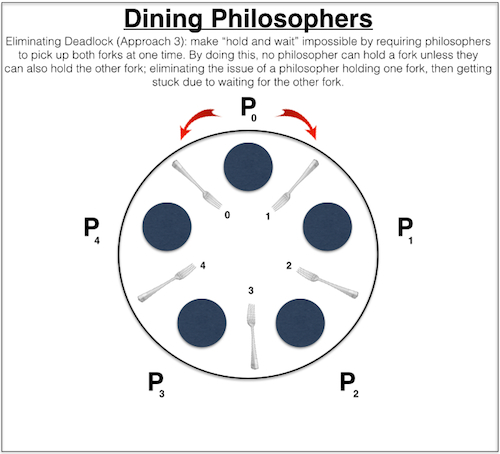

## Outline
{:.no_toc}

* Outline
{:toc}
# January 22 (x-hour): Synchronization #

<a href="../7/7.html">[prev]</a>
<a href="../9/9.html">[next]</a> 

We saw briefly at the end of last class that we should be careful when concurrent 
threads are accessing shared resources. Today we'll explore related issues in a 
bit more depth. For further reading, see the 
<a href="http://docs.oracle.com/javase/tutorial/essential/concurrency/index.html">concurrency tutorial</a>.</p>

## Outline ##

* <a href="#interleave">Interleaving execution</a>
* <a href="#pc">Producer/consumer</a>
* <a href="#deadlock">Deadlock, starvation</a>

All the code files for today: 

1. [Incrementer.java](resources/Incrementer.java) | 
[IncrementerInterleaving.java](resources/IncrementerInterleaving.java) | 
[IncrementerTotal.java](resources/IncrementerTotal.java) | 
[IncrementerSync.java](resources/IncrementerSync.java) 
2. [ProducerConsumer.java](resources/ProducerConsumer.java)
[Producer.java](resources/Producer.java) | 
[Consumer.java](resources/Consumer.java) | 
[MessageBox.java](resources/MessageBox.java)
3. [DiningPhilosophers.java](resources/DiningPhilosophers.java) | 
[Philosopher.java](resources/Philosopher.java) | 
[Fork.java](resources/Fork.java)
4. [MonitoredDiningPhilosophers.java](resources/MonitoredDiningPhilosophers.java) | 
[MonitoredPhilosopher.java](resources/MonitoredPhilosopher.java) | 
[MonitoredFork.java](resources/MonitoredFork.java)

<a name="interleave"></a><h2>Interleaving execution</h2>

[Incrementer.java](resources/Incrementer.java) provides a very simple example of 
what can happen when two threads are accessing a shared resource. The shared resource 
here is a variable, and each thread is incrementing it. These threads run concurrently. 
The main method also calls join() on each of them. This method says that the current 
thread should wait until the thread that join() is called on completes. Otherwise 
the the main program can print "total at end" before the other two have completed. 
They keep running on their own.

It looks like the threads should each increment the total a million times, so the 
total should be 2 million. Why isn't it? There can be a low-level interleaving of 
the thread execution, such that they trample on each other. For example, the first 
thread could get the current total (say 100) and be in the process of adding 1 to 
it, and meanwhile the second thread also gets the current total (still 100) and 
begins adding 1 to it. The first thread finishes addition and writes the new total 
(101), but then so does the second thread. Two increments for the price of one!

[IncrementerInterleaving.java](resources/IncrementerInterleaving.java) further illustrates 
this, by putting some print statements in the middle of the incrementing, so that 
we can see the interleaving. All kinds of orders happen, though usually they trample 
on each other (I/O slows things down and provides a good chance for someone else 
to slip in).

[IncrementerTotal.java](resources/IncrementerTotal.java) is a new class that has 
a synchronized method for incrementing; [IncrementerSync.java](resources/IncrementerSync.java) 
uses it to do a properly synchronized version of two incrementers. Only one thread 
at a time can be executing any synchronized method of a single object. Thus the 
increment is "atomic" &mdash; it happens without any kind of visible subdivision 
into pieces that can be interleaved. This approach is a version of what is known 
as a <em>monitor</em>. With a monitor there are critical sections of code that 
only one thread should be allowed to execute at a time. If every method in a class 
is synchronized (except constructors, which cannot and do not need to be synchronized) 
then we would have a standard monitor. Java allows more flexibility, in that it 
allows only some methods in the class to be synchronized. This increases the amount 
of concurrency allowed, but can cause problems when a programmer fails to realize 
that certain operations cannot be safely performed simultaneously.

The basic idea of a monitor is that only one thread can be inside of it at a time. 
If several threads make method calls one is allowed to proceed and the others must 
wait. One of them will be allowed to proceed once the first thread leaves the 
critical region (the synchronized method). Java implements this by providing a 
lock for each object. Only one thread can hold the lock at a time, and it gives 
it up when it returns from the synchronized method. The other threads wait for 
the lock to come available.

Look back at the chat server from last time, and you'll see that access to the list 
of communicators is synchronized. What could go wrong if it weren't?

<a name="pc"></a><h2>Producer/consumer</h2>

Let's look at another example of when concurrent threads need to be synchronized. 
In a "producer/consumer" set-up, one or more Producers output items and one or 
more Consumers input the items that the Producers produce. The Consumers can't 
consume until the Producers have produced, and the Producers can't get too big a 
backlog of unconsumed items. The Consumers of one item can in turn be Producers 
of another item, leading to a pipeline through which items flow. For the pipeline 
to flow smoothly, the production/consumption has to be synchronized.

A powerful example of this is approach the "pipe" construct in Unix. The following 
is a spell checker.

```
cat USConstitution.txt | tr 'A-Z' 'a-z' | tr -cs 'a-z' '\n' | sort | uniq | comm -23 - biggerSorted.txt
```

Let's try to break this down. I don't expect you to understand the commands,
but rather the overall information flow.

* The "cat" command is concatenate. It concatenates all files that follow the command 
  and writes the concatenation to the standard output. Here there is only one file, 
  so it reads and outputs it.

* The "|" is the pipe construct. It says to take the output from the command on its 
  left (the "cat") and use it as input to the command on its right (the "tr").

* The "tr" command is translate. In this case the letters in A-Z get converted to 
  the letters in a-z. So this converts the text to lower case. Note that the output 
  of this "tr" is input to a second "tr", which translates any character NOT in a-z 
  to a return character (\\n). Thus each word ends up on its own line.

* The output of this "tr" becomes the input to "sort", which not surprisingly sorts 
  it into alphabetical order and outputs it. The "uniq" method outputs only unique 
  lines, eliminating duplicates.

* Finally "comm" compares the two files. Each line appearing only in the first 
  file (the input from the pipe) goes into one column, each line appearing only 
  in the second file appears in a second column, and each line appearing in both 
  files appears in a third column. However, the "-23" says to surpress outputting 
  columns 2 and 3. The file biggerSorted.txt is a just a big list of words extracted 
  from various texts and on-line resources. So what is output from the whole thing 
  is all words in USConstitution.txt that are not found in biggerSorted.txt. These 
  words may be misspelled.

Okay, we won't implement a wnole Unix pipe system here, but let's think about how 
to do the kind of synchronization required between producers and consumers. The 
key idea is to have a way for the producer to tell the consumer when the next item 
is ready, and likewise for the consumer to tell the producer when it's ready for 
the next item. (We'll look at a single item, but the idea works for multiple items.)

We use a version of a <em>semaphore</em> &mdash; a way for one thread to give a signal 
to another. It's also a form of a mutual exclusion (mutex) lock. I like to think 
of it as a message box, where a producer can drop off a message, but only if the 
box is empty, and a consumer can pick up a message, but of course only if there 
is one in there. If the box isn't empty, the producer will simply wait till it is; 
likewise, if the box is empty, the consumer will wait till it has something.

But the "wait till it's empty / occupied" bit is tricky. As we saw above, due to 
interleaving, a thread has to be careful that nobody else has snuck in ahead of 
it, after it checked to see empty / occupied but before it finished putting in / taking 
out. So it needs to be synchronized. But only one thread can be in a synchronized 
method of an object, so if a thread sits in the synchronized block waiting for help, 
whatever thread could help it can't actually get into another synchronized block 
to help out.

To get around this impasse there are three additional thread methods: "wait", "notify", 
and "notifyAll". The "wait" method removes the thread from the synchonized method 
and puts it into a list of waiting threads. Then someone else can have access to 
a synchronized method. When they're done, they call either "notify" or "notifyAll". 
The "notify" method picks an arbitrary method from the list of waiting threads and 
starts it running again from where it called "wait". (Note that the waiting list 
is <b>not</b> a FIFO queue, which will have implications on fairness that we will 
discuss later.) The "notifyAll" method reactivates all of the threads currently 
waiting, and the first to respond gets to continue. The rest wait for the method, 
but do not need to be notified again.

Once a waiting thread is notified, it must check again if it can proceed. Just 
because it has been notified doesn't mean that the condition is satisfied &mdash; 
the notifier had no idea why this thread was waiting, but just was letting everyone 
know it was done with the synchronized resource. So we have to put the "wait" in a 
"while" loop that keeps waiting until the desired condition is satisfied. It is 
very important to have a "while" loop instead of a simple "if" to be sure that it's 
safe to proceed. When the thread is awoken, it might not be because the desired 
resource is available (or in a more complicated scenario, maybe it was, and someone 
else already snagged it). So it needs to check to be sure again, after waking 
up&mdash;thus a "while".

Producer/consumer code following this approach: [ProducerConsumer.java](resources/ProducerConsumer.java), 
organizing [Producer.java](resources/Producer.java) and [Consumer.java](resources/Consumer.java) 
via [MessageBox.java](resources/MessageBox.java). The producer puts strings into 
the message box, and the consumer takes them out. The box has synchronized put and 
take methods that wait correspondingly for the box to be empty or occupied.

<center>

</center>
<center>

</center>
<center>

</center>
<center>

</center>
<center>

</center>
<center>

</center>

<a name="deadlock"></a><h2>Deadlock, starvation</h2>

While synchronization can help solve consistency problems, it also leads to other 
types of nasty problems, namely <em>deadlock</em> and <em>starvation</em>. It's 
easiest to think of these issues in terms of trying to acquire some resource. In 
our examples so far, the resources are the running total and the message box, as 
well as the list of client handlers for the chat server. Deadlock is when the 
pattern of synchronization has produced a state where no thread may proceed because 
each needs a resource that another is holding. Starvation is when some thread 
never gets the resource it needs.

These two problems are commonly illustrated in the "dining philosophers" problem. 
Suppose there are <em>n</em> philosophers sitting around a circular table with <em>n</em> 
forks, one between each pair of philosophers. Every so often, a philosopher decides 
to eat, and to do so must pick up two forks &mdash; one on their left and one on 
their right. After acquiring the forks, the philosopher eats for a while before 
putting them both back down. Deadlock and starvation can arise because of the limited 
resources (for some reason, those poor philosophers never have enough forks to go 
around).

In the naive fork acquisition algorithm, a philosopher first picks up the left fork 
and then the right fork. So it can be the case that each gets the left fork, but 
the right fork is held by their neighbor. We have a deadlock, where nobody can 
proceed.

<center>

</center>

An example in Java: [DiningPhilosophers.java](resources/DiningPhilosophers.java), 
with [Philosopher.java](resources/Philosopher.java) using [Fork.java](resources/Fork.java). 
Each philosopher keeps track of their forks, and each fork keeps track of whether 
someone is holding it. We use the same approach as with producer/consumer to 
synchronize acquisition/release, waiting for the fork to be available, and 
notifying when it is. Note that some random pauses are inserted between the main 
steps, to help illustrate the interleaving. This one deadlocks on me immediately 
sometimes, and runs for a few meals other times.

For a deadlock to occur, then four conditions must hold:

* **Mutual Exclusion:** at least one resource class must have non-sharable access. 
  That is, at least one class must satisfy the rule that for any instance, at any time: 
    * either exactly one process is using that instance, or 
    * that instance is free

* **Hold and Wait:** at least one process is holding a resource instance, while 
  also waiting to be granted another resource instance. (e.g., Each philosopher 
  is holding on to their left fork, while waiting to pick up their right fork.)

* **No Preemption:** granted resources cannot be pre-empted; a resource can be released 
  only voluntarily by the process holding it (e.g., you can't force the philosophers 
  to drop their forks.)

* **Circular Wait:** there must exist a circular chain of at least two processes, 
  each of whom is waiting for a resource held by the previous one. (e.g., each 
  Philosopher[i] is waiting for Philosopher[(i-1) mod 5] to drop its fork.)

The code certainly satisfies all of these conditions. Each philosopher needs two forks. 
As described above they pick up one and then try to pick up the other. We don't make 
a philosopher put down their fork. And we can have each philosopher holding their 
left fork while waiting for their right one, so we can get a circular wait-for pattern.

How can we avoid this deadlock? Make it so that condition 4 (circular wait) cannot 
happen. One approach is for each philosopher to grab the lower-numbered fork first. 
This is a special case of a general approach to avoiding deadlocks. This approach 
puts a linear order resources and requires a task to acquire the resources in 
increasing order and release them in decreasing order. (If all resources are 
released at the same time, the order that they are released in does not matter, 
but it does matter if we are going to release some, but not all, resources 
and then acquire others.) Doing this prevents a loop. If there were a loop one of 
the threads *T* in the loop would hold a resource *R* that is larger than any resource 
held by any other thread in the loop. But this thread cannot be waiting for a 
resource held by another thread, because resources that they hold all have lower 
values that *R* so would have been acquired before *T* acquired *R*.

<center>

</center>

Another approach is to have a waiter prevent the last philosopher from taking the 
last fork until some other philospher puts down his forks.

Yet another approach is illustrated in [MonitoredDiningPhilosophers.java](resources/MonitoredDiningPhilosophers.java), 
with [MonitoredPhilosopher.java](resources/MonitoredPhilosopher.java) using [MonitoredFork.java](resources/MonitoredFork.java). 
We make condition 2 (hold and wait) impossible. We can allow a philosopher to pick 
up forks *only* if both are available. But how can we do this? What if both forks 
are free when the philosopher checks, but a neighbor grabs the second one after 
they pick up the first? A monitor solves that problem. It knows about all the forks 
(rather than letting the forks control their own acquisition) and its synchronized 
acquire and release methods deal with pairs of forks simultaneously. It's essentially 
an aggressive dining-hall monitor that enforces some kind of etiquette rule. 
Another way to think about it as making the taking of two forks a simultaneous/atomic 
operation, the same way that we saw above with the incrementing of a variable (which 
you probably thought was an atomic operation before seeing this).

<center>

</center>

This approach does have drawbacks. A philosopher can starve if one of their neighbors 
always has a fork. As long as one of them is eating while the other is thinking, 
this can occur. Using a monitor also prevents two philosophers on opposite sides 
of the table from picking up forks simultaneously, which is not necessary.
