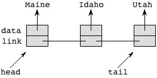
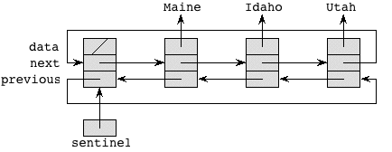
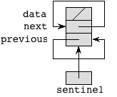
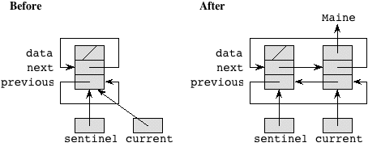
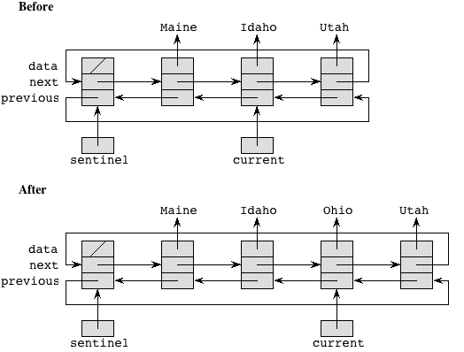
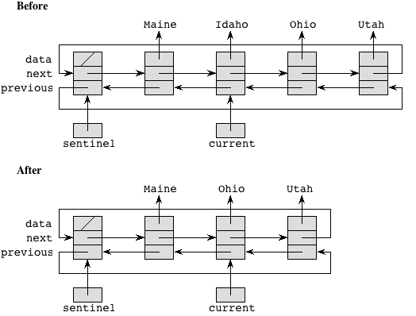
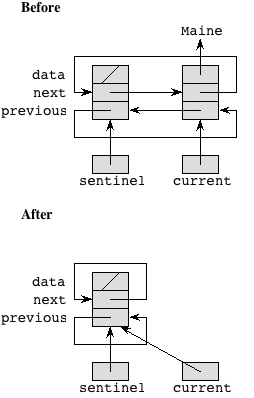
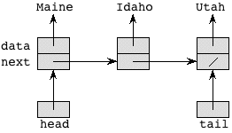
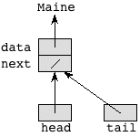
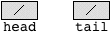

## Outline
{:.no_toc}

* Outline
{:toc}
# January 23: Linked-List Structures #

<a href="../8/8.html">[prev]</a>
<a href="../10/10.html">[next]</a> 

Today we will begin to shift directions and talk about a data structure known as 
as a Linked List. For many of you this will be more of a review since you have probably 
seen Linked Lists before in either CS 1, ENGS 20, or your AP course. But you haven't 
seen them like you're going to see them here.

## Outline ##

* <a href="#ll">Linked lists</a>
* <a href="#implementing-ll">Implementing linked lists</a>
* <a href="#dll-sentinel">Circular, doubly linked lists with a sentinel</a>
* <a href="#sll">Singly linked list implementation</a>
* <a href="#java">Java notes</a>

All the code files for today: 
[CS10LinkedList.java](resources/CS10LinkedList.java) |
[SentinelDLL.java](resources/SentinelDLL.java) |
[ListTest.java](resources/ListTest.java) |
[SLL.java](resources/SLL.java)

<a name="ll"></a><h2>Linked lists</h2>

Some reminders about linked lists. A linked list is in some ways like an array. 
In particular, it defines a linear ordering of elements. Unlike an array, we can 
insert an element into any position in the linear order in *constant time*, and 
we can also delete an element from any position in the linear order in *constant time*, 
with all other elements maintaining their relative positions for both insertion 
and deletion. With an array, we have to shift elements when inserting or deleting 
if we want them to maintain their positions relative to each other, and so it can 
take a while to insert or delete into an array (or an <code>ArrayList</code>).

Another advantage of linked lists is that they grow and shrink dynamically. That is, 
the space occupied by an <span class="math"><em>n</em></span>-element linked list, 
in which each element occupies <span class="math"><em>b</em></span> bytes, is about 
<span class="math"><em>b</em><em>n</em></span>. Although you could implement an 
<code>ArrayList</code> to grow and shrink dynamically, you cannot do so while maintaining 
constant-time per insertion or deletion from the middle of the <code>ArrayList</code>.

So what's the downside of linked lists? They're a little more complicated to work 
with than arrays. They also take a bit more space than arrays (need space for the links). 
Like an <code>ArrayList</code>, a linked list can store only objects, not primitive 
types. But the biggest disadvantage is that we cannot index into them in constant 
time. In other words, we can find the <span class="math"><em>i</em></span>th element 
of an array or an <code>ArrayList</code> in constant time, but finding the <span class="math"><em>i</em></span>th 
element of a linked list takes time proportional to <span class="math"><em>i</em></span>. 
For applications where we need to index quickly, linked lists are not a great choice.

In a linked list, the elements are arranged in a linear order that is determined 
by following a chain of <strong>links</strong>. For example, here is a conceptual 
picture of a linked list with three elements, each of which contains a reference 
to the name of a state:

<center>

</center>

As you can see, we think of the list as having a **head** and a **tail** element, 
and we can think of references head and tail to these elements.

The link part of each element tells us the next or previous element on the list. 
These will be implemented as references to entire elements.

<a name="implementing-ll"></a><h2>Implementing linked lists</h2>

We will see a couple of ways to implement linked lists. Both ways will support a 
basic set of operations. When we have a set of operations to be supported but 
without a specific implementation for them, we make an **interface**. We will use 
the <code>CS10LinkedList</code> interface in <a href="CS10LinkedList.java">CS10LinkedList.java</a>. 
Like an <code>ArrayList</code>, this interface uses a generic type <code>T</code>.

**NOTE:** At this point, we've *used* ArrayLists and just briefly touched on generic types 
(what enables us to put varying types of data into an ArrayList). We haven't talked 
about how an ArrayList really works though, nor have we talked about what an *interface* 
is and how we make one in Java. All of this will be covered in greater detail in 
our next lecture. For now, try to enjoy these linked lists :)

The specifications of the methods of the <code>CS10LinkedList</code> interface 
assume that the linked list maintains a notion of a &quot;current&quot; element 
of the list. We will run through this file in class to get a better understanding 
of all of the operations that we want our <code>CS10LinkedList</code> to implement.

### A note on for-loops with linked lists ###

You can traverse a linked list to get a reference to each element of the list. Here, 
each element is an Integer object, just to keep things simple. (We rely on unboxing 
in the loop body, where we add i, which is really a reference to an Integer object, 
into sum.) Notice the header of the for-loop to traverse the list:

```java
  for (Integer i = myList.getFirst(); i != null; i = myList.next()) {
    System.out.println("List element with value " + i);
    sum += i;
  }
```

This style of for-loop header might seem strange to you, becuase it doesn't use the 
increment or decrement operators of Java to go through the linked list, as you would 
for an array or ArrayList. Since we don't index into a linked list, there's no 
need to maintain an index and hence no need to increment.

Let's dissect the first for-loop header. The initialization sets <code>i</code> to 
be the value of the first element in the list and sets <code>current</code> to 
reference the first list element. It's the equivalent of getting the 0th element 
in an array. The test checks whether we've hit the end of the linked list, the equivalent 
of the index into an array reaching the size of the array. The update part advances 
<code>current</code> by one position in the linked list, setting <code>i</code> 
to the value of the next element in the list.

We don't have to rely on <code>getFirst</code> and <code>next</code> returning 
<code>null</code> when they hit the end of the list. The second for-loop calls the 
<code>hasCurrent</code> method to determine when that happens, but it has to 
explicitly call the <code>get</code> method within the body of the loop to get 
the value of the current element:

```java
  for (myList.getFirst(); myList.hasCurrent(); myList.next()) {
    Integer i = myList.get();
    System.out.println("List element with value " + i);
    sum += i;
  }
```

<a name="dll-sentinel"></a><h2>Circular, doubly linked lists with a sentinel</h2>

If you took CS 1, then you know that the simplest, cleanest way to implement a 
linked list is with a <strong>circular, doubly linked list with a sentinel</strong>. 
The implementation is in <a href="SentinelDLL.java">SentinelDLL.java</a>. The class 
is generic for a type <code>T</code>, declared with the line

```java
public class SentinelDLL<T> implements CS10LinkedList<T>
```

### The <code>Element</code> inner class ###

Each list element is an object of the class <code>Element</code> and 
has three instance variables:

* <code>data</code> is a reference to the object being stored in that list element. 
  This object must be of the type <code>T</code>. For the above example with state 
  names, when we create a <code>SentinelDLL</code> object, <code>T</code> will be a 
  <code>String</code>, so that <code>data</code> is a reference to a <code>String</code>.
* <code>next</code> is a reference to the <code>Element</code> after this one in the list.
* <code>previous</code> is a reference to the <code>Element</code> before this one in the list.

The <code>Element</code> class is a private inner class. It has the following methods:

* A constructor that takes a reference to an object of type <code>T</code>. It 
  stores this reference in the instance variable <code>data</code>.
* <code>toString()</code> returns the <code>String</code> representation of this 
  element's data object.

Because each <code>Element</code> stores a reference to an object, strange things 
can happen if we store a reference to an object and then the object is changed. 
Therefore, we require that once a reference to an object is stored in an <code>Element</code>, 
the object itself should not change.

### The <code>SentinelDLL</code> class ###

The class <code>SentinelDLL</code> implements the linked list. In fact, it implements 
the <code>CS10LinkedList</code> interface. The methods of <code>SentinelDLL</code> 
will need to access the <code>data</code>, <code>next</code>, and <code>previous</code> 
instance variables of each <code>Element</code> object. Because <code>Element</code> 
is a private inner class, the methods of <code>SentinelDLL</code> can access its 
instance variables, even though they are declared as private. No methods outside 
of <code>SentinelDLL</code> can access the instance variables of <code>Element</code>, 
and so no methods outside of <code>SentinelDLL</code> can refer to <code>data</code>, 
<code>next</code>, or <code>previous</code>.

Next we examine the declaration for the class <code>SentinelDLL</code>. It contains 
several methods, but first let's look at the instance variables.

* <code>current</code> references the &quot;current&quot; list element, which we 
  will need for several of the linked-list operations.
* <code>sentinel</code> references a special list element, which we call the 
  <strong>sentinel</strong>.

The scheme is that a linked list has exactly one sentinel, along with zero or more 
&quot;real&quot; elements. For example, the list above, with the names of three 
states, would contain four <code>Element</code> objects: the sentinel, and objects 
for <code>Maine</code>, <code>Idaho</code>, and <code>Utah</code>. The picture 
looks like the following, where a slash indicates a <code>null</code> reference:</p>

<center>

</center>

Here, I omitted showing which <code>Element</code> object is pointed to by <code>current</code>. 
Despite how I had to draw the figure, <strong>each of these references points not 
to individual instance data, but rather to an entire <code>Element</code> object.</strong> 
The sentinel's <code>data</code> is a <code>null</code> reference.

Notice how the list is circular, in that you can start at the sentinel and follow 
either forward (<code>next</code>) or backward (<code>previous</code>) references 
and eventually get back to the sentinel.

In this scheme, every linked list, <em>even an empty one</em>, has a sentinel. In 
an empty list, both references in the sentinel point to the only <code>Element</code> 
available, namely the sentinel:

<center>

</center>

It may seem strange to have an &quot;empty&quot; list actually have an <code>Element</code> 
object in it, but it turns out to really simplify some of the code. You may appreciate 
this simplicity later on when we examine other ways to implement linked lists.

### Methods ###

Having seen how we intend circular, doubly linked lists with a sentinel to be 
represented, now we examine the methods of the <code>Element</code> and <code>SentinelDLL</code> 
classes in <a href="SentinelDLL.java">SentinelDLL.java</a>. The methods for <code>Element</code> 
are straightforward, so we won't go over them here.

#### Making an empty list and making a list empty ####

The <code>SentinelDLL</code> constructor makes an empty list with only the sentinel, 
as the diagram above shows. It also sets the instance variable <code>current</code> 
to point to the only <code>Element</code> in town, namely the sentinel. Setting 
the <code>next</code> and <code>previous</code> fields of the sentinel and setting 
<code>current</code> are done by a call to <code>clear</code>, which makes any list 
empty (leaving any contents for garbage collection).

#### Converting to a <code>String</code> ####

The <code>toString</code> method for a <code>SentinelDLL</code> is fairly 
straightforward. It uses a common style of traversing a linked list by a clever 
for-loop header:

```java
  String result = "";

  for (Element<T> x = sentinel.next; x != sentinel; x = x.next)    
    result += x.toString() + "\n";

  return result;
```

The for-loop iterates through the list, starting from the first non-sentinel on the 
list (<code>sentinel.next</code>), following <code>next</code> references, and 
stopping when it gets back to the sentinel. It concatenates the string representation 
of each element in the list onto a <code>String</code> named <code>result</code>, 
returning <code>result</code> at the end. Of course, this style of traversing the 
linked list works <em>only</em> within methods of the <code>SentinelDLL</code> class, 
since the instance variables <code>sentinel</code> and <code>next</code> are private 
to their respective classes.

#### Inserting into a list ####

The <code>add</code> method for a list takes an object reference <code>obj</code>, 
and it inserts it after the <code>Element</code> object referenced by the instance 
variable <code>current</code>. Notice that we restrict <code>obj</code> to be of 
type <code>T</code>. The code manipulates references to &quot;splice in&quot; the 
new element. For example, if we start from an empty list, where <code>current = sentinel</code>, 
and insert an element with the string <code>Maine</code>, we have the following situation:

<center>

</center>

The <code>add</code> method makes <code>current</code> reference the new <code>Element</code> 
object.

The splicing works the same when inserting into any position of the list. For example, 
starting from the 3-element list from before, we insert <code>Ohio</code> after 
<code>Idaho</code> as follows:

<center>

</center>

Let's take a careful look at how <code>add</code> works. First, it makes a new 
<code>Element</code> that references the given object, and <code>x</code> references 
this new <code>Element</code>. It is this new <code>Element</code> that we will 
add to the list. We need to do four things:

1. Make <code>x</code>'s <code>next</code> reference the element following the 
   one that <code>current</code> references. The assignment <code>x.next = current.next</code> does so.
2. Make <code>x</code>'s <code>previous</code> reference <code>current</code>. 
   The assignment <code>x.previous = current</code> does so.
3. The element following the one referenced by <code>current</code> will have a 
   new predecessor, namely the element that <code>x</code> references, so we need 
   to set the <code>previous</code> instance variable of this element to reference 
   <code>x</code>'s element. The assignment <code>current.next.previous = x</code> 
   does so. The expression <code>current.next.previous</code> can be a bit confusing, 
   so let's examine it carefully. <code>current</code> references the current element. 
   <code>current.next</code> references the element following the one that <code>current</code> 
   references. This element has an instance variable <code>previous</code> that references 
   its predecessor (which is <code>current</code> at the time that the <code>add</code> 
   method is called, but it's about to be updated). Since we want to assign to the 
   <code>previous</code> instance variable of the <code>Element</code> object 
   referenced by <code>current.next</code>, we put <code>current.next.previous</code> 
   on the left-hand side of the assignment statement.
4. The element referenced by <code>current</code> will have a new successor, namely 
   the element that <code>x</code> references, so we set the <code>next</code> instance 
   variable of <code>current</code>'s element to reference <code>x</code>'s element. 
   The assignment <code>current.next = x</code> does so.

As you can easily see from the <code>add</code> code, it takes constant time to 
insert an element into a circular, doubly linked list with a sentinel. You can 
also see, by the absence of if-statements, that there are no special cases.

#### Removing from a linked list ####

The <code>remove</code> method for a list removes the <code>Element</code> object 
that <code>current</code> references. You <strong>never ever</strong> remove the 
sentinel, so the first thing we do is check whether <code>current</code> references 
the sentinel by calling the <code>hasCurrent</code> method. If <code>current</code> 
references the sentinel (indicated by <code>hasCurrent</code> returning <code>false</code>), 
then we print an error message to <code>System.err</code>, rather than to <code>System.out</code>. 
On some systems, you can suppress regular output printed to <code>System.out</code>, 
but you have to go to extra lengths to suppress error messages printed to <code>System.err</code>. 
In Eclipse, when you print to <code>System.err</code>, the message appears in red 
in the console. We want to make error messages likely to be seen.

Normally, the <code>remove</code> method is not trying to remove the sentinel. We 
splice the current element out of the list and make <code>current</code> reference 
its successor in the list.

For example, to remove <code>Idaho</code> from the previous list:

<center>

</center>

and to remove the only element from a list:

<center>

</center>

The time to remove an element is constant. As we will see when we examine &quot;simpler&quot; lists, 
this running time is quite good; with linked lists whose representation appears 
simpler than that of a circular, doubly linked list with a sentinel, the time to 
remove an element at the <span class="math"><em>i</em></span>th position in the list 
is proportional to <span class="math"><em>i</em></span>.

#### Finding a particular list element ####

The <code>contains</code> method for a <code>SentinelDLL</code> takes a reference 
<code>obj</code> to an object of the generic type <code>T</code> and looks for an 
element that equals <code>obj</code>, according to the <code>equals</code> method 
on the <code>data</code> field of each <code>Element</code>. We traverse the list, 
calling <code>equals</code> on each element's data, until a match is found. If 
the <code>contains</code> method finds such an element, it sets <code>current</code> 
to reference it, so that we can next either add a new element after it or remove it.

We could check to make sure that we haven't returned to the sentinel, along with 
checking whether we have a match, but we use a clever way to avoid having to check 
that we haven't returned to the sentinel in each iteration of the loop. We put 
the value we're looking for in the sentinel. That way, we're guaranteed of finding 
it. If where we found it was the sentinel, it wasn't there in the first place. 
If where we found it was not the sentinel, then it really was there. We set 
<code>sentinel.data</code> to be the same reference as <code>obj</code> before 
traversing the list, and we make sure to put a <code>null</code> back into 
<code>sentinel.next</code> after the traversal is done, no matter where in the 
list the traversal stopped.

When we use the sentinel trick, the for-loop needs no body:

```java
for (x = sentinel.next; !x.data.equals(obj); x = x.next)
  ;
```

This process is really just a *linear search*. The time to perform it depends on 
the time to compare two elements. If we denote this comparison time by <span class="math"><em>t</em></span>, 
and we say that the list has <span class="math"><em>n</em></span>elements, then 
the time to find a list element is proportional to <span class="math"><em>t</em><em>n</em></span> 
in the worst case (when the element is not in the list). If <span class="math"><em>t</em></span> 
is a constant that can be ignored, then the worst-case time is proportional to <span class="math"><em>n</em></span>.

#### Easy list operations ####

The remaining list operations are really easy. Note that the later operations use 
the <code>isEmpty</code>, <code>hasCurrent</code>, and <code>hasNext</code> predicates 
rather than just doing the tests directly. Accessing the linked list through these 
methods makes changing the representation easier. You can (and should) check out 
the rest of the methods and their implementations on your own time :) You should 
also review the <code>CS10LinkedList</code> interface. 

### Testing the <code>SentinelDLL</code> class ###

We can use the <a href="ListTest.java">ListTest.java</a> program to test the 
<code>SentinelDLL</code> class. You can use the debugger to examine the linked 
list if you like.

Notice that to declare and create the linked list, we specify the type that will 
be stored in the list. Here, it's a <code>String</code>:

```java
  CS10LinkedList<String> theList = new SentinelDLL<String>();
```

Because <code>theList</code> is declared as a reference to the interface <code>CS10LinkedList</code>, 
we cannot call the <code>previous</code> or <code>hasPrevious</code> methods in this driver.

<a name="sll"></a><h2>Singly linked lists</h2>

Although doubly linked circular linked lists with sentinels are the easiest linked 
lists to implement, they can take a lot of space. There are two references 
(<code>next</code> and <code>previous</code>) in each element, plus the sentinel node. 
Some applications create a huge numbers of very short linked lists. (One is hashing, 
which we'll see later in this course.) In such situations, the extra reference in 
each node and the extra node for the sentinel can take substantial space.

The code for singly linked lists has more special cases than the code for circular, 
doubly linked lists with a sentinel, and the time to remove an element in a singly 
linked list is proportional to the length of the list in the worst case rather 
than the constant time it takes in a circular, doubly linked list with a sentinel.

The <code>SLL</code> class in <a href="SLL.java">SLL.java</a> implements the <code>CS10LinkedList</code> 
interface with a generic type <code>T</code>. A <strong>singly linked list</strong>, as 
implemented in the <code>SLL</code> class, has two structural differences from a circular, 
doubly linked list with a sentinel:

1. Each Element object in a singly linked list has no backward (previous) reference; 
   the only navigational aid is a forward (next) reference.
2. There is no sentinel, nor does the list have a circular structure. Instead, the 
   SLL class maintains references head to the first element on the list and tail 
   to the last element on the list.

A singly linked list with <code>Maine</code>, <code>Idaho</code>, and <code>Utah</code> would look like

<center>

</center>

A singly linked list with only one element would look like

<center>

</center>

And an empty singly linked list looks like

<center>

</center>

The file <a href="SLL.java">SLL.java</a> contains the class definitions for <code>Element</code> 
and <code>SLL</code> for a singly linked list. These declarations are similar to 
those for circular, doubly linked lists with a sentinel. As before, <code>Element</code> 
class is a private inner class, and all method declarations are the same. The 
only difference is in the instance data. We can use the same <a href="ListTest.java">ListTest.java</a> 
driver to test the singly linked list class, as long as we change the line creating 
the list to read

```java
  CSLinkedList<String> theList = new SLL<String>();
```

Let's examine the <code>List</code> methods in <a href="SLL.java">SLL.java</a> 
for singly linked lists. We will highlight those that differ from those for 
circular, doubly linked lists with a sentinel.

### Making an empty list ###

The <code>clear</code> method, which is called by the <code>SLL</code> constructor 
as well as being publicly available, makes an empty list by setting all instance 
variables (<code>head</code>, <code>tail</code>, and <code>current</code>) to <code>null</code>.

### Adding an element into a list ###

As before, the <code>add</code> method places a new <code>Element</code> object 
after the one that <code>current</code> references. Without a special case, however, 
there would be no way to add an element as the new head of the list, since there is 
no sentinel to put a new element after. Therefore, if <code>current</code> is <code>null</code>, 
then we add the new element as the new list head.

The code, therefore, has two cases, depending on whether <code>current</code> is 
<code>null</code>. If it is, we have to make the new element reference what <code>head</code> 
was referencing and then make <code>head</code> reference the new element. 
Otherwise, we make the new element reference what the current element is referencing 
and then make <code>current</code> reference the new element. If the new element 
is added after the last element on the list, we also have to update <code>tail</code> 
to reference the new element.

Compare this code to the add code for a circular, doubly linked list with a sentinel. 
Although there is only one directional link to maintain for a singly linked list, 
the code has more cases and is more complex. For either implementation, however, 
adding an element takes constant time.

### Removing from a linked list ###

As mentioned, removing an element from a singly linked list takes time proportional 
to the length of the list in the worst case—in other words, time that is linear 
in the length of the list— which is worse than the constant time required for a 
circular, doubly linked list with a sentinel. Why does it take linear time, rather 
than constant time? The reason is that the <code>previous</code> reference in a 
doubly linked list really helps. In order to splice out the current element, we 
need to know its predecessor in the list, because we have to set the <code>next</code> 
instance variable of the predecessor to the value of <code>current.next</code>. 
With the <code>previous</code> reference, we can easily find the predecessor in 
constant time. With only <code>next</code> references available, the only way we 
have to determine an element's predecessor is to traverse the list <em>from the 
beginning</em> until we find an element whose <code>next</code> value references 
the element we want to splice out. And that traversal takes linear time in the 
worst case, which is when the element to be removed is at or near the end of the 
list.

The <code>remove</code> method first checks that <code>current</code>, which references 
the <code>Element</code> object to be removed, is non-<code>null</code>. If <code>current</code> 
is <code>null</code>, we print an error message and return. Normally, <code>current</code> 
is non-<code>null</code>, and the <code>remove</code> method finds the predecessor 
<code>pred</code> of the element that <code>current</code> references. Even this 
search for the predecessor has two cases, depending on whether the element to be 
removed is the first one in the list. If we are removing the first element, then 
we set <code>pred</code> to <code>null</code> and update <code>head</code>. Otherwise, 
we have to perform a linear search, stopping when <code>pred.next</code> references 
the same element as <code>current</code>; once this happens, we know that <code>pred</code> 
is indeed the predecessor of the current element. (There is also some &quot;defensive coding,&quot; 
just in case we simply do not find an element <code>pred</code> such that <code>pred.next</code> 
references the same element as <code>current</code>. We do not expect this to ever happen, 
but if it does, we have found a grave error and so we print an error message and return.) 
Assuming that we find a correct predecessor, we splice out the current element. We 
also have to update <code>tail</code> if we are removing the last element of the list.

The bottom line is that, compared with the <code>remove</code> code for a circular, 
doubly linked list with a sentinel, the <code>remove</code> code for a singly linked 
list is more complex, has more possibilities for error, and can take longer.

### <code>toString</code> for a list ###

The toString for a singly linked list is similar to how we print a circular, doubly 
linked list with a sentinel, except that now we start from <code>head</code> rather 
than <code>sentinel.next</code> and that the termination condition is not whether 
we come back to the sentinel but rather whether the reference we have is <code>null</code>. 
The for-loop header, therefore, is

```java
for (x = head; x != null; x = x.next)
```

### Finding a particular list element ###

The <code>contains</code> method for a singly linked list is perhaps a little shorter 
than for a circular, doubly linked list with a sentinel, because now we do not 
replace the object reference in the sentinel. The for-loop header, therefore, becomes 
a little more complicated. We have to check whether we have run off the end of 
the list (which we did not have to do when we stored a reference to the object 
being searched for in the sentinel) and then, once we know we have not run off 
the end, whether the element we are looking at equals the object we want. The 
bodyless for-loop is

```java
for (x = head; x != null && !x.data.equals(obj); x = x.next)
  ;
```

Although the code surrounding the for-loop simplifies with a singly linked list, 
the loop itself is cleaner for the circular, doubly linked list with a sentinel. 
Either way, it takes linear time in the worst case.

### Easy list methods ###

The remaining list operations are pretty easy, but do have some slight variations 
compared to curcular, doubly linked lists &mdash; be sure to check them out.

### Other options ###

It is also possible to have a dummy list head, even if the list is not circular. 
If we do so, we can eliminate some special cases, because adding at the head becomes 
more similar to adding anywhere else. (Instead of changing the <code>head</code> 
you update a <code>next</code> field.) It is also possible to have <code>current</code> 
reference the element <em>before</em> the element that it actually indicates, so 
that removal can be done in constant time. It takes a while to get used to having 
<code>current</code> reference the element before the one that is actually &quot;current.&quot;

It is also possible to have a circular singly linked list, either with or without 
a sentinel.

<a name="java"></a><h2>Java notes</h2>

<dl>
<dt>inner class</dt>
<dd>A class can be defined inside another class. This is useful, e.g., if it just supports the work of that class. The inner class then has access to the outer class variables and methods.</dd>
</dl>
