This page tells you how to download and install Java 7 and Eclipse on
Mac OS X, and how to configure Eclipse.

## Installing Java 7 ##

**NOTE:** Java 8 has been released but not with enough time for us to fully
test the code we will write and run in this course so we will stick with Java 7.

1. Go to the [Oracle website](http://www.oracle.com/technetwork/java/javase/downloads/index.html).
   You'll see something like this:

    {:refdef: style="text-align: center;"}
    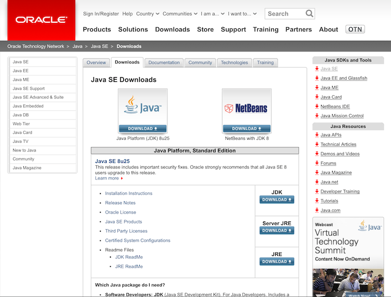
    {: refdef}

2. Scroll down until you see a heading beginning "Java SE 7u71/72."  On
   the right, you'll see a Download button.  Click it.  

    {:refdef: style="text-align: center;"}
    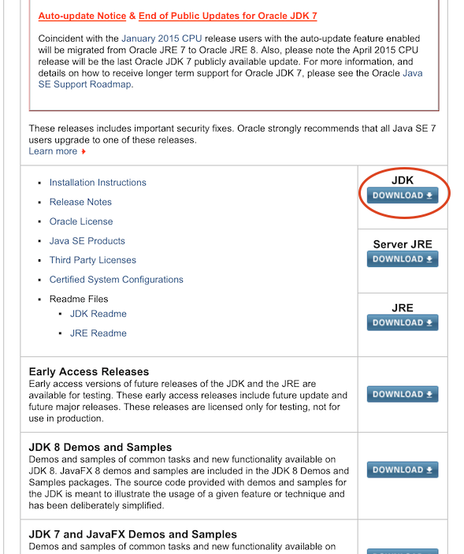
    {: refdef}

3. The next screen will look like this:

    {:refdef: style="text-align: center;"}
    
    {: refdef}

   Click the radio button next to "Accept License Agreement" and then
   click on "jdk-7u71-macosx-x64.dmg".  You'll be asked whether to save
   the file that is going to be downloaded; click on "Save File".

3. Open your Downloads folder, and double-click on
   "jdk-7u71-macosx-x64.dmg".  You'll see this window:

     {:refdef: style="text-align: center;"}
     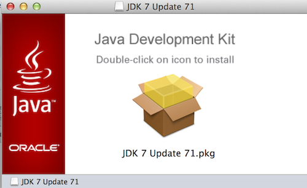
     {: refdef}

4. Double-click on the package icon, and follow the instructions to
   install.  When the installation has completed, click on Done.  At
   this point, you may close up the window and drag
   "jdk-7u71-macosx-x64.dmg" to the Trash.

## Installing Eclipse ##

1. If you already have Eclipse installed on your Mac, you need to get
   rid of it.  To do so, first quit Eclipse if you're currently
   running it.  Then, go to your workspace folder (probably in
   Documents/workspace) and save anything there that you want to keep,
   because you're about to get rid of this folder.  Next, drag the
   workspace folder to the Trash.

   Go to your Applications folder.  One way to get there is, from
   the Finder, type command-shift-A.  You'll a folder named "eclipse" in
   there; drag the "eclipse" folder to the Trash.  If you have an
   Eclipse icon in your dock, remove it from the dock.

2. Now you're ready to download and install the newest version of
   Eclipse.  Go to [the Eclipse website](https://www.eclipse.org/downloads).
   You'll see a window like this:

     {:refdef: style="text-align: center;"}
     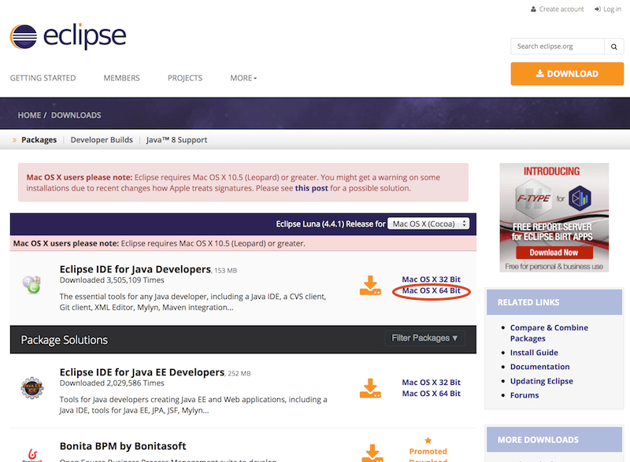
     {: refdef}

   I've circled the link you should click on.  It's the "Mac OS X 64
   Bit" link next to "Eclipse IDE for Java Developers."

3. You'll see this window:

    {:refdef: style="text-align: center;"}
    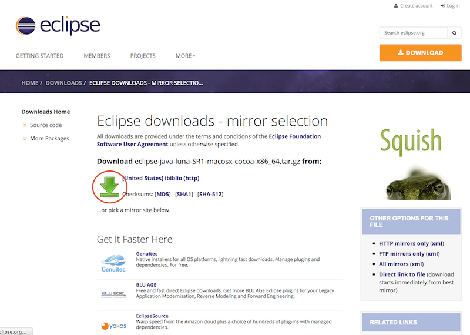
    {: refdef}

     Click on the green download arrow that I've circled.  Click on
     "Open with Archive Utility (default)" and then click OK.  The
     download might take a few minutes.  You should not feel compelled
     to donate.

4. After the download completes, folders should automatically expand.
   When that's done, you should see a folder named "eclipse" in your
   Downloads folder.  When you open your Downloads folder, if you see
   Applications under the Favorites on the left side of the window,
   you should drag the "eclipse" folder into Applications.  If you don't
   see Applications, then open a new window for Applications (from the
   Finder, command-shift-A), and drag the eclipse folder into
   Applications.

5. Open your Applications folder, and then open the "eclipse" folder.
   You'll see an item named Eclipse; if you like, drag its icon into
   the dock so that you'll be able to launch Eclipse easily.

6. Launch Eclipse.  If you're asked whether you want to open it, of
   course you do; click "Open".  You'll see a window like this:

   {:refdef: style="text-align: center;"}
   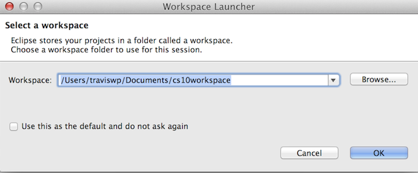
   {: refdef}

   It will have your user name rather than mine (traviswp).  Select where
   you want your workspace to be; I recommend the default of your
   Documents folder.  I like to name my workspaces with a meaningful name, so
   notice that I've prepended "cs10" to the default "workspace" name. Feel free
   to call it whatever you like, but I recommend using either "workspace" or
   "cs10workspace" for simplicity and clarity. Click the checkbox for using this
   location as the default, and then click "OK".

7. You'll see a window like this:

    {:refdef: style="text-align: center;"}
    
    {: refdef}

   Click on the Workbench arrow in the upper right that I've
   circled.  You shouldn't see this screen again, even if you quit
   Eclipse and relaunch it.

8. You'll get an empty workbench like this:

     {:refdef: style="text-align: center;"}
     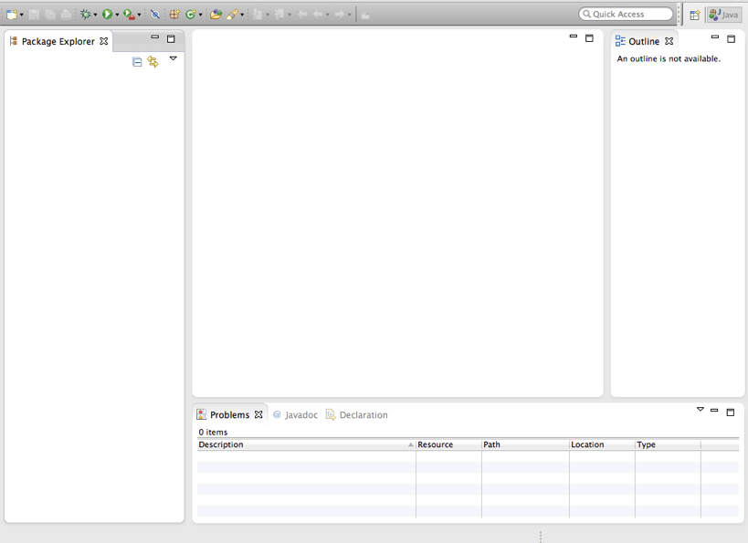
     {: refdef}

    You have now installed Eclipse!

## Configuring Eclipse ##

You don't *have* to configure Eclipse the way I do, but you'll
probably avoid some confusion if you do.  Here's how.

1. In the Eclipse menu bar, click on the Eclipse menu and then on
   "Preferences...". You'll see a window with two panes.  On the left
   pane is a list of types of things you can configure.

2. Click on the triangle to the left of General.  Then click on the
   triangle to the left of Appearance.  Then click on "Colors and
   Fonts."  You should see a window like this:

     {:refdef: style="text-align: center;"}
     
     {: refdef}

3. In the window in the middle, click on the triangle next to Java.
   Then double-click on "Java Editor Text Font":

   {:refdef: style="text-align: center;"}
   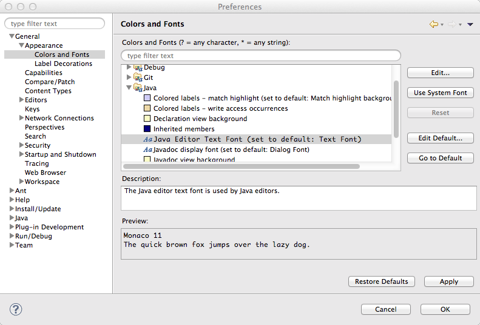
   {: refdef}

4. You'll see this window:

    {:refdef: style="text-align: center;"}
    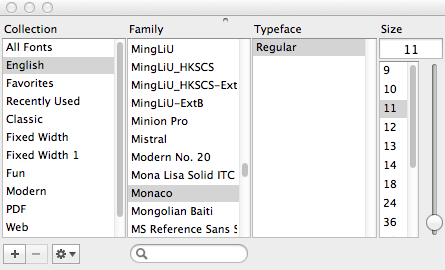
    {: refdef}

   On the right, where you can select the size, click 12.  Then
   close this window by clicking on the window's close button.

5. Close up the General preferences by clicking on the triangle to the
   left of General.  Click the triangle next to "Java" and then click
   the triangle next to "Code Style."  Then click Formatter.  Here's
   what you should see:

    {:refdef: style="text-align: center;"}
    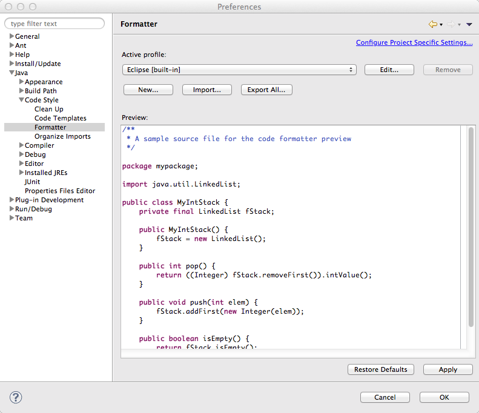
    {: refdef}

6. Click the button that says "New...".  You'll see a window such as
   this one:

    {:refdef: style="text-align: center;"}
    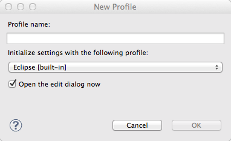
    {: refdef}

     You can type in any profile name you like. I used "Travis-CS10":

     {:refdef: style="text-align: center;"}
     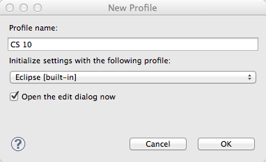
     {: refdef}

     Click OK.

7. You should see a window like this:

    {:refdef: style="text-align: center;"}
    
    {: refdef}

     Change the tab size to 4.

     You'll see that the indentation size automatically changes as
     well.

8. Click on "Blank Lines," and set 1's and 0's as I have below:

     {:refdef: style="text-align: center;"}
     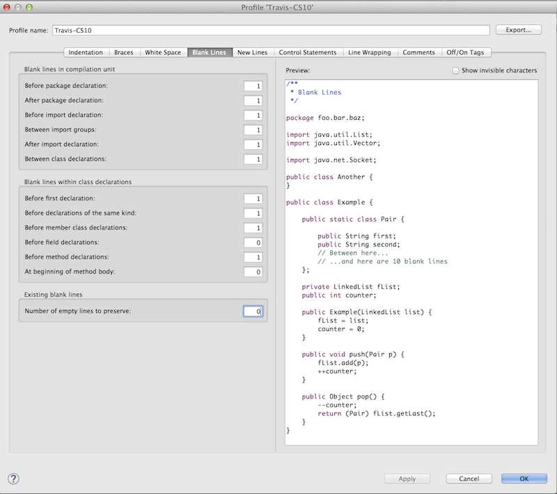
     {: refdef}

9. Click on "Control Statements," and check/uncheck the boxes as I've done here:

     {:refdef: style="text-align: center;"}
     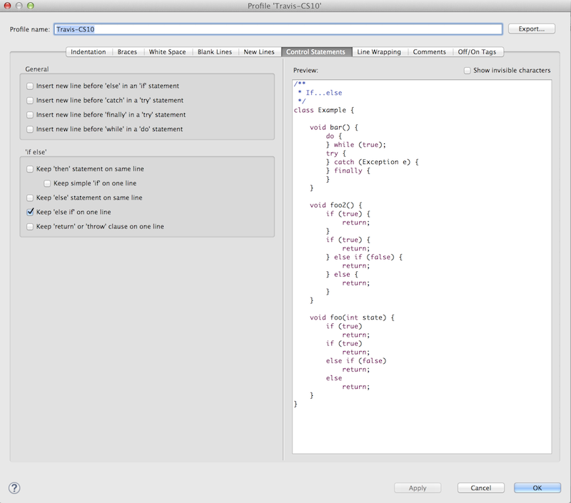
     {: refdef}

     Click OK.

10. Now click on triangles to close up Java.  Click on the triangle
    next to Run/Debug, and then click on Console:

     {:refdef: style="text-align: center;"}
     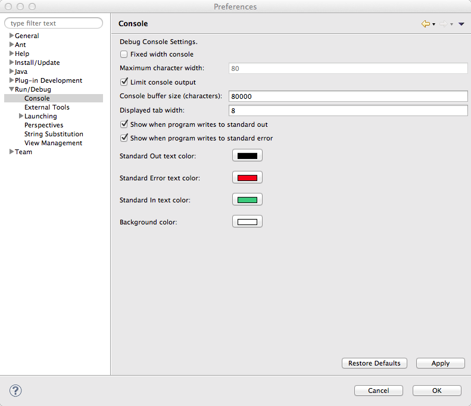
     {: refdef}

11. Click on the green color sample next to "Standard In text color."
    You'll get a color picker:

     {:refdef: style="text-align: center;"}
     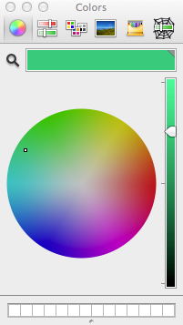
     {: refdef}

12. Slide the slider on the right down, so that you get a dark green.
    (You're at Dartmouth.  What other color could you possibly want?)

     {:refdef: style="text-align: center;"}
     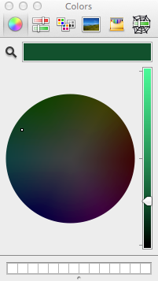
     {: refdef}

    Close the color picker window by clicking its close button, and
    click OK again to close the Preferences window.

13. Finally, I don't use the Outline pane, which is on the right-hand
    side of the window.  Click on the "X" next to Outline in the tab
    of this pane; I've circled the "X":

     {:refdef: style="text-align: center;"}
     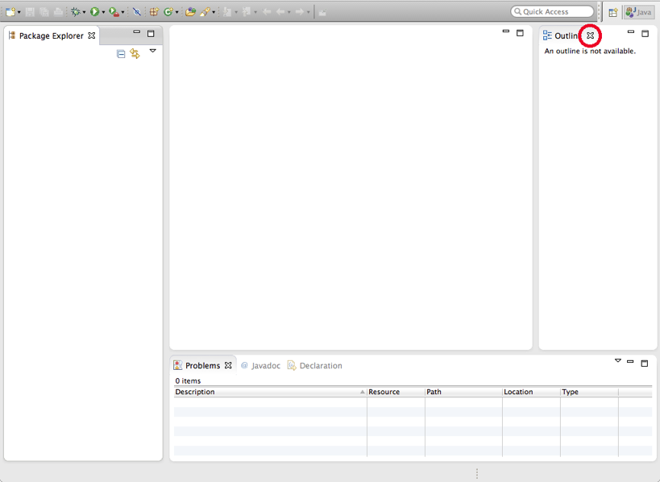
     {: refdef}

      You'll get something like this:

     {:refdef: style="text-align: center;"}
     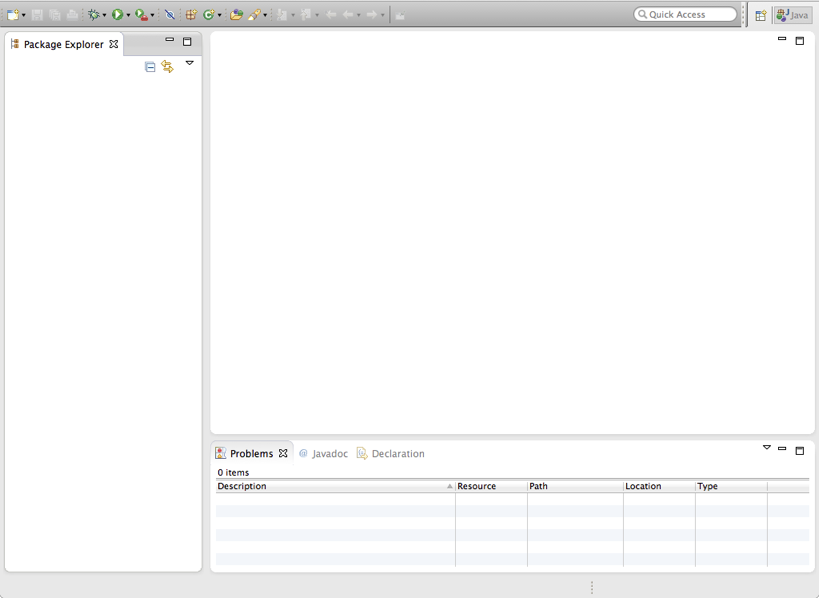
     {: refdef}

    And you're done!
