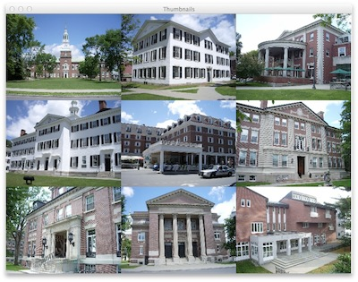

## Exercises ##

Construct a thumbnail-based viewer for a set of images ([dart-imgs.zip](resources/dart.zip)). Instead of stepping
through the images, as in our slideshow, show all of them at once (scaled down).

Clicking on one image makes it take up the whole window; clicking again reverts
to the thumbnail display. You may assume that the layout of the thumbnails is
such that they require exactly the same size window as the full-size images. In
the above example, the 800 x 600 images are laid out in a 3 x 3 grid of images sized
266.67 x 200.

{:refdef: style="text-align: center;"}

{: refdef}

If you'd like, you may develop the whole application yourself. You would probably
want to start with the common scaffold code. If you want, I have provided an even
further developed scaffold that does much of the work, letting you focus on the
key concept of producing the thumbnails, displaying them, and determining which
one was clicked. (That's a lot like with the puzzle, but the hope is that you
have internalized the idea enough that you can write those parts yourself.)

In my scaffold, [Thumbnails.java](resources/Thumbnails.java), you'll see that there
is a second array to hold thumbnail-sized versions of the original images. The
`createThumbs()` method does that by calling the `scaleTo()` method (your code).
The `click()` method handles mouse presses, by zooming in to the image for the
selected thumbnail (your code) or zooming back out, as appropriate. The `draw()`
method either draws the full-size selected image, or lays out the thumbnails (your code).

## Submission Instructions ##

Turn in your completed Java code and a snapshot of the thumbnail display of the
Dartmouth images from lecture.
