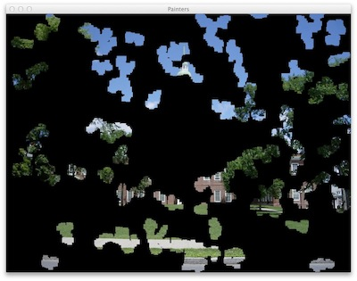
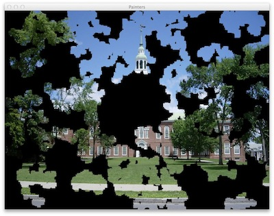

## Exercises ##

Create an image animation in which we start off with a blank image and a set of
agents gradually "draw" a picture on it. For example, the following snapshots
show the progress of 100 painters early on in their job and somewhat later.

{:refdef: style="text-align: center;"}

{: refdef}

You can again roll this from scratch or start from my template [Painters.java](resources/Painters.java)
and add just a few pieces there, along with another class in another file. The
key trick is to use a pair of images &mdash; the original one loaded from the
file, along with a new one into which pixels are transferred from the original
by the agents. Recall that a DrawingFrame loads a file into "image" and just draws
it. So we can grab hold of "image" in another variable, replace it with a blank,
and use an Agent to transfer pixels to it. In my implementation, I chose to extend
Wanderer to a new class whose move() method also does the pixel transfer, in a
small neighborhood of its current position. Then as usual each agent moves for
each tick of a Timer. But it's fine to have a completely different agent behavior,
as long as it leads to painting in the image.

**NOTE:** While it is not required that you extend the Wanderer class (as I have),
you must *extend* one of the Agent classes (e.g., Agent, Bouncer, Wanderer).
The reason for this is that we want you to practice extending classes on your own.
In general, in Java, you cannot go and change the existing super classes (at least
you shouldn't!) -- but rather, you would identify something that you want to change
and you would *extend* that class to extend/update the functionality of that class
in your subclass.

## Submission Instructions ##

Turn your completed Java code and a snapshot of a partially drawn image.
