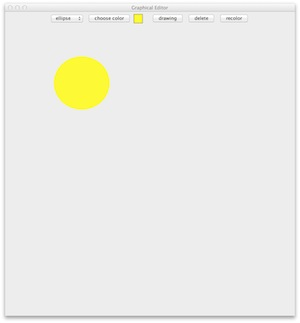
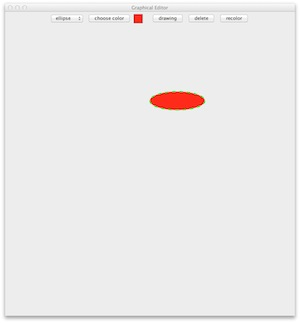

## Exercises ##

This short assignment will build up a core piece of a graphical editor. Next
week we'll flesh it out and make it concurrent (like a shared canvas, with
multiple people drawing on it). Now we'll just get the user interface machinery
in place.

This core part only supports drawing and modifying a single ellipse. When the
"drawing" toggle button is selected, an ellipse is drawn by pressing the mouse
button for one corner of the ellipse (well, the bounding box around it) and
dragging to the other corner. When the "drawing" toggle button is unselected,
the ellipse can be moved by clicking on it and dragging. It can likewise be
deleted or recolored by selecting it (by mouse click) and pressing the delete
or recolor button.

{:refdef: style="text-align: center;"}

{: refdef}

Most of the GUI is given in this scaffold: [EditorOne.java](resources/EditorOne.java);
there are places for you to plug in some code to make it all work. The ellipse itself
is handled by a separate class, [Ellipse.java](resources/Ellipse.java) and its superclass,
[Shape.java](resources/Shape.java). A few notes (largely echoed in the comments):

* The "drawing" variable indicates whether the user is currently drawing (true)
  or editing (false). Various other actions (e.g., does a drag expand the ellipse
  or move it?) depend on the setting of this variable.

* The "point" variable indicates where the mouse was first pressed to start a
  new ellipse (when drawing) or where it last was in the drag event (when moving).

* The "current" variable holds either the one and only ellipse drawn, or null.

* The "selected" variable indicates whether the object has been clicked on (in
  the editing mode).

Your job is to fill in the various actions and the paintComponent() method to do
the right things. Recall that the repaint() method can be invoked to cause a
refresh of the display after things have changed (recoloring, etc.).

## Submission Instructions ##

Turn in your completed Java code and a snapshot of a most beautiful ellipse.
