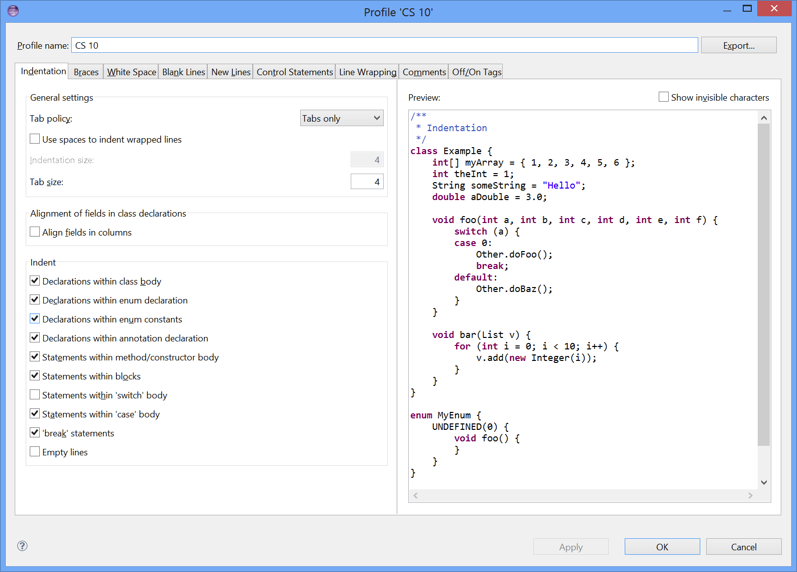

This page tells you how to download and install Java 7 and Eclipse on Windows,
and how to configure Eclipse.

**NOTE:** I don't run windows myself so these instructions are modified for Windows
users from the perspective of a Mac user :). Images of relevant links that you need
to click are captured on my Mac, but everything should be the same for you on your
machine running Windows.

## Installing Java 7 ##

**NOTE:** Java 8 has been released but not with enough time for us to fully
test the code we will write and run in this course so we will stick with Java 7.

1. Go to the [Oracle website](http://www.oracle.com/technetwork/java/javase/downloads/index.html).
   You'll see something like this:

    {:refdef: style="text-align: center;"}
    
    {: refdef}

2. Scroll down until you see a heading beginning "Java SE 7u71/72."  On
   the right, you'll see a Download button.  Click it.  

     {:refdef: style="text-align: center;"}
     
     {: refdef}

3. The next screen will look like this:

     {:refdef: style="text-align: center;"}
     
     {: refdef}

   Click the radio button next to "Accept License Agreement" and then
   click on " jdk-7u71-windows-x64.exe".  You'll be asked whether to save
   the file that is going to be downloaded; click on "Run".

4. Follow the instructions to install.  When the installation has completed,
   click on "Close".

## Installing Eclipse ##

1. If you already have Eclipse installed on your PC, you need to get
   rid of it.  To do so, first quit Eclipse if you're currently
   running it.  Then, go to your workspace folder (probably in
   Documents/workspace) and save anything there that you want to keep,
   because you're about to get rid of this folder.  Next, drag the
   workspace folder to the Recycle Bin.
   **Also:** Find your eclipse folder and drag the eclipse folder to the
   Recycle Bin.

2. Now you're ready to download and install the newest version of
   Eclipse.  Go to [the Eclipse website](https://www.eclipse.org/downloads).
   You'll see a window like this:

     {:refdef: style="text-align: center;"}
     
     {: refdef}

   I've circled the link you should click on.  It's the "Windows 64 Bit" link
   next to "Eclipse IDE for Java Developers."

3. On the next page that opens, click on the big green download arrow. Click on
   "Open with Archive Utility (default)" and then click OK. The download might
   take a few minutes. You should not feel compelled to donate.

4. After the download completes, folders should automatically expand.
   When that's done, you should see a folder named eclipse in a window.
   Drag the eclipse folder to your Desktop.

5. Open the eclipse folder in your Desktop.  You'll see an item named
   Eclipse.

6. Launch Eclipse.  You'll see a window like this:

     {:refdef: style="text-align: center;"}
     
     {: refdef}

   It will have your user name rather than the one shown (yuhanlyu).  Select where
   you want your workspace to be; I recommend the default of your
   Documents folder.  I like to name my workspaces with a meaningful name.
   Feel free to call it whatever you like, but I recommend using either "workspace"
   or "cs10workspace" for simplicity and clarity. Click the checkbox for using this
   location as the default, and then click "OK".

7. You'll see a window like this:

     {:refdef: style="text-align: center;"}
     
     {: refdef}

   Click on the Workbench arrow in the upper right that I've
   circled.  You shouldn't see this screen again, even if you quit
   Eclipse and relaunch it.

8. You'll get an empty workbench like this:

     {:refdef: style="text-align: center;"}
     
     {: refdef}

   You have now installed Eclipse!

## Configuring Eclipse ##

You don't *have* to configure Eclipse the way I do, but you'll
probably avoid some confusion if you do.  Here's how.

1. In the Eclipse menu bar, click on the Eclipse menu and then on
   "Preferences...". You'll see a window with two panes.  On the left
   pane is a list of types of things you can configure.

2. Click on the triangle to the left of General.  Then click on the
   triangle to the left of Appearance.  Then click on "Colors and
   Fonts."  You should see a window like this:

     {:refdef: style="text-align: center;"}
     
     {: refdef}

3. In the window in the middle, click on the triangle next to Java.
   Then double-click on "Java Editor Text Font":

    {:refdef: style="text-align: center;"}
    
    {: refdef}

4. You'll see this window:

    {:refdef: style="text-align: center;"}
    
    {: refdef}

   On the right, where you can select the size, click 12.  Then
   close this window by clicking on the window's close button.

5. Close up the General preferences by clicking on the triangle to the
   left of General.  Click the triangle next to "Java" and then click
   the triangle next to "Code Style."  Then click Formatter.  Here's
   what you should see:

    {:refdef: style="text-align: center;"}
    
    {: refdef}

6. Click the button that says "New...".  You'll see a window such as
   this one:

     {:refdef: style="text-align: center;"}
     
     {: refdef}

     You can type in any profile name you like. I used "CS10" here:

     {:refdef: style="text-align: center;"}
     
     {: refdef}

     Click OK.

7. You should see a window like this:

    {:refdef: style="text-align: center;"}
    
    {: refdef}

    Change the tab size to 4.

8. Click on "Blank Lines," and set 1's and 0's as I have below:

    {:refdef: style="text-align: center;"}
    
    {: refdef}

9. Click on "Control Statements," and check/uncheck the boxes as I've done here:

    {:refdef: style="text-align: center;"}
    
    {: refdef}

    Click OK.

10. Now click on triangles to close up Java.  Click on the triangle
    next to Run/Debug, and then click on Console:

    {:refdef: style="text-align: center;"}
    
    {: refdef}

11. Click on the green color sample next to "Standard In text color."
    You'll get a color picker:

    {:refdef: style="text-align: center;"}
    
    {: refdef}

12. Click on "Define Custom Colors."  On the right, there are three
    boxes labelled by Red, Green, and Blue.  Type 0 for Red, 112 for
    Geen, and 60 for Blue.  That will give you dark green.  (You're at
    Dartmouth.  What other color could you possibly want?)

    {:refdef: style="text-align: center;"}
    
    {: refdef}

    Close the color picker window by clicking its close button, and
    click OK again to close the Preferences window.

13. Finally, I don't use the Outline pane, which is on the right-hand
    side of the window.  Click on the "X" next to Outline in the tab
    of this pane; I've circled the "X":

    {:refdef: style="text-align: center;"}
    
    {: refdef}

    You'll get something like this:

    {:refdef: style="text-align: center;"}
    
    {: refdef}

    And you're done!
